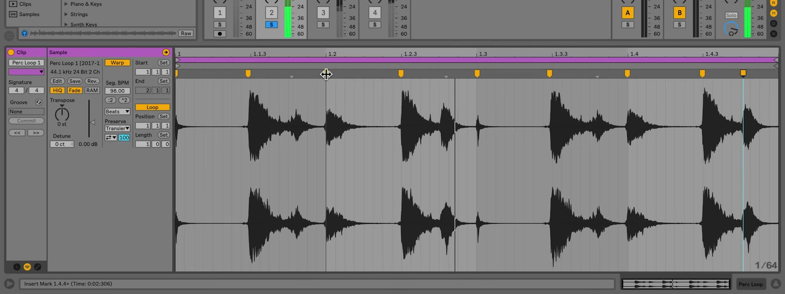

# How to Warp Audio Clips in Ableton Live

Warping maps an audio clip's timing to Live's musical timeline. It lets a rhythmic loop follow the Set tempo, corrects timing within a recording, and supports deliberate rhythmic changes without editing the source audio. Start with an audio clip in Session or Arrangement View, then open its Clip View. Ableton's [Audio Clips, Tempo, and Warping documentation](https://www.ableton.com/en/live-manual/12/audio-clips-tempo-and-warping/) describes the current Live 12 controls and Warp Modes.

## Video walkthrough

  <iframe
    src="https://www.youtube.com/embed/tlsRVC72hx4?rel=0"
    title="Learn Live: Warping clips"
    allow="accelerometer; autoplay; clipboard-write; encrypted-media; gyroscope; picture-in-picture; web-share"
    referrerpolicy="strict-origin-when-cross-origin"
    allowfullscreen>
  </iframe>

## Decide whether the clip should follow the Set tempo

Double-click an audio clip to open Clip View, then use the **Warp** switch in the Audio Utilities panel. When Warp is on, the clip follows the Set tempo. When it is off, the sample plays at its original speed, unaffected by tempo changes.

Enable warping for material with a musical pulse that should stay synchronized, such as drum loops, percussion, basslines, or an entire song. Leave it off for material that should retain its original duration, including many one-shots, sound effects, spoken-word clips, and ambient textures.

The Record, Warp & Launch Settings determine how Live handles samples when they are first loaded. **Loop/Warp Short Samples** controls the default treatment for short samples, while **Auto-Warp Long Samples** controls whether long files are analyzed and warped automatically. These defaults save time, but always check the result before relying on it in an arrangement.

## Set the first downbeat and original tempo

For a clean, even-length loop, Live estimates the original tempo and places Warp Markers at the beginning and end. Check the **BPM** field in the Audio Utilities panel. If the original tempo is known, enter it directly; use the **×2** or **÷2** controls when Live has interpreted the tempo as double or half its actual value.

For an uneven recording or a loop with silence before the first beat, locate the first clear downbeat in the Sample Editor. Move the insert marker there, open the context menu, and choose **Set 1.1.1 Here**. This pins that event to the start of the bar and provides a reliable reference for the rest of the clip.

Use the metronome while checking the result. Listen through several bars before adding more markers: an incorrect starting point or BPM can make every later correction seem necessary.

## Add and move Warp Markers

A Warp Marker locks a specific point in the waveform to a position on Live's timeline. Live displays transients as small gray markers along the top of the Sample Editor; hovering over one reveals a gray pseudo-marker that can be turned into a Warp Marker by double-clicking or dragging it.

You can also double-click in the upper half of the Sample Editor to create a Warp Marker, or press `Ctrl`+`I` on Windows or `Cmd`+`I` on macOS to insert one at the insert marker. Drag a marker left or right to change the timing around it. Select a marker and use the Arrow keys for small adjustments; double-click a marker, or select its time and press `Backspace` on Windows or `Delete` on macOS, to remove it.

For corrective work, begin at the first downbeat and move from left to right. Pin the beginning and end of a section that already fits the grid, then adjust the next drifting transient. Adding markers around a correction prevents it from changing the timing of a neighboring phrase. Hold `Shift` while dragging a selected Warp Marker when you need to adjust the waveform's start position under that marker rather than move its timeline position.

## Use auto-warping in manageable sections

Long recordings and songs can contain tempo changes or ambiguous downbeats. Rather than trusting every automatically generated marker, establish a correctly aligned section first. Then use the Sample Editor's **Warp From Here** commands to re-analyze the audio to the right of the selected marker while leaving the markers to its left intact.

Use **Warp From Here (Straight)** for material with no tempo variation when a single starting marker and the estimated original BPM are appropriate. For a detailed performance, continue working section by section and listen with the metronome after each adjustment. This makes it easier to find the first point where the audio begins to drift.

## Choose a Warp Mode for the source material

Warp Modes use different time-stretching algorithms, so the right choice depends on the audio. Select the mode in the Audio Utilities panel, then audition the clip at the target tempo.

| Material or goal | Warp Mode | Practical use |
| --- | --- | --- |
| Drums and rhythmic loops | **Beats** | Preserves transients; choose **Transients** in the Preserve control for many percussive loops. |
| Vocals, bass, and monophonic instruments | **Tones** | Works with audio that has a distinct pitch. |
| Pads, noise, drones, or dense ambiguous textures | **Texture** | Suits material without a clearly defined melody or pitch. |
| Turntable-style speed and pitch changes | **Re-Pitch** | Changes pitch and timing together, like changing playback speed. |
| Entire songs or mixed material | **Complex** or **Complex Pro** | Handles a combination of beats, melodies, and textures; Complex Pro may provide a higher-quality result but can use more CPU. |

Do not treat a Warp Mode as permanent. If a clip sounds smeared, clicky, or unnatural at the required tempo, compare another suitable mode before adding extra Warp Markers.

## Use warping for correction and deliberate changes

Warp Markers can repair a performance by aligning an early or late transient with the grid. They can also alter the groove intentionally: move a percussion hit ahead of or behind the beat, stretch a pause, or change the spacing between events. For a more uniform adjustment, use Live's audio quantization after focusing the Sample Editor; `Ctrl`+`U` on Windows or `Cmd`+`U` on macOS moves nearby transients toward the current quantization grid.

After the timing is correct, save the clip settings when you want your own sample to retain its Warp Markers the next time it is added to a Live Set. Otherwise, the warp information remains stored with the current Set and can still be changed later.

## Check the result in the full arrangement

Audition the warped clip with the other tracks and at the tempos it will actually use. Correct only the points that are audibly out of time, choose a mode suited to the material, and leave the original waveform intact for later changes. This keeps warping both reversible and practical as the Set develops.

## References

- [Ableton Live 12 Reference Manual: Audio Clips, Tempo, and Warping](https://www.ableton.com/en/live-manual/12/audio-clips-tempo-and-warping/)
- [Ableton Live 12 Reference Manual: Clip View](https://www.ableton.com/en/live-manual/12/clip-view/)
- [Ableton Live 12 Reference Manual: Live Keyboard Shortcuts](https://www.ableton.com/en/manual/live-keyboard-shortcuts/)
- [Learn Live: Warping clips](https://www.youtube.com/watch?v=tlsRVC72hx4)
