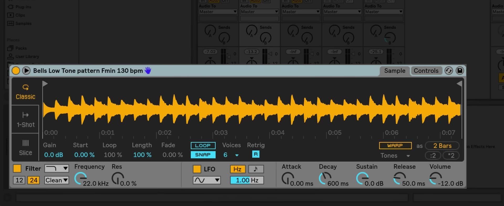

# How to Warp Audio in Simpler

Simpler can time-stretch a sample so that its musical duration stays aligned with the Live Set tempo while you play it from MIDI. Start with an audio file already loaded into Simpler on a MIDI track, preferably a loop whose intended number of bars is known. See Ableton's current [Live Instrument Reference](https://www.ableton.com/en/manual/live-instrument-reference/) for an overview of Simpler and its controls.

## Video walkthrough

  <iframe src="https://www.youtube.com/embed/1I59CN7NKIg?rel=0" title="Learn Live: Warping in Simpler" allowfullscreen></iframe>

## Start with a sample whose musical length you know

Load the audio into Simpler and audition it with the Set playing. A drum loop, vocal phrase, or musical passage with a clear bar length is a useful starting point because it makes the timing result easy to judge. If the loop is intended to fill two bars, for example, it should repeat at the same point as the metronome when it is configured correctly.

Before changing Warp settings, set the Set to the tempo at which you want to use the sample. Simpler's Warp controls adapt the sample to that tempo; they do not change the Set tempo itself.

## Enable Warp to keep the sample in time

Turn on **Warp** in Simpler's sample controls. With Warp off, Simpler behaves like a conventional sampler: playing different MIDI pitches changes the sample's playback speed. With Warp on, a rhythmic sample can stay synchronized with the current Set tempo even when it is played at different pitches.

Use this distinction deliberately. Leave Warp off when a pitch-dependent change in playback speed is part of the sound you want. Enable it when the sample needs to retain its rhythmic duration while you transpose or trigger it from MIDI.

## Set the loop length with Warp as

With Warp enabled, choose the intended duration from **Warp as…**. Select the number of bars or beats the sample should occupy in the Set. Live makes an initial estimate, but the correct setting depends on the source material, so confirm it by listening against the metronome or other clips.

If Live interprets the duration at half or double its intended value, use the **÷2** or **×2** controls beside Warp as to correct that estimate, then listen again. This is particularly useful for loops with a sparse introduction or an ambiguous first transient.

## Choose a Warp mode that suits the material

Simpler's Warp modes use the same general approach as the Warp modes for audio clips. Choose a mode based on what must be preserved in the sample:

- **Beats** is suited to drums and other material with clear transients.
- **Tones** is useful for monophonic, pitched material such as a bass line or vocal phrase.
- **Texture** can suit sustained, layered, or atmospheric sounds.
- **Re-Pitch** changes speed and pitch together, which can be useful when that tape-like behavior is intentional.
- **Complex** and **Complex Pro** are designed for more complex material, but require more processing.

Audition the same passage after changing modes. The most appropriate mode is the one that produces the most natural result at the amount of stretching and transposition required in the Set.

## Test the sample from MIDI

Create or play a short MIDI pattern that triggers the Simpler instrument. Listen first at the sample's original pitch, then at a few higher and lower notes. When Warp is configured correctly, the loop should continue to fit its selected musical duration and remain in time with the Set.

For a loop that needs to repeat continuously, test it over several repetitions rather than only once. A small timing error may be difficult to hear at the first trigger but becomes clear when the loop meets the next bar.

## Balance quality and processing load

Complex and Complex Pro can be useful for demanding source material, but they use more CPU than the simpler Warp modes. Test the sound in the actual MIDI part, especially if it includes multiple simultaneous notes, large pitch changes, or rapid retriggering. If playback becomes unreliable, try a more suitable lighter mode or reduce the amount of processing required.

## Put the warped sample to use

Warping in Simpler lets a sampled loop behave more like a playable MIDI instrument without losing its relationship to the Set tempo. Confirm the musical length first, select a Warp mode that matches the material, and then test the result at the pitches and density you intend to use in the arrangement.

For current details, see Ableton's [Simpler reference](https://www.ableton.com/en/manual/live-instrument-reference/), [Warping in Simpler help article](https://help.ableton.com/hc/en-us/articles/209072629-Warping-in-Simpler), and [Audio Clips, Tempo, and Warping chapter](https://www.ableton.com/en/manual/audio-clips-tempo-and-warping/). The source video is [Learn Live: Warping in Simpler](https://www.youtube.com/watch?v=1I59CN7NKIg).
