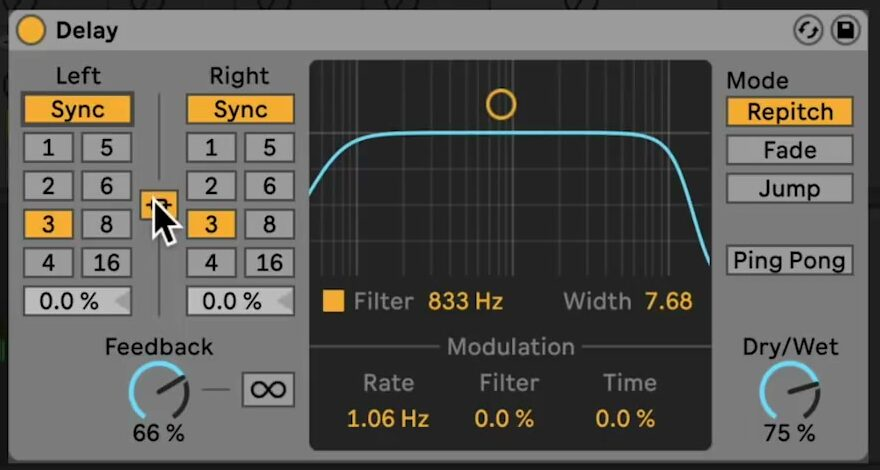
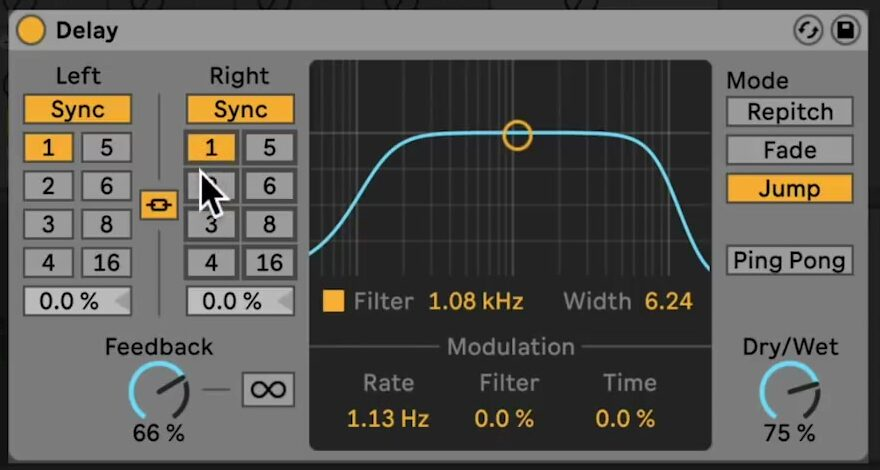

# How to Use Delay in Ableton Live

Delay repeats incoming audio at a chosen interval. In Live 12, it is available in Intro, Standard, and Suite, and it can process an audio track, the output of a MIDI instrument, or a return track. Start with a track that has an audible clip or instrument part, then use Ableton's current [Delay reference](https://www.ableton.com/en/live-manual/12/live-audio-effect-reference/#delay) alongside this guide.

The source walkthrough was published in 2019 and shows an earlier Live interface. This article uses the current Live 12 control names and behavior. In particular, Live 12.4 expanded Delay's LFO timing modes and waveform choices.

## Video walkthrough

  <iframe
    src="https://www.youtube.com/embed/Ss5yOq8nQK4?rel=0"
    title="Learn Live: Delay"
    allow="accelerometer; autoplay; clipboard-write; encrypted-media; gyroscope; picture-in-picture; web-share"
    referrerpolicy="strict-origin-when-cross-origin"
    allowfullscreen>
  </iframe>

## Add Delay and establish the repeat level

In the Browser, open **Audio Effects** and drag **Delay** to the target track's device chain. If the effect is on a return track, set **Dry/Wet** to 100 percent so the return supplies only the processed signal; use the sending tracks and return level to balance it. On an insert track, begin with a lower Dry/Wet value so the original signal remains present.

Set **Feedback** to determine how much of each delayed output returns to its own delay line. Lower values produce a small number of repeats, while higher values make the repeats last longer. Adjust it while the source is playing, and lower the value again before changing other settings if the repeats begin to build too heavily.

## Set the time for each delay line

Delay has separate left and right delay lines. Use **Sync** when the repeats should follow the Set tempo, or switch to **Time** to specify a duration in milliseconds. In Sync mode, the numbered time buttons are measured in sixteenth notes: for example, `4` is one quarter note.

Use **Stereo Link** to keep the left and right delay-time settings together. Turn it off to make a stereo pattern with different left and right values. The **Offset** controls can shift each side by a fraction of the selected interval, which is useful for a subtle swing or a less rigid pair of repeats.

## Capture and shape the repeats

Activate **Freeze** to loop the audio held in Delay's buffer. While Freeze is active, Delay does not accept new input; turn it off to resume processing the track. This makes it possible to hold a short fragment and change its filtering or timing independently of the material that follows.

Enable **Filter** to apply Delay's band-pass filter to the repeats. In the filter display, the horizontal position sets the centre frequency and the vertical position sets the width. Use the **Freq** and **Width** controls when a more deliberate adjustment is needed. Filtering the repeats can leave room for the dry sound and prevent accumulating echoes from masking the mix.

## Add motion with the LFO

Use the LFO's **Delay** amount to modulate delay time and its **Filter** amount to modulate the filter. Small values can add movement without changing the rhythmic role of the repeats; larger values create an obviously shifting effect.

Open the full LFO controls to select its rate mode, waveform, and morph setting. Current Live 12.4 versions can run the LFO in hertz, milliseconds, or tempo-synced beat divisions, including triplet, dotted, and sixteenth-note timing options. The current waveform choices include Sine, Triangle, ramps, Square, Sample & Hold, and Wander. The 2019 source video predates these Live 12.4 LFO additions.

## Choose how timing changes and stereo repeats behave

Delay's timing **Mode** controls how it changes from one delay time to another:

- **Repitch** is the default. Changing the delay time also changes the pitch of material already in the delay line, similar to changing tape speed.
- **Fade** crossfades from the old delay time to the new one.
- **Jump** changes immediately and can create clicks or abrupt transitions.

Use **Ping Pong** when the delayed output should alternate between the left and right channels. Keep it off when the two delay lines should repeat independently. Revisit **Dry/Wet** after enabling Ping Pong or changing Feedback, because those choices can change the apparent level of the effect.

## Apply the effect in context

Build the basic rhythm first: choose a tempo-synced interval, set a restrained Feedback value, and balance Dry/Wet or the return level. Then add one creative change at a time—an Offset, a filtered repeat, Freeze, Ping Pong, or modest LFO movement—and compare it against the untreated track. This makes it easier to retain a repeat pattern that supports the part rather than obscuring it.

For current control details, see Ableton's [Delay reference](https://www.ableton.com/en/live-manual/12/live-audio-effect-reference/#delay), the [Live 12 release notes](https://www.ableton.com/en/release-notes/live-12/), and the [Live edition comparison](https://www.ableton.com/en/live/compare-editions/). For the original demonstration, watch Ableton's [Learn Live: Delay](https://www.youtube.com/watch?v=Ss5yOq8nQK4).
