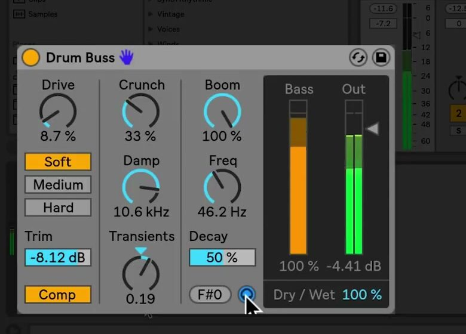

# How to Use Drum Buss in Ableton Live

Drum Buss is an analog-style drum processor that combines compression, distortion, transient shaping, and low-end enhancement in one audio effect. It is useful on a drum track or a drum group when the material needs more cohesion, attack, or weight. Start with a drum loop or Drum Rack pattern at a sensible track level. Ableton’s [Drum Buss manual section](https://www.ableton.com/en/live-manual/12/live-audio-effect-reference/#drum-buss) documents the current controls; the Live 12 edition comparison lists Drum Buss in Standard and Suite.

The February 2018 source video shows a Live 10-era interface. The current Live 12 manual confirms the same principal signal flow and control labels covered here.

## Video walkthrough

  <iframe
    src="https://www.youtube.com/embed/_okKGKp5a9I?rel=0"
    title="Learn Live: Drum Buss"
    allow="accelerometer; autoplay; clipboard-write; encrypted-media; gyroscope; picture-in-picture; web-share"
    referrerpolicy="strict-origin-when-cross-origin"
    allowfullscreen>
  </iframe>

## Add Drum Buss where the processing belongs

Open **Audio Effects** in the Browser and add **Drum Buss** to an individual drum track or to the group containing the full kit. Use it on one drum sound when only that sound needs treatment; use it on a group when the goal is to make multiple drum parts feel more connected.

Drum Buss is currently available in Live 12 Standard and Suite. Before making changes, play the complete drum pattern and keep an eye on its track level. The device includes several stages that can add substantial level and harmonic content, so judging it in the context of the Set is more reliable than making the processed track loud in isolation.

## Set the input level, compression, and distortion

Use **Trim** to reduce the input level before Drum Buss processes the signal. This is useful when an already-hot drum recording reacts too strongly to Drive or distortion. Enable **Comp** when the drum group needs the fixed, drum-optimized compressor that occurs before the distortion stage.

Choose a distortion character, then increase **Drive** gradually:

- **Soft** applies waveshaping distortion.
- **Medium** applies limiting distortion.
- **Hard** applies clipping distortion with a bass boost.

The choice of mode changes the character as well as the intensity. Establish a small amount of Drive in Soft mode first, then compare the other modes at a similar output level rather than assuming that the loudest option is the best fit.

## Shape clarity and attack above the low end

Use **Crunch** to add sine-shaped distortion to the mid-high frequencies, which can help a snare or hi-hat cut through a denser arrangement. Add only as much as the material needs; excessive Crunch can make cymbals or sharp samples fatiguing.

**Damp** is a low-pass filter that removes unwanted high frequencies introduced by distortion. Adjust it after setting Drive and Crunch, because it works on the tone created by those stages.

The **Transients** control shapes frequencies above 100 Hz. Positive values add attack and sustain for a fuller, more forceful result. Negative values also add attack but reduce sustain, which can make a loose drum loop tighter and reduce rattle between hits. Compare a small positive and negative setting before committing to either direction.

## Reinforce and tune the low end

The **Boom** section uses a resonant filter to enhance low frequencies. Raise **Boom** slowly, then set **Freq** to choose the frequency being emphasized. The **Bass Meter** shows the effect of Boom, which is useful when the monitoring system does not reproduce the lowest frequencies clearly.

Set the enhancement to a musical frequency with **Force To Note**, which tunes the frequency to the nearest MIDI note. Use **Decay** to control the decay of the low frequencies. When Boom is at zero, Decay affects the incoming post-drive and distortion signal; once Boom is raised, it affects both the incoming and enhanced low-frequency signals.

Enable **Boom Audition** with the headphone icon to solo the low-end enhancer while tuning it. Turn the audition off before balancing the full kit, since a useful soloed bass enhancement can still overwhelm the kick or bass line in the complete mix.

## Match the output and mix in the processing

Use **Output Gain** to compensate for level changes caused by compression, distortion, or Boom. Compare Drum Buss on and off at similar perceived levels, then use **Dry/Wet** to blend the processed and original signals. A partial blend can retain the unprocessed transient while adding the device’s body and color underneath it.

Start with modest Drive, a small Boom amount, and a level-matched output. Then use one additional control—Transients, Crunch, or Decay—to solve a specific problem in the drum material. This produces a clearer result than increasing every stage at once. For current control details and edition availability, see Ableton’s [Drum Buss manual section](https://www.ableton.com/en/live-manual/12/live-audio-effect-reference/#drum-buss) and [Live edition comparison](https://www.ableton.com/en/live/compare-editions/). For the original walkthrough, see the canonical source video, [Learn Live: Drum Buss](https://www.youtube.com/watch?v=_okKGKp5a9I).
