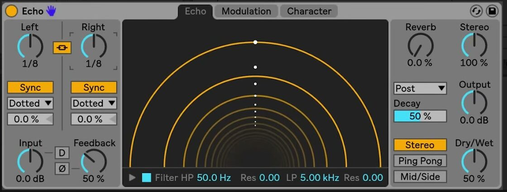

# How to Use Echo in Ableton Live

Echo is a modulation delay with two independent delay lines, filtering, reverb, and modulation controls. It is included with Live 12 Suite. Begin with an audio or MIDI track that has audible material, then keep Ableton's current [Echo reference](https://www.ableton.com/en/live-manual/12/live-audio-effect-reference/#echo) available while you configure the device.

The source walkthrough was published in 2018, when Echo was introduced with Live 10. This guide uses current Live 12 labels and current Suite availability rather than treating the older video interface as definitive.

## Video walkthrough

  <iframe
    src="https://www.youtube.com/embed/4LxhIE169x4?rel=0"
    title="Learn Live: Echo – Walkthrough"
    allow="accelerometer; autoplay; clipboard-write; encrypted-media; gyroscope; picture-in-picture; web-share"
    referrerpolicy="strict-origin-when-cross-origin"
    allowfullscreen>
  </iframe>

## Add Echo and choose a channel mode

In the Browser, open **Audio Effects** and drag **Echo** onto the target track's device chain. For a return track, set **Dry/Wet** to 100 percent so the return contributes only the processed signal. For an insert effect, begin with a lower Dry/Wet setting and balance the repeats against the unprocessed track.

Use the channel-mode buttons to choose the pattern across the stereo field:

- **Stereo** gives the left and right delay lines independent stereo outputs.
- **Ping Pong** alternates the repeats between the two sides.
- **Mid/Side** processes the centre and side portions of the stereo signal; its delay controls become **Mid** and **Side**.

Choose Stereo for a conventional starting point. Select Ping Pong when a moving left-right repeat is useful, or Mid/Side only when the distinction between the centre and edges of the source is deliberate.

## Set the repeat timing and feedback

Set the left and right delay lines with **Sync** on to use beat divisions, or turn Sync off to enter time in milliseconds. In sync mode, use **Notes**, **Triplet**, **Dotted**, or **16th** in the Sync Mode chooser to set the rhythmic division. Enable **Stereo Link** when the two lines should change together; their **Delay Offset** controls can still be adjusted separately for fractional, swing-like shifts.

Use **Feedback** to set how much of each line's output returns to its input. Increase it gradually while playback is running, then use **Input**, **Output**, and Dry/Wet to keep the processed level controlled. The **Ø** button inverts a channel's feedback signal before it returns to the delay line. The **D** button adds distortion to the dry input signal, so begin with it disabled until the repeat pattern is established.

## Filter the repeated sound

Open the **Echo** tab to view the Echo Tunnel. Its circular lines represent individual repeats, and the spacing between them shows the delay time. You can drag in the display to adjust the delay times directly, but use the delay-line controls when a precise rhythmic choice is needed.

Enable **Filter** to shape only the delayed sound. Set the **HP** control and its **Res** control to remove or emphasize lower frequencies in the repeats, then use **LP** and its **Res** control to control the high end. Open the Filter Display when a graphical view makes the filter relationship easier to judge.

## Place reverb in the Echo signal flow

Use the **Reverb** control to add reverb to Echo, then choose its location in the processing chain:

- **Pre** puts reverb before the delay.
- **Post** puts reverb after the delay.
- **Feedback** puts reverb inside Echo's feedback loop.

Use **Decay** to set the reverb-tail length. Start with a small reverb amount and a short-to-medium decay. A feedback-loop reverb can become dense quickly because the reverb is included in later repeats.

## Refine the motion and character

The remaining two tabs extend the basic delay without changing its core timing workflow. The **Modulation** tab contains an LFO and an envelope follower that can modulate delay time and filter frequency. Use small modulation amounts first, especially when the two delay lines already have different times or offsets.

The **Character** tab provides Gate, Ducking, Noise, Wobble, and Repitch controls. Gate can restrict which input material enters Echo, while Ducking lowers the wet signal while input is present. Noise and Wobble add vintage-style irregularities. **Repitch** makes existing repeats change pitch when delay time changes; turn it off when a crossfade between the old and new delay times is preferred.

## Set width, output level, and mix

Use **Stereo** to set the width of Echo's wet signal. At 0 percent, the wet signal is mono; values above 100 percent widen it. Use **Output** to correct the processed level after changing Feedback, Reverb, or Input, then finish with Dry/Wet. The Dry/Wet context menu also contains **Equal-Loudness**, which can make a 50/50 balance sound more even for many signals.

Start with a simple, tempo-synced delay and a restrained feedback value. Add filtering or reverb before experimenting with character controls, and compare each change with the effect bypassed. This keeps the repeat rhythm intelligible while you decide which motion and colour actually support the track.

For current controls and edition availability, see Ableton's [Echo reference](https://www.ableton.com/en/live-manual/12/live-audio-effect-reference/#echo) and [Live edition comparison](https://www.ableton.com/en/live/compare-editions/). For the original Live 10-era demonstration, watch Ableton's [Learn Live: Echo – Walkthrough](https://www.youtube.com/watch?v=4LxhIE169x4).
