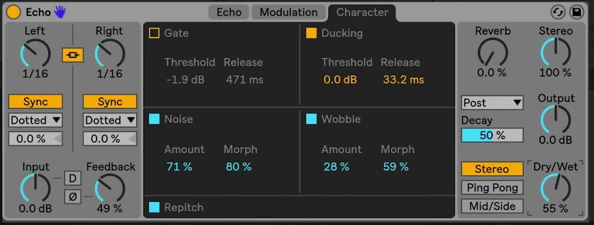

# How to Use Echo’s Character Section

Echo’s Character tab controls the dynamics of the delayed signal and adds irregularities associated with older delay hardware. Echo is included with Live 12 Suite. Before using this tab, load Echo on a track or return track and establish a basic repeat pattern; Ableton’s current [Echo reference](https://www.ableton.com/en/live-manual/12/live-audio-effect-reference/#echo) explains the complete device signal flow.

The source video was published in 2018 for the Live 10 release of Echo. This guide uses the current Live 12 Suite controls and names rather than treating the earlier interface as the current version.

## Video walkthrough

  <iframe
    src="https://www.youtube.com/embed/WJ16d_FpvEg?rel=0"
    title="Learn Live: Echo – Character section"
    allow="accelerometer; autoplay; clipboard-write; encrypted-media; gyroscope; picture-in-picture; web-share"
    referrerpolicy="strict-origin-when-cross-origin"
    allowfullscreen>
  </iframe>

## Open the Character tab with a stable repeat pattern

Select **Character** at the top of Echo. Its controls work with Echo’s existing delay-time, feedback, filter, and mix settings, so set those fundamentals first and keep playback running while adjusting the tab.

The controls fall into two groups. **Gate** and **Ducking** manage the relationship between the input and Echo’s wet signal. **Noise**, **Wobble**, and **Repitch** change the character of the repeats or how they react to timing changes.

## Use Gate to control what enters Echo

Enable **Gate** to prevent input material below its threshold from entering Echo. Raise or lower **Threshold** until the intended notes, drum hits, or vocal phrases open the gate. Use **Release** to set how long the gate remains open after the input falls below the threshold.

For a rhythmic use, start with a threshold that admits only the louder parts of the source and a release long enough to preserve the desired repeat. If the start of a sound disappears, lower the threshold or lengthen the release. If unwanted quieter material is creating echoes, raise the threshold or shorten the release.

## Use Ducking to make room for the dry signal

Enable **Ducking** when the repeats should recede while the source is playing and become more audible in the spaces between notes or hits. Ducking reduces Echo’s wet signal in proportion to the input once the input exceeds its **Threshold**. **Release** determines how quickly the wet signal returns after the input falls below that threshold.

Set the Ducking threshold so the main source activates it reliably, then adjust release by ear. A shorter release returns the repeats sooner; a longer one leaves more space for the direct sound. Ducking is useful independently of Gate, so enable each only for the result required.

## Add noise without masking the repeat

Enable **Noise** to introduce noise that simulates vintage equipment. **Amount** sets how much noise is added, and **Morph** changes the type of noise. Begin with a small Amount and use Morph to select the texture before raising the level further.

Compare Noise during quieter passages as well as during the active part. When Echo receives no input, Live can suspend the device after sustained silence to save CPU; it remains active when both Noise and Gate are enabled. If the noise distracts from the delay rhythm, reduce Amount or disable Noise rather than compensating by increasing the dry level.

## Introduce tape-like instability with Wobble

Enable **Wobble** to add irregular delay-time modulation, which creates the pitch and timing variation associated with tape delays. **Amount** sets the depth of the variation, while **Morph** changes its behavior.

Use a low Amount for subtle movement on sustained material. Increase it only after checking how it interacts with Echo’s left and right delay times, feedback, and any modulation already applied in the Modulation tab. Wobble can become more pronounced as repeats accumulate.

## Choose how repeats respond to timing changes

**Repitch** determines what happens to the material already in Echo when you change delay time. When it is on, timing changes create pitch variation similar to a hardware delay. When it is off, Echo crossfades between the old and new delay times instead.

Leave Repitch on when automated timing changes should sound obviously mechanical or tape-like. Turn it off when changing a synchronized value or adjusting the delay time should avoid a pitch sweep.

## Apply the Character controls in context

Set Echo’s timing, feedback, output, and Dry/Wet balance before adding character. Then choose one purpose: Gate to limit what enters the effect, Ducking to clear room for the source, Noise for background texture, Wobble for instability, or Repitch for audible timing transitions. Add a second control only after the first serves a clear role, and bypass Echo occasionally to confirm that the delayed part remains useful in the track.

For current device behavior and edition availability, see Ableton’s [Echo reference](https://www.ableton.com/en/live-manual/12/live-audio-effect-reference/#echo) and [Live edition comparison](https://www.ableton.com/en/live/compare-editions/). For the original Live 10-era demonstration, watch Ableton’s [Learn Live: Echo – Character section](https://www.youtube.com/watch?v=WJ16d_FpvEg).
