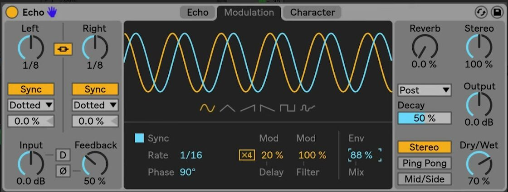

# How to Use Echo’s Modulation Section

Echo’s Modulation tab combines an LFO with an envelope follower to move the effect’s delay time and filter frequency. Echo is included with Live 12 Suite. Start with Echo loaded on an audible track or return track, and set a basic delay time and feedback value before adding modulation. Ableton’s current [Echo reference](https://www.ableton.com/en/live-manual/12/live-audio-effect-reference/#echo) documents the complete device.

The source video was published in 2018 for the Live 10 release of Echo. This guide uses the current Live 12 Suite labels and behavior rather than treating the earlier interface as the current version.

## Video walkthrough

  <iframe
    src="https://www.youtube.com/embed/inMwdangbA0?rel=0"
    title="Learn Live: Echo – Modulation section"
    allow="accelerometer; autoplay; clipboard-write; encrypted-media; gyroscope; picture-in-picture; web-share"
    referrerpolicy="strict-origin-when-cross-origin"
    allowfullscreen>
  </iframe>

## Open the Modulation tab with a stable echo

Select **Modulation** at the top of Echo. Its LFO can move both delay time and filter frequency, while **Env Mix** determines whether the LFO, Echo’s envelope follower, or a blend of both supplies the modulation.

Establish the basic echo first. Choose the delay line times, feedback, filter state, and Dry/Wet balance before changing modulation. This makes it easier to hear whether movement is improving the repeat pattern or merely obscuring it.

## Choose an LFO waveform and rate

Use the waveform buttons below the display to select **Sine**, **Triangle**, **Sawtooth Up**, **Sawtooth Down**, **Square**, or **Noise**. The display shows the resulting LFO shape for the left and right channels.

Enable **Sync** when the LFO should follow the Set tempo, then use **Rate** to choose a beat division. With Sync off, use **Freq** to set the LFO rate in hertz. **Phase** offsets the left and right LFO waveforms; at 180 degrees they are exactly out of phase. A smaller phase offset preserves a more centered motion, while a larger offset creates more stereo movement.

## Set the delay-time and filter modulation depth

Use **Mod Delay** to set how much the LFO or envelope follower changes Echo’s delay time. Begin with a low value, especially with feedback enabled, because small timing changes accumulate across repeated echoes. Enable **Modulation x4** only when deeper delay-time movement is needed; it multiplies the delay-time modulation depth by four and can create strong flanging with short delay times.

Use **Mod Filter** to set how much the modulation source moves Echo’s filter frequency. Filter modulation can add movement without altering the spacing of the repeats, so it is often a useful first target when the delay rhythm should remain clear.

## Blend the LFO and envelope follower

**Env Mix** blends the LFO with Echo’s envelope follower. At 0 percent, the LFO is the only modulation source. At 100 percent, only the envelope follower is heard. Intermediate values combine the regular LFO motion with movement caused by changes in the input signal’s level.

Start at either end of the control to identify each source clearly. Use the LFO-only position for predictable, tempo-related motion. Use the envelope-follower position when the modulation should respond to the source performance, then introduce a small amount of the other source only if the result benefits from both behaviors.

## Apply modulation in context

Choose one target and one source before adding complexity. For example, use a slow, synced LFO with modest Mod Filter for repeat movement that retains its timing, or use envelope-following Mod Delay for a response that follows the source’s dynamics. Revisit feedback and Dry/Wet after raising Mod Delay, and compare the result with Echo bypassed so the main rhythm remains intelligible.

For current device behavior and edition availability, see Ableton’s [Echo reference](https://www.ableton.com/en/live-manual/12/live-audio-effect-reference/#echo) and [Live edition comparison](https://www.ableton.com/en/live/compare-editions/). For the original Live 10-era demonstration, watch Ableton’s [Learn Live: Echo – Modulation section](https://www.youtube.com/watch?v=inMwdangbA0).
