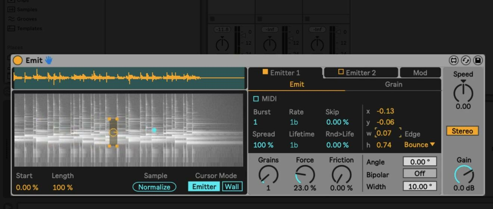
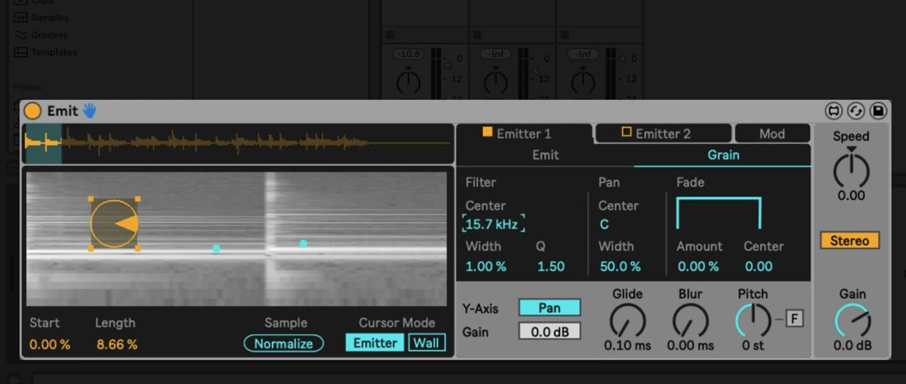

# How to Use Emit in Ableton Live

Emit is a visual granular synthesizer in the Inspired by Nature Pack. It turns a loaded sample into small grains represented by particles travelling through a spectrogram, allowing particle position and movement to shape the sound. Start with a MIDI track and an audio file to use as source material. Ableton’s [Inspired by Nature Pack page](https://www.ableton.com/en/packs/inspired-nature/) confirms that the Pack is included with Live 12 Suite and requires Live 12 Standard with Max for Live when used outside Suite.

The June 2021 source video presents Emit in Live 11. The current Live 12 Pack retains Emit’s particle-based granular workflow, and the Pack has since been updated for Live 12, including support for Live’s modulation system.

## Video walkthrough

  <iframe
    src="https://www.youtube.com/embed/fuQ60fe0PIA?rel=0"
    title="Learn Live: Emit"
    allow="accelerometer; autoplay; clipboard-write; encrypted-media; gyroscope; picture-in-picture; web-share"
    referrerpolicy="strict-origin-when-cross-origin"
    allowfullscreen>
  </iframe>

## Install Inspired by Nature and load a sample

Install the current **Inspired by Nature** Pack before searching for Emit. If it is not already installed, download it from the Browser’s Pack area or the official Pack page, then locate **Emit** and its presets in the Pack content. Add it to a MIDI track.

Drag an audio file onto the device to load it. Emit analyzes the file and displays a spectrogram, where horizontal position represents time and vertical position represents frequency. Brighter regions represent louder spectral content. Start Live’s transport or play MIDI notes after loading the sample so the particle activity and resulting audio can be evaluated together.

## Position the emitter and choose its path

In the spectrogram, the **Emitter** produces particles that play small slices of the source. Drag the emitter to select a new part of the sample, or use its position and size controls for a more deliberate placement. Resize it by dragging its corners: a smaller emitter reads a narrower time and frequency area, while a larger one draws from more of the spectrogram.

Use the emitter’s motion controls to determine how particles travel:

- **Angle** sets their main direction through the spectrogram.
- **Width** broadens the range of emission directions.
- **Bipolar** allows particles to travel in both directions.
- **Edge** determines what happens at the display boundary: particles can **Bounce**, **Wrap**, or be **Deleted**.

Try moving a small emitter across a recognizable sample while keeping Angle and Width modest. This makes the relationship between particle motion and the chosen part of the sample easier to hear.

## Control particle generation and physical movement

The **Rate** control determines how often particles are created, while **Lifetime** sets how long they remain active. **Grains** limits how many particles can exist at once. Together, these settings determine whether Emit produces isolated events or a continuous texture.

Add variation with the remaining emitter controls:

- **Rnd>Life** randomizes particle lifetimes.
- **Skip** omits some particle-generation events.
- **Burst** creates multiple particles within each Rate interval.
- **Spread** distributes a burst through its interval; reduce it to concentrate the particles near the beginning.
- **Force** propels particles more strongly, and **Friction** slows them as they travel.

The device-level **Speed** control changes the overall speed of the physics simulation and also affects Rate and Lifetime. Use it after establishing a workable particle pattern, because it changes several temporal behaviors at once.

Switch **Cursor Mode** to **Wall** to draw barriers in the spectrogram. Particles interact with those walls, making it possible to redirect their motion. Return to **Emitter** mode to move or resize the emitter again.

## Shape grain playback in the Grain tab

Open the **Grain** tab to control how the particles are heard. **Pitch** transposes the grains, with the adjacent fine-tune control available for smaller adjustment. **Glide** smooths changes between the sample slices encountered by particles, while **Blur** applies an envelope in the frequency domain for a more ringing or smeared response.

The vertical position of a particle can control either filter frequency or panning through the **Y-Axis** mode. In Filter mode, use **Center**, **Width**, and **Q** to define the band-pass filtering. In Pan mode, vertical position is used for stereo placement and the filter center is set directly. The Grain tab also provides overall pan width and a **Fade** envelope for each particle’s lifetime.

Change one grain parameter at a time while a repeatable particle pattern plays. For example, first set the filter range, then add a small amount of Glide or Blur, rather than using both to mask each other’s effect.

## Use MIDI, a second emitter, and modulation

Enable an emitter’s **MIDI** mode to create particles from MIDI notes instead of from the automatic Rate pattern. MIDI notes can control the rhythm and, when the note-pitch option is enabled, the pitch of the resulting grains. This is useful for turning a selected area of the sample into a playable granular instrument.

Enable **Emitter 2** to layer a second, independently configured particle system. A practical starting point is to use one emitter for a stable rhythmic source and another for a quieter, slower-moving texture. Balance each emitter with its Gain control before increasing the number of grains or adding detailed modulation.

The **Mod** section provides two LFOs and two envelopes that can be routed to device parameters. Use the routing controls to choose a source, destination, and amount. The envelopes respond to incoming MIDI, making them appropriate for note-shaped changes such as pitch or emitter position. Current Live 12 Pack release notes also confirm that the Pack’s devices respond to Live’s modulation system; use that current capability as an addition to the source video’s built-in modulation examples.

## Build a controlled variation from a simple patch

Begin with one emitter, a limited particle count, and a small area of the source sample. Once the timing and grain sound are clear, introduce a wall, a second emitter, or one modulation route. This produces variations that remain attributable to individual changes and makes it easier to save a useful preset or Set state before expanding the design.

For current requirements and Pack information, see Ableton’s [Inspired by Nature page](https://www.ableton.com/en/packs/inspired-nature/), [Packs release notes](https://www.ableton.com/en/release-notes/packs-release-notes/), and [updated-Packs guidance for Live 12](https://help.ableton.com/hc/en-us/articles/12955161906076-Updated-Packs-in-Live-12). For the original Live 11 workflow, see the canonical source video, [Learn Live: Emit](https://www.youtube.com/watch?v=fuQ60fe0PIA).
