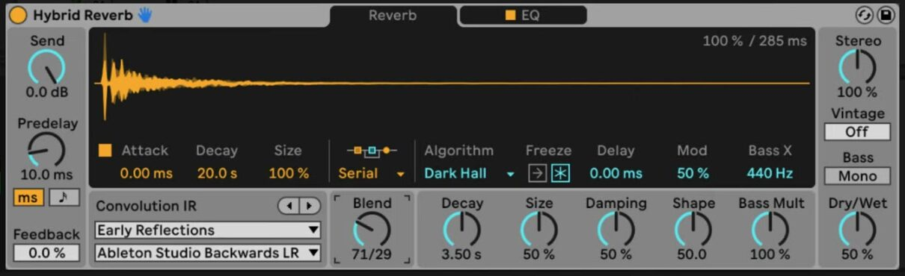
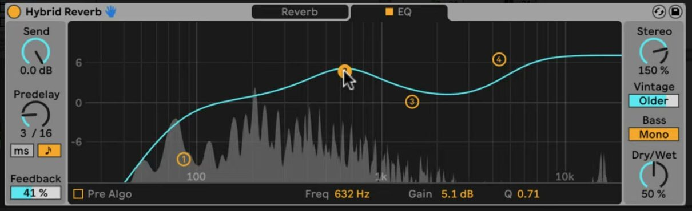

# How to Use Hybrid Reverb in Ableton Live

Hybrid Reverb combines convolution reverb, which uses an impulse response, with an algorithmic reverb engine. It is included with Live 12 Suite. Begin with an audio or MIDI track that has audible material, then refer to Ableton's current [Hybrid Reverb reference](https://www.ableton.com/en/live-manual/12/live-audio-effect-reference/#hybrid-reverb) as you work through the device.

The source video was made for Live 11, where Hybrid Reverb was introduced. This article uses the current Live 12 controls and availability; it does not assume that the video interface is the current version.

## Video walkthrough

  <iframe
    src="https://www.youtube.com/embed/yLBIOiM97Vs?rel=0"
    title="Learn Live: Hybrid Reverb"
    allow="accelerometer; autoplay; clipboard-write; encrypted-media; gyroscope; picture-in-picture; web-share"
    referrerpolicy="strict-origin-when-cross-origin"
    allowfullscreen>
  </iframe>

## Add Hybrid Reverb and set the input level

In the Browser, open **Audio Effects** and drag **Hybrid Reverb** to the device chain of the target track. On a return track, set **Dry/Wet** to 100 percent so the return supplies only the processed signal. On an insert track, begin with a lower Dry/Wet value and balance it against the original signal.

Use **Send** in Hybrid Reverb's input section to set the gain that feeds the reverb engines. This is separate from a track's return-send controls; the dry signal still passes through the device. **Predelay** delays the start of the early reflections relative to the input, and can be set as time or as a tempo-synced beat division. **Feedback** returns the predelay output to its input, allowing the predelay itself to create repeated reflections.

## Choose how the two reverb engines work together

The **Routing** chooser determines whether the convolution and algorithmic engines are combined or used alone:

- **Serial** routes the convolution engine's output into the algorithmic engine.
- **Parallel** processes the signal in both engines independently.
- **Algorithm** uses only the algorithmic engine.
- **Convolution** uses only the convolution engine.

When Routing is set to Serial or Parallel, use **Blend** to move between the convolution and algorithmic sections. Blend has no effect in the two single-engine modes. Select a single-engine mode while choosing its basic character, then switch to Serial or Parallel when the two sounds are ready to combine.

## Load and shape an impulse response

The convolution engine applies the character of an impulse response (IR) to the incoming sound. Choose an IR category in the upper **Convolution IR** menu, then choose a specific response in the lower menu. The included categories range from real rooms and halls to plates, springs, drums, and textures.

To try a personal audio file as an IR, drag it from the Browser onto the convolution waveform display. Then shape the response with the convolution controls:

- **Attack** sets the attack time of the IR envelope.
- **Decay** sets the decay time of the envelope.
- **Size** changes the impulse response's relative size.

An unusual audio file can produce a highly recognizable reverb texture, so reduce the Send or Dry/Wet setting before auditioning a new IR in a dense mix.

## Select an algorithmic space or animated texture

Choose an algorithm from the **Algorithm** menu. The current device provides **Dark Hall**, **Quartz**, **Shimmer**, **Tides**, and **Prism**; each supplies its own secondary controls. All five provide **Decay**, **Size**, **Delay**, and Freeze controls.

For example, choose **Tides** when you want modulation in the reverb spectrum. Use **Tide** to set the intensity, **Rate** to set the modulation speed, and **Phase** to set the offset between the left and right modulation signals. Use **Damping** to reduce high frequencies in the algorithmic reverb tail.

Use **Freeze** to stop new input from entering the algorithmic engine while the existing tail sustains. Turn on **Freeze In** as well only when new input should build into that frozen reverberation. Return both controls to their normal state after creating the texture so the effect follows the track again.

## Shape the reverb with EQ and output controls

Open the **EQ** tab to filter or rebalance the reverb. Its four bands include low and high bands that can be pass filters or shelves, plus two midrange peak bands. By default, the EQ is after both reverb engines. Enable **Pre Algo** to place it before the algorithmic engine instead, which lets the EQ affect the signal going into that engine.

Use the output controls to refine the completed reverb:

- **Stereo** sets the width of the wet signal; values above 100 percent widen the stereo image.
- **Vintage** adds the degradation associated with older digital reverbs, with Subtle, Old, Older, and Extreme settings.
- **Bass Mono** sums Hybrid Reverb output below 180 Hz to mono.
- **Dry/Wet** balances processed and original audio; use 100 percent on a return track.

## Apply Hybrid Reverb in a mix

Start by choosing one engine and setting its decay and level for the role it needs to play. Add the other engine only when it contributes a distinct space or texture, then compare Serial and Parallel routing at the same output level. Finish by removing low-frequency buildup with EQ or Bass Mono, and automate Send, Blend, or Dry/Wet only after the basic reverb balance is stable.

For current device details and edition availability, see Ableton's [Hybrid Reverb reference](https://www.ableton.com/en/live-manual/12/live-audio-effect-reference/#hybrid-reverb) and [Live edition comparison](https://www.ableton.com/en/live/compare-editions/). For the original Live 11 demonstration, watch Ableton's [Learn Live: Hybrid Reverb](https://www.youtube.com/watch?v=yLBIOiM97Vs).
