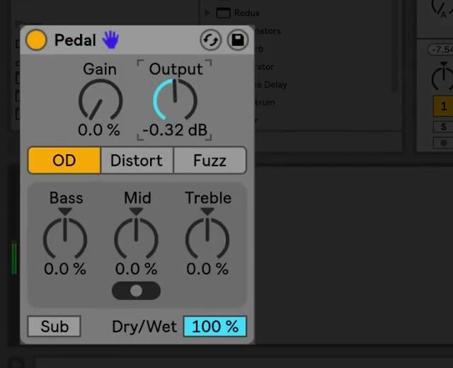

# How to Use Pedal in Ableton Live

Pedal is a stompbox-style distortion audio effect with overdrive, distortion, and fuzz modes. It is included with Live 12 Suite. Load it on an audible audio track, then use Ableton’s current [Pedal reference](https://www.ableton.com/en/manual/live-audio-effect-reference/#pedal) alongside this guide to understand its complete behavior.

The source video was published for Live 10 in 2018, when Pedal was introduced. The workflow below uses the current Live 12 manual for the device controls and Suite availability.

## Video walkthrough

  <iframe
    src="https://www.youtube.com/embed/6c1dZ2emnJo?rel=0"
    title="Learn Live: Pedal"
    allow="accelerometer; autoplay; clipboard-write; encrypted-media; gyroscope; picture-in-picture; web-share"
    referrerpolicy="strict-origin-when-cross-origin"
    allowfullscreen>
  </iframe>

## Add Pedal and establish a safe starting level

In Live’s Browser, open **Audio Effects** and drag **Pedal** into the device chain after the sound source. Begin with **Gain** at 0% and increase it slowly while the source is playing. Pedal applies some distortion even at 0%, so this is the minimum-drive setting rather than a completely clean setting.

Set **Output** after choosing the gain amount. Lowering Output to roughly match the bypassed level makes it easier to judge the change in tone rather than being misled by a louder signal. If the source is already too hot at Pedal’s input, place **Utility** before Pedal and lower Utility’s Gain instead of relying only on Pedal’s Gain control.

## Choose the drive character

Use the three type buttons to choose the basic distortion character before fine-tuning the EQ:

- **Overdrive** produces a warm, smooth drive sound.
- **Distortion** produces a tighter, more aggressive result.
- **Fuzz** produces an unstable, broken-amplifier character.

Raise Gain in small increments after selecting a type. Try the same gain amount in each mode before changing other controls; this exposes what the type selection itself contributes. Use Pedal on more than guitar when appropriate: its distortion can also color drums, vocals, and synthesizers.

## Shape the post-distortion EQ

Pedal’s three-band EQ operates after the distortion stage. Its response is adaptive: increasing an EQ boost also increases its resonance, so large boosts have a more focused effect than small ones.

- **Bass** is a peak EQ centered at 100 Hz. It can add punch to bass or drum material, or reduce low frequencies from a guitar part.
- **Mid** is a boost-and-cut EQ. Set **Mid Frequency** to the left, middle, or right position to center it at 500 Hz, 1 kHz, or 2 kHz respectively. The lowest position has the narrowest range; the highest position has the widest.
- **Treble** is a shelving EQ with a 3.3 kHz cutoff. Reduce it to control harshness or raise it when the processed sound needs more high-frequency content.

Use the **Sub** switch to enable a low-shelf boost below 250 Hz. For a low-end contrast, turn Sub on while setting Bass below its neutral position, or turn Sub off while raising Bass. Check the result in the context of the full mix so the added low end does not compete with the kick or bass.

## Blend Pedal and choose its place in the chain

Use **Dry/Wet** to balance Pedal’s processed signal with the original. A fully wet setting makes the device’s tone easiest to evaluate; a lower setting can retain transient clarity or introduce drive as a parallel texture.

Device order changes the result. A **Compressor** before Pedal can produce a more even response, while an EQ or filter with substantial gain and resonance before it can drive the distortion more strongly. For a conventional guitar-style chain, use Pedal with Live’s Tuner, Amp, and Cabinet effects; for other material, compare Pedal before and after time-based effects rather than assuming the same placement will work for every source.

## Use Hi-Quality mode when needed

Open Pedal’s device title-bar context menu and enable **Hi-Quality** to reduce aliasing, especially with high-frequency material. This improves sound quality at the cost of a small increase in CPU use. Turn it on after selecting the effect settings, then compare it at the project’s playback level to decide whether the improvement is useful for that track.

## Apply Pedal in a mix

Start by choosing the drive type, then set Gain and Output before making EQ changes. Use Mid Frequency and Treble to place the distortion in the mix, and add Sub only after checking the existing low-end balance. Finally, compare the track with Pedal bypassed and adjust Dry/Wet or Output so the effect contributes character without masking the source.

For current control details and edition availability, see Ableton’s [Pedal reference](https://www.ableton.com/en/manual/live-audio-effect-reference/#pedal) and [Live edition comparison](https://www.ableton.com/en/live/compare-editions/). For the original Live 10 demonstration, watch Ableton’s [Learn Live: Pedal](https://www.youtube.com/watch?v=6c1dZ2emnJo).
