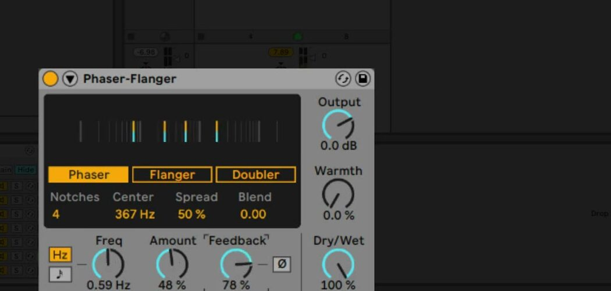
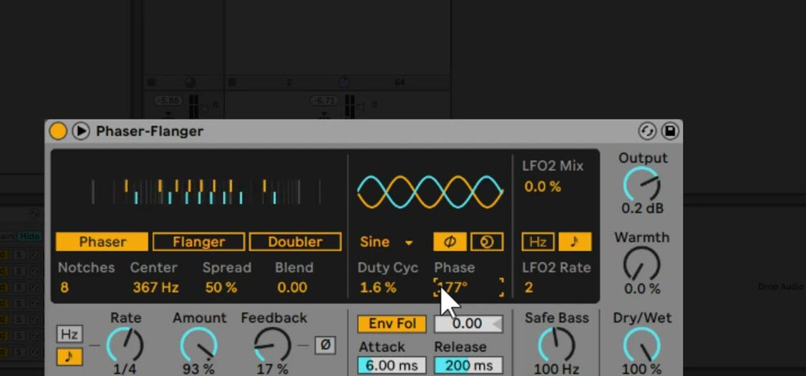

# How to Use Phaser-Flanger in Ableton Live

Phaser-Flanger combines phaser, flanger, and doubler processing in one audio effect. It is included with all Live 12 editions. Start with an audible audio or instrument track, then refer to Ableton’s current [Phaser-Flanger reference](https://www.ableton.com/en/manual/live-audio-effect-reference/#phaser-flanger) for the full device behavior.

The source video was published in 2021 for the Live 11 introduction of Phaser-Flanger. This guide uses current Live 12 labels, behavior, and edition availability.

## Video walkthrough

  <iframe
    src="https://www.youtube.com/embed/bZjzOSqWn1s?rel=0"
    title="Learn Live: Phaser-Flanger"
    allow="accelerometer; autoplay; clipboard-write; encrypted-media; gyroscope; picture-in-picture; web-share"
    referrerpolicy="strict-origin-when-cross-origin"
    allowfullscreen>
  </iframe>

## Add Phaser-Flanger and choose a mode

Open **Audio Effects** in Live’s Browser and drag **Phaser-Flanger** into the selected track’s device chain. Select one of the three mode buttons in the device display:

- **Phaser** creates moving notch filters from modulated all-pass filters.
- **Flanger** mixes a time-modulated, delayed signal with feedback into the input, producing a changing comb-filter effect.
- **Doubler** uses time-modulated delay lines to create the impression of multiple takes playing together.

Set **Dry/Wet** high enough to hear the processed signal clearly while selecting a mode, then reduce it later if the effect is used as a parallel texture. Use **Output** to compensate for level changes and **Warmth** to add slight distortion and filtering.

## Shape a phaser sweep

Choose **Phaser** to work with its notch-filter controls. **Notches** changes the number of all-pass filters, **Center** sets the central frequency of the notches, and **Spread** changes the distance between them. Use fewer notches for a simpler sweep and increase them for denser spectral movement.

**Blend** determines where the modulation is routed. At 0.0, it moves Center; at 1.0, it moves Spread. Intermediate values combine both routes. Start with Blend at 0.0 and a modest LFO Amount to establish the sweep, then raise Blend when the notches should expand and contract as well as move together.

## Create flanging and doubling effects

Choose **Flanger** when the goal is a short, moving delay that creates comb filtering. Adjust **Time** for the base delay-line time, then use the LFO Amount and rate to determine how far and how quickly it moves. Keep Feedback low at first; small changes can make the comb-filter pattern much more obvious.

Choose **Doubler** to create layered copies of the incoming signal. Its Time control covers a broader delay range than Flanger. Doubler modulation is bipolar: moving right in the display increases the delay time and moving left decreases it. Raising Feedback stacks further copies; when playback is stopped, high Feedback can also create audible delays.

## Set LFO, feedback, and output controls

Use the main LFO’s **Freq/Rate** control to set the movement speed. Choose free-running frequency for an independent speed or a tempo-synced rate for beat divisions. **Amount** sets the strength of delay modulation and affects both LFOs when the second LFO is used.

**Feedback** returns part of each channel’s output to its input. Higher values sound more extreme and can emphasize or suppress specific frequencies. The **Ø** button inverts the feedback signal, which can create a hollow character at high Feedback values. Increase Feedback carefully because some settings can raise the output level quickly.

Use **Dry/Wet** to set the balance between original and processed audio. If Phaser-Flanger is placed on a return track, use 100% Dry/Wet and control the amount of effect with the track’s send level instead.

## Open the expanded modulation controls

Click the unfold button in Phaser-Flanger’s title bar to reveal the main LFO display, LFO2, the envelope follower, and **Safe Bass**. The main LFO offers Sine, Triangle, Saw Up, Saw Down, Rectangle, Random, Random S&H, and stepped or analog Triangle variants.

Select **Phase** to offset the left and right LFO waveforms; at 180 degrees they are completely inverted. Select **Spin** to detune their rates instead. **Duty Cyc** compresses the waveform toward the front or back of its cycle, except with the noise-based random waveforms.

Use **LFO2 Mix** to blend in the second, triangular LFO. At 0%, only the main LFO is active; at 100%, only LFO2 is active. LFO2 can run freely in hertz or sync to tempo independently of the main LFO.

## Respond to the source and protect the low end

Enable **Env Fol** to make modulation follow the incoming signal’s level. Set a nonzero envelope amount, then shape the response with **Attack** and **Release**. Negative envelope amounts reverse the modulation direction.

Use **Safe Bass** to high-pass the components that Phaser-Flanger affects. Its cutoff range is 5 Hz to 3 kHz, so it can preserve low-frequency stability when processing bass-heavy material. Raise it only as far as necessary and compare the result with the device bypassed to ensure the effect is moving the intended range.

## Apply Phaser-Flanger in a mix

Choose the mode first, then establish its Time or Phaser settings before adding modulation and feedback. For subtle motion, use a low Amount and feedback value; for a prominent sweep or flange, increase one of those controls at a time while watching the output level. Use Safe Bass and Dry/Wet to keep the effect from destabilizing the low end or masking the source.

For current controls and edition availability, see Ableton’s [Phaser-Flanger reference](https://www.ableton.com/en/manual/live-audio-effect-reference/#phaser-flanger) and [Live edition comparison](https://www.ableton.com/en/live/compare-editions/). For the original Live 11 demonstration, watch Ableton’s [Learn Live: Phaser-Flanger](https://www.youtube.com/watch?v=bZjzOSqWn1s).
