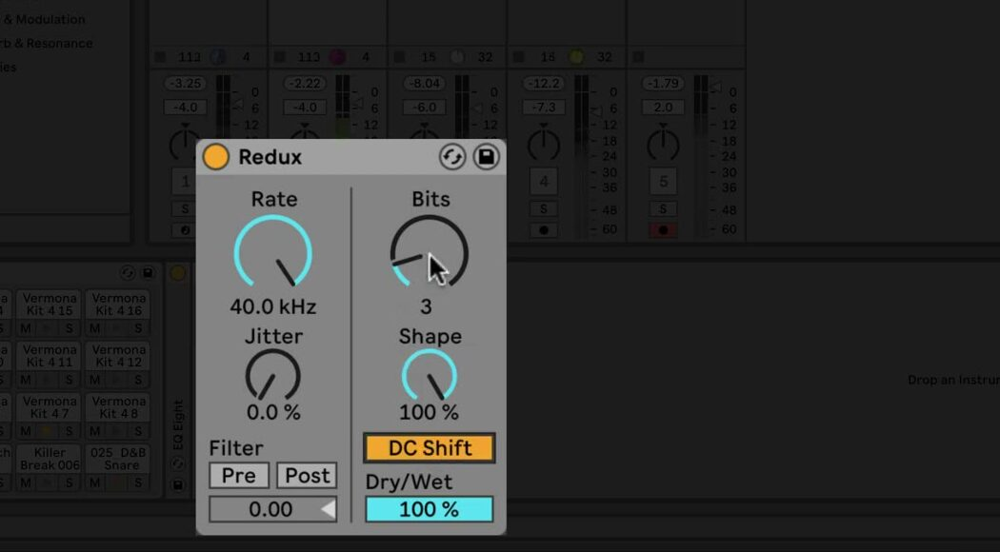

# How to Use Redux in Ableton Live

Redux is a digital degradation effect that combines downsampling and bit reduction. It is included with all Live 12 editions. Load it on a track with an audible source, then use Ableton’s current [Redux reference](https://www.ableton.com/en/manual/live-audio-effect-reference/#redux) to check the complete device behavior.

The source video was published in 2021 for the Live 11 update of Redux. This article uses current Live 12 control names, behavior, and edition availability.

## Video walkthrough

  <iframe
    src="https://www.youtube.com/embed/71A5FC272L0?rel=0"
    title="Learn Live: Redux"
    allow="accelerometer; autoplay; clipboard-write; encrypted-media; gyroscope; picture-in-picture; web-share"
    referrerpolicy="strict-origin-when-cross-origin"
    allowfullscreen>
  </iframe>

## Add Redux and identify its two processors

In Live’s Browser, open **Audio Effects** and drag **Redux** into the selected track’s device chain. The left side controls downsampling; the right side controls bit reduction. Adjust the two sections separately or combine them, then use **Dry/Wet** to balance the resulting processed signal with the original audio.

Start at a moderate Dry/Wet setting while learning the device. This makes it easier to hear the character contributed by a control without immediately replacing the source with a heavily degraded signal. For a return track, set Dry/Wet to 100% and use the track’s send level to control the amount of Redux in the mix.

## Reduce the sample rate with Rate and Jitter

Use **Rate** to set the sample rate to which Redux degrades the signal. Lower Rate values introduce more imaging and inharmonic tones, while preserving a higher rate produces a subtler texture. Change Rate in small steps while the source is playing, especially with material that has strong high-frequency content.

Use **Jitter** to add noise and randomness to Redux’s downsampler clock. Jitter also increases stereo width. Keep it low when the goal is a stable, deliberate sample-rate texture, and raise it when a noisier, less predictable result is appropriate.

## Filter the downsampled signal

Use **Pre** to enable the filter before downsampling. It reduces the bandwidth of the signal that reaches the downsampler and, when Jitter is active, also reduces the added stereo width. This is useful when the downsampler should respond to a more limited frequency range.

Use **Post** to enable the low-pass filter after downsampling. It reduces imaging introduced by the downsampler. Adjust the **Post-Filter Octave** slider to set the cutoff relative to half of the Rate frequency; the displayed number is the number of octaves above or below that reference point.

## Reduce bit depth with Bits and Shape

Use **Bits** to decrease the number of bits used to encode Redux’s output. Lower values reduce dynamic range while adding distortion and noise. At extreme settings, the original dynamics can be lost entirely, so use Dry/Wet and output monitoring to keep the result intentional.

Use **Shape** to change the quantizer’s amplitude curve. Higher Shape values give smaller amplitudes finer resolution, so quiet details can be affected differently from louder parts of the signal. Compare the shape settings with the same Bits value before changing both controls together.

Enable **DC Shift** to apply an amplitude offset before quantization. It changes the sound of the bit-reduction distortion most noticeably at low Bits values and can raise the output level, so reduce Dry/Wet or the track level if needed before making other mix decisions.

## Blend Redux in context

Use the two halves of Redux for different jobs: lower Rate for resampling artifacts and Jitter, lower Bits for quantization distortion and reduced dynamic range. Begin with one processor, then bring in the other only after the first result is clear. Recheck the sound with Redux bypassed and adjust Dry/Wet so that the effect adds the intended digital character without masking important transients or the source’s pitch information.

For current control details and edition availability, see Ableton’s [Redux reference](https://www.ableton.com/en/manual/live-audio-effect-reference/#redux) and [Live edition comparison](https://www.ableton.com/en/live/compare-editions/). For the original Live 11 demonstration, watch Ableton’s [Learn Live: Redux](https://www.youtube.com/watch?v=71A5FC272L0).
