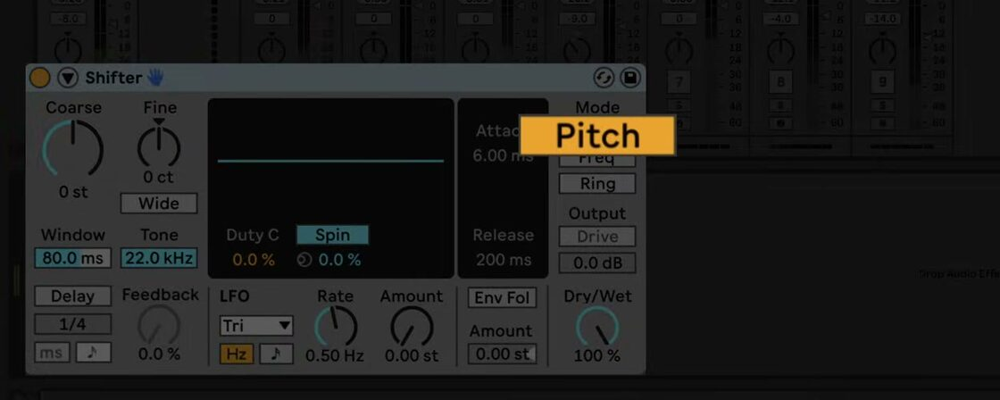
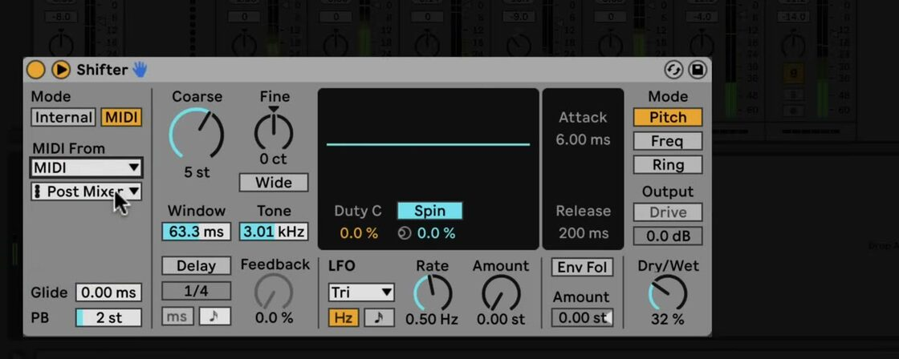

# How to Use Shifter in Ableton Live

Shifter is an audio effect for real-time pitch shifting, frequency shifting, and ring modulation. It is included with Live 12 Standard and Suite. Load it on a track with an audible audio source before following the examples below, and use Ableton’s current [Shifter reference](https://www.ableton.com/en/manual/live-audio-effect-reference/#shifter) to check the complete device behavior.

The source video is a Live 11 tutorial published in 2022. This article uses the current Live 12 manual and edition comparison for control behavior and availability.

## Video walkthrough

  <iframe
    src="https://www.youtube.com/embed/uqY8K8otbp0?rel=0"
    title="Learn Live: Shifter"
    allow="accelerometer; autoplay; clipboard-write; encrypted-media; gyroscope; picture-in-picture; web-share"
    referrerpolicy="strict-origin-when-cross-origin"
    allowfullscreen>
  </iframe>

## Add Shifter and choose a processing mode

In Live’s Browser, open **Audio Effects** and drag **Shifter** to the track’s device chain after the sound source. The device has three **Mode** buttons:

- **Pitch** shifts the incoming audio by semitones and cents while retaining the harmonic relationships between its frequencies. Use it for transposition and real-time harmonic layers.
- **Freq** moves every frequency by an amount in hertz. It does not retain harmonic relationships, so larger shifts can produce dissonant or metallic results.
- **Ring** adds and subtracts the selected frequency from the input. It is useful for ring-modulation textures and metallic percussion treatments.

Use **Dry/Wet** to balance the original and processed signals. Start with a clear signal and one mode at a time, so it is easy to distinguish a change in tuning from a change in timbre.

## Shift pitch while preserving musical intervals

Select **Pitch**, then set the broad interval with **Coarse** and refine it with **Fine**. Coarse operates in semitones and Fine operates in cents in this mode. This is the appropriate mode when the aim is to transpose an audio part without deliberately breaking its harmonic relationships.

The **Window** setting changes the analysis window used by the pitch-shifting algorithm. Longer windows often suit low-frequency material, while shorter windows often suit high-frequency material. Compare the result while the source is playing rather than choosing a value by instrument type alone.

Enable **Wide** only when using a nonzero **Spread** value. Wide reverses the right channel’s Spread polarity, moving the left and right channels in opposite directions for a stereo effect. With Spread at zero, Wide has no effect. When Shifter’s delay is enabled, **Tone** cuts high frequencies in the delay feedback path.

## Use frequency shifting and ring modulation deliberately

Select **Freq** for spectral movement rather than conventional pitch transposition. Small shifts can produce phasing when the dry and processed signals are both audible; a Dry/Wet balance near the middle makes that interaction easier to hear. Larger shifts are more suited to metallic sound design or to changing the apparent tuning of a drum layer.

Select **Ring** when a more pronounced modulation effect is wanted. Here, the shift amount is in hertz, and **Drive** becomes available to add distortion to the ring-modulated output. Very low Ring values—around 20 Hz or lower—can create tremolo. Combine a small Spread value with Wide for stereo motion, then reduce Dry/Wet if the modulation obscures the original part.

## Add repeats and movement

Enable **Delay** to feed the shifted signal into Shifter’s delay section. Choose free or beat-synced delay timing with the Delay Mode controls, set the timing value, then raise **Feedback** gradually. Pitch-shifted repeats can become dense quickly, so reduce Feedback or Dry/Wet before increasing the shift amount further.

Turn on the LFO to add regular movement. Choose a waveform, set **Rate** in free time or sync it to the Set tempo, and use **Amount** for the modulation depth. The waveform display also provides stereo controls: depending on the waveform and rate, these appear as **Phase**, **Spin**, or **Width**. Phase offsets the left and right LFOs, Spin detunes their speeds, and Width controls the stereo extent of the random LFO waveform.

For movement driven by the performance, enable **Env Fol**. The envelope follower translates incoming audio level into modulation. Raise its Amount, then use **Attack** to determine how quickly it responds to rising levels and **Release** to determine how quickly it falls after the signal becomes quieter.

## Set the shift with incoming MIDI

Click the triangle on the left side of Shifter’s title bar to unfold the sidechain parameters. **Internal** uses the device’s Coarse and Fine controls; **MIDI** sets pitch or frequency from an incoming MIDI note.

After choosing **MIDI**, select the MIDI track that should supply the note data. Use a single-note MIDI part for a predictable result, as Shifter provides real-time monophonic pitch shifting. **Glide** sets the time for one note to slide to the next, and **PB** sets the pitch-bend range from 0 to 24 semitones.

## Apply Shifter in a mix

Treat Shifter as either a focused transposition tool or a parallel texture. For a pitched drum layer, duplicate the drum track, use Pitch mode with Delay enabled, automate Coarse sparingly, and keep the duplicate lower in the mix. For a subtle effect, begin with a small Freq shift and a moderate Dry/Wet balance. Recheck the result with Shifter bypassed after changing delay, feedback, or modulation so that the processed sound remains intentional.

For current device details and edition availability, see Ableton’s [Shifter reference](https://www.ableton.com/en/manual/live-audio-effect-reference/#shifter) and [Live edition comparison](https://www.ableton.com/en/live/compare-editions/). For the original Live 11 demonstration, watch Ableton’s [Learn Live: Shifter](https://www.youtube.com/watch?v=uqY8K8otbp0).
