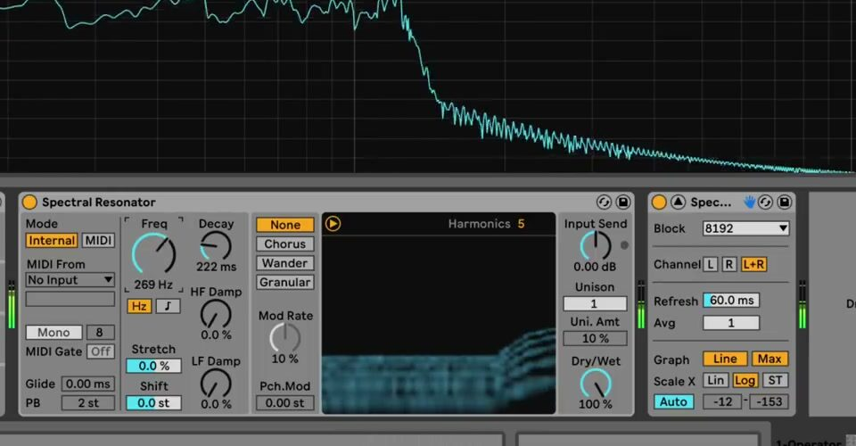
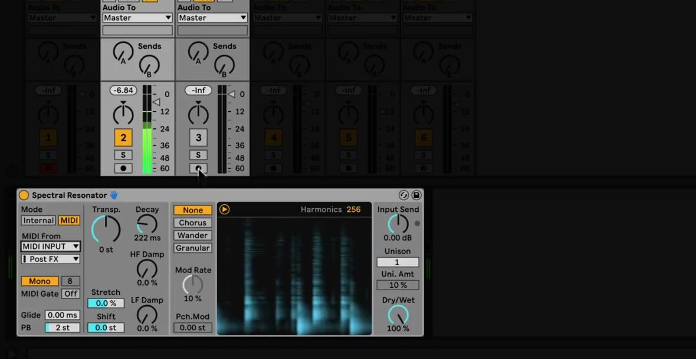

# How to Use Spectral Resonator in Ableton Live

Spectral Resonator applies tuned resonances to an audio signal’s spectrum, allowing rhythmic, vocal, or percussive material to take on a pitched character. Start with an audio track that has a short loop or other clearly audible source, then add the device in Device View. Ableton’s current [Spectral Resonator reference](https://www.ableton.com/en/live-manual/12/live-audio-effect-reference/#spectral-resonator) describes the available controls; the current edition comparison lists the device in Live Suite.

The February 2021 source video demonstrates the device as introduced in Live 11. The core Internal and MIDI pitch workflows remain applicable in Live 12, while Live 12.2 added scale-aware controls and harmonic quantization, which this guide identifies separately.

## Video walkthrough

  <iframe
    src="https://www.youtube.com/embed/iXcN-0oaIKs?rel=0"
    title="Learn Live: Spectral Resonator"
    allow="accelerometer; autoplay; clipboard-write; encrypted-media; gyroscope; picture-in-picture; web-share"
    referrerpolicy="strict-origin-when-cross-origin"
    allowfullscreen>
  </iframe>

## Add Spectral Resonator to an audio track

In the Browser, open **Audio Effects** and add **Spectral Resonator** to the track carrying the sound to be processed. The effect needs incoming audio to excite its resonances, so begin playback before judging its settings. A drum loop, sustained vocal, or harmonically rich instrument gives a clear indication of the effect’s behavior.

Spectral Resonator is currently a Live Suite device. If it is absent from the Browser, confirm the installed edition and that the Browser is not filtering the device list. Work from a modest track level at first; the device’s **Input Send** control includes limiting, and its adjacent indicator lights when that limiter is active.

## Set the resonator’s pitch in Internal mode

Use **Internal** mode when the effect should hold one fixed resonant pitch. Set **Freq** in Hertz or as a note using the mode buttons beneath the control, then listen to the result against the rest of the Set. This establishes the fundamental frequency from which the resonant partials are generated.

Adjust the main frequency-shaping controls one at a time:

- **Harmonics** changes the number of resonant partials. Higher values create a brighter result and use more CPU.
- **Stretch** changes the spacing between harmonics. Negative values compress the spacing, while positive values expand it.
- **Shift** transposes the input spectrum before it reaches the resonator; it does not transpose the resonator’s own pitch.
- **Decay** controls how long each resonance remains audible. Use shorter settings for a more percussive response and longer settings for sustained tones.
- **HF Damp** and **LF Damp** reduce high- or low-frequency partials to shape the balance of the resonant sound.

Start with a lower Harmonics value and a moderate Decay. Raise either only after a useful fundamental pitch is established, since a dense, long-lasting result can make it harder to hear which control is responsible for the change.

## Drive the effect from MIDI notes

Switch to **MIDI** mode when the resonator should follow a melody, bass line, or chord progression. Select a MIDI track in Spectral Resonator’s **External Source** chooser and choose the desired tapping point. That MIDI track can contain a clip, accept a controller, or receive MIDI from elsewhere in the Set.

Use **Mono** for one note at a time, or choose **Poly** to respond to chords. In Poly mode, set the number of voices with **Polyphony**; the current range is two to sixteen voices. More voices divide the available harmonics between them, so reduce the voice count or increase Harmonics if the result becomes thin.

The **MIDI Gate** control determines whether notes are required to activate the effect in Mono mode. With the gate on, the device only resonates while notes play. With the gate off, the audio can continue to excite the selected pitch even between notes. **Glide** applies only in Mono mode, while **PB** sets the range for incoming pitch-bend messages.

## Add movement and width deliberately

The modulation section provides four modes: **None**, **Chorus**, **Wander**, and **Granular**. Chorus applies regular modulation, Wander uses independent random movement for partials, and Granular produces irregular, decaying partial events. Set **Mod Rate** and **Pch. Mod** conservatively before increasing them; a small amount is often enough to make a held resonance feel active.

Use **Unison** to add detuned copies of the resonant partials, then set the detuning amount with **Uni. Amt**. This can thicken an otherwise narrow response, but it also increases density. Compare the effect in the context of the full Set rather than making the source track unnecessarily wide on its own.

## Use Live 12 scale and tuning features when needed

The source video predates Live 12.2. In current Live 12, enable **Use Current Scale** in the device title bar to make Spectral Resonator follow the active clip scale. In Internal mode, the Freq control becomes **SD Shift** and transposes the resonance in scale degrees. In MIDI mode, the Transp. control changes to the same scale-degree control.

The spectrogram also now includes **Quantize**. Enable it to constrain the device’s harmonics to the active scale or tuning system; without an active scale or tuning system, it uses chromatic pitches. Current Live 12 tuning systems also affect the device: Freq in Internal mode and Transp. in MIDI mode use note indices when a tuning system is active. These are current Live 12 behaviors, not controls demonstrated in the Live 11 video.

## Balance the processed and original sound

Use **Dry/Wet** to determine how prominently the resonated signal appears. Bring it up from a low setting while the complete mix plays, and reduce Decay, Harmonics, or Unison before lowering Dry/Wet if the effect becomes overly dense. When Spectral Resonator is on a return track, set Dry/Wet to 100 percent so the return level controls the blend.

Spectral Resonator is especially useful for aligning non-pitched audio with a musical part: place it on a drum or vocal track, drive it from an existing MIDI clip, and then refine its decay and harmonic density to fit the arrangement. For current device details, consult Ableton’s [Spectral Resonator manual section](https://www.ableton.com/en/live-manual/12/live-audio-effect-reference/#spectral-resonator), [Live 12 release notes](https://www.ableton.com/en/release-notes/live-12/), and [edition comparison](https://www.ableton.com/en/live/compare-editions/). For the original Live 11 workflow, see the canonical source video, [Learn Live: Spectral Resonator](https://www.youtube.com/watch?v=iXcN-0oaIKs).
