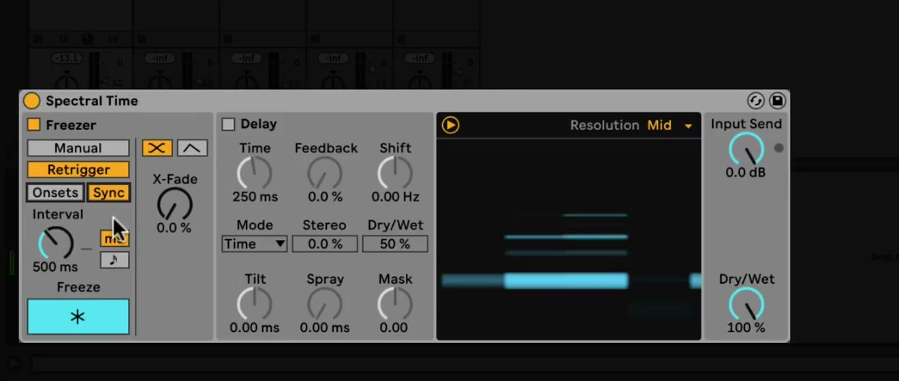
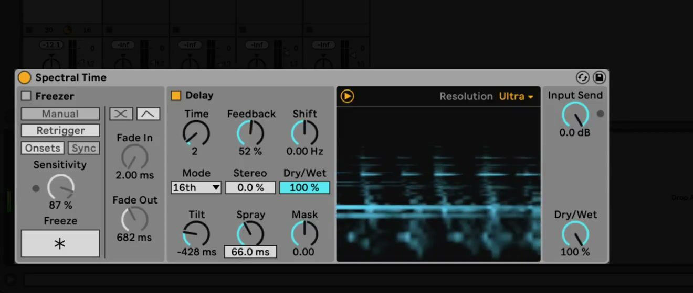

# How to Use Spectral Time in Ableton Live

Spectral Time combines a time-freezing processor with a frequency-based delay. It can sustain a short fragment of incoming audio, repeat spectral information, and reshape that material into rhythmic, metallic, or diffuse textures. Start with an audio track containing a clearly audible loop, vocal, or instrument and add the device in Device View. Ableton’s [Spectral Time reference](https://www.ableton.com/en/live-manual/12/live-audio-effect-reference/#spectral-time) documents the current controls; the current edition comparison lists Spectral Time in Live Suite.

The February 2021 source video shows Spectral Time as a Live 11 device. The current Live 12 manual confirms the same principal Freezer, Delay, Resolution, and global-control workflow, which this guide presents using current labels.

## Video walkthrough

  <iframe
    src="https://www.youtube.com/embed/EBuB6G9ik1A?rel=0"
    title="Learn Live: Spectral Time"
    allow="accelerometer; autoplay; clipboard-write; encrypted-media; gyroscope; picture-in-picture; web-share"
    referrerpolicy="strict-origin-when-cross-origin"
    allowfullscreen>
  </iframe>

## Add the device and establish a starting point

Open **Audio Effects** in the Browser and add **Spectral Time** to the audio track. The device has two main processors: **Freezer**, which captures and sustains part of the incoming signal, and **Delay**, which creates delayed copies of spectral information. Enable either processor independently with its section toggle before adjusting its controls.

Begin with only one processor active and set the global **Dry/Wet** control high enough to identify the processed sound. The spectrogram visualizes the signal over time: dry signal is yellow and processed signal is blue. This makes it easier to relate a setting change to the result instead of relying on a static device display.

## Capture a sound with the Freezer

In **Manual** mode, turn on the Freezer section and press **Freeze** while the source plays. The device captures the current slice of audio and sustains it. Set **Fade In** and **Fade Out** in milliseconds to avoid abrupt starts or ends when the frozen material enters or leaves the mix.

Manual freezing works well when a particular chord, vocal syllable, or drum hit is worth holding. Disable **Delay** while learning this section so that repeated echoes do not obscure the behavior of the frozen signal.

## Re-trigger freezes from onsets or time intervals

Choose **Retrigger** when Spectral Time should make new freezes automatically. In **Onsets** mode, it freezes after each detected transient; increase **Sensitivity** to make the detector respond to quieter transients and reduce it when unwanted triggers occur. In **Sync** mode, it freezes at the interval set by **Interval**, which can be displayed in milliseconds or beat-time values.

Choose a fade shape for the transition between freezes:

- **Crossfade** fades in the new freeze as the previous freeze or dry input fades out. **X-Fade** determines the transition time relative to the Sync interval.
- **Envelope** exposes independent **Fade In** and **Fade Out** controls. It can layer up to eight simultaneous freezes, making it useful for denser, overlapping results.

Use a rhythmic source and a short Sync interval to create repeatable patterns. For a looser response, use Onsets and adjust Sensitivity until the source material triggers the intended events.

## Choose an appropriate processing resolution

The **Resolution** control above the spectrogram determines how accurately Spectral Time processes the incoming signal. Lower values reduce latency, but introduce more artifacts and less fidelity. Higher values sound more detailed and increase overall latency.

Use a lower resolution when monitoring or recording through the effect, where latency is important. Raise it when producing or rendering a sound whose spectral detail matters, then compare the result in the context of the Set rather than only in isolation.

## Build a spectral delay

Enable **Delay** after establishing a useful freeze, or use it on its own. Choose **Time** mode to specify a delay length in milliseconds, or use **Notes** mode to synchronize the delay to the Set. **Feedback** controls how much delayed output returns to the delay input; increase it gradually because repeats can become dense quickly.

Use the spectral-delay controls to change the character of the repeats:

- **Shift** frequency-shifts each successive delay up or down.
- **Tilt** delays high frequencies more at positive values and low frequencies more at negative values.
- **Spray** randomizes delay times across frequencies for a more dispersed result.
- **Mask** limits Tilt and Spray to high frequencies at positive values or low frequencies at negative values.
- **Stereo** adjusts the stereo width of the Tilt and Spray behavior.

The **Dry/Wet** control inside the Delay section affects that section only. Use it to balance the delayed copies before changing the device-wide Dry/Wet control.

## Combine the sections and balance the output

When both sections are on, choose the processing order with **Frz > Dly** or **Dly > Frz**. The first option sends frozen audio into the delay; the second sends delayed material into the freezer. Compare both while a loop plays, since the order changes whether the device sustains a source fragment or a moving network of repeats.

Use **Input Send** to set the gain entering Spectral Time. Then set the global **Dry/Wet** control while listening to the full arrangement. Place Spectral Time on a return track and set global Dry/Wet to 100 percent when the return level should control the blend.

Start by using the Freezer to preserve one useful sound, then add Delay with modest feedback and a small Shift value. That approach makes it easier to identify whether a more pronounced result comes from the captured material, repeat pattern, frequency shift, or global mix. For current device details, see Ableton’s [Spectral Time manual section](https://www.ableton.com/en/live-manual/12/live-audio-effect-reference/#spectral-time) and [edition comparison](https://www.ableton.com/en/live/compare-editions/). For the original Live 11 workflow, see the canonical source video, [Learn Live: Spectral Time](https://www.youtube.com/watch?v=EBuB6G9ik1A).
