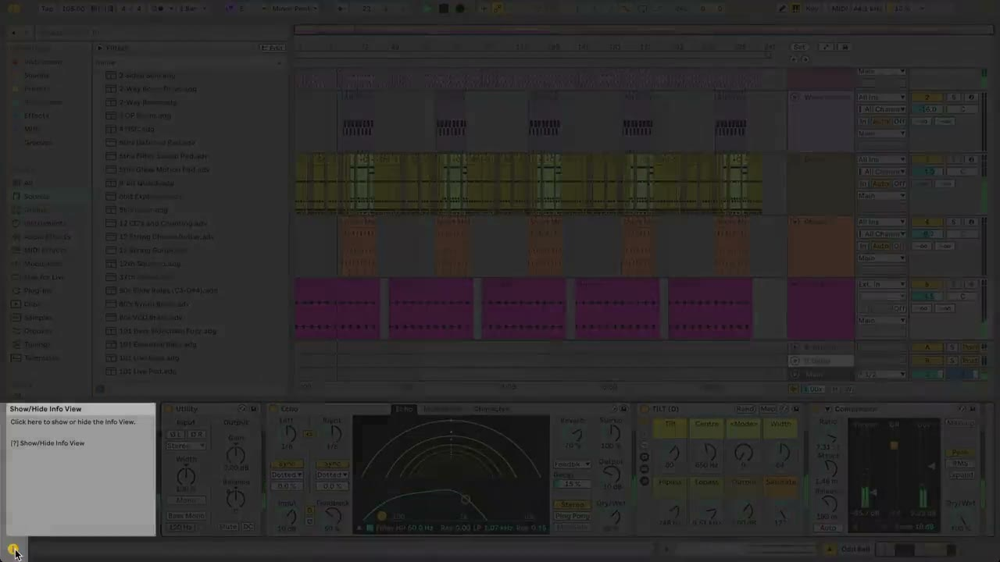
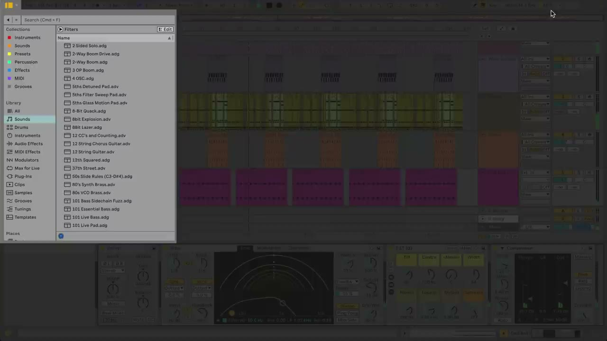
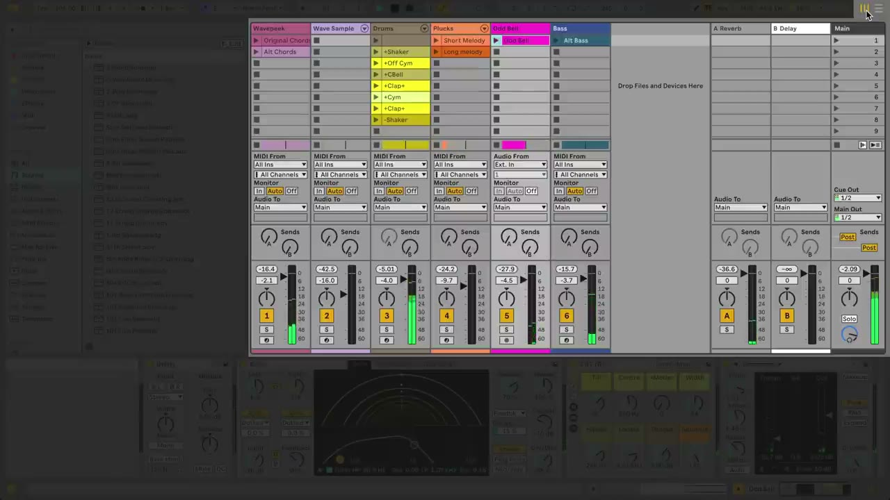
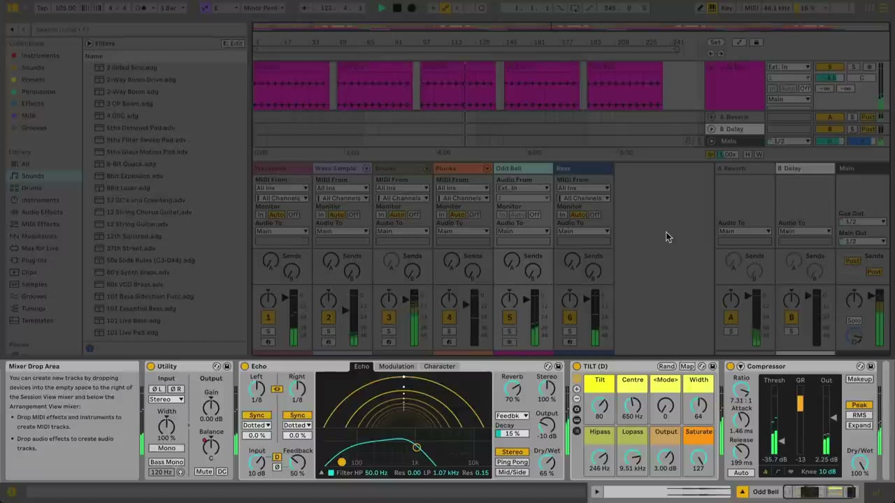
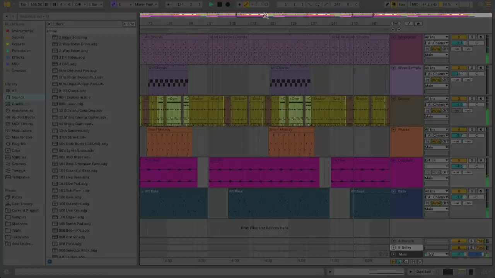

# Ableton Live User Interface Overview

Ableton Live uses a modular workspace. Its panels can be shown, hidden, resized, and rearranged so the window can emphasize the task at hand. This overview identifies the main areas of the Live 12 interface and explains how they fit together.

Open [Ableton Live](https://www.ableton.com/en/live/) with any Set before following along. The interface can look slightly different when panels are hidden, a second window is in use, or the window is narrow.

## Video walkthrough

  <iframe
    src="https://www.youtube-nocookie.com/embed/_XDkA_f8n08?rel=0"
    title="Learn Live 12: Live's user interface"
    allow="accelerometer; autoplay; clipboard-write; encrypted-media; gyroscope; picture-in-picture; web-share"
    referrerpolicy="strict-origin-when-cross-origin"
    allowfullscreen>
  </iframe>

## Start with Info View

Info View is a useful reference when learning Live. Show or hide it with the control in the lower-left corner of the Live window. When it is visible, hover the pointer over a control, panel, or button to see its name, purpose, and—where available—its keyboard shortcut.

Leave Info View open while becoming familiar with the workspace. It provides context without taking you away from the Set you are working on.

## Use the Control Bar for global controls

The Control Bar runs across the top of the window and remains visible as you move between the main views. It contains controls that apply to the current Set rather than to one individual track or clip.

The Control Bar includes:

- Tempo, time signature, metronome, and scale controls.
- The current Arrangement position and the main Play, Stop, and Record controls.
- Recording-related controls, including MIDI overdub, automation arm, Capture MIDI, and Session Record.
- Arrangement looping and punch-in or punch-out controls.
- Draw Mode, the Computer MIDI Keyboard, and Key or MIDI Map modes.
- Sample-rate and CPU-use indicators.

You do not need to adjust every Control Bar section before starting a Set. At minimum, confirm the tempo, time signature, and playback controls before recording or arranging material.

## Open the Browser to find content

The Browser occupies the left side of the Live window. It is where you locate instruments, sounds, audio effects, MIDI effects, Packs, presets, samples, and folders added to Live.

Use the Show/Hide Browser control in the upper-left portion of the Control Bar when you need more space for the main work area. Drag the Browser’s right edge to change its width. The Browser configuration control also exposes options for areas such as Tuning and the Groove Pool.

The Browser is not limited to loading built-in devices. It is also the usual starting point for locating personal samples, saved presets, and other project content.

## Switch between Arrangement View and Session View

The central work area has two main views. Use the view controls at the top right of the Live window, or press `Tab`, to switch between them.

### Arrangement View

Arrangement View lays clips out on a horizontal timeline. Use it to build, edit, and refine a linear song structure. Tracks appear as horizontal lanes, with track headers at the right side of the view in the standard Live 12 layout.

### Session View

Session View organizes tracks as vertical columns. Clips occupy the upper grid, and the Mixer can appear below it. This view is useful for launching clips, trying combinations, and working without committing to a fixed timeline.

The two views are connected through the same Set and tracks. Switching the visible view does not stop playback or change the material that is currently playing.

## Show the Mixer and Detail View

The Mixer is available in both main views. In Session View, it sits beneath the clip grid when visible. Its controls include track volume, panning, solo, mute, record arm, sends, return tracks, and the Main track.

Use the Mixer view control in the lower-right portion of the window to show or hide it. A neighboring control lets you show or hide individual Mixer sections when the full mixer is not needed.

Detail View is also at the bottom of the Live window. It has two primary tabs:

- **Device View** shows the instruments and effects on the selected track.
- **Clip View** shows the contents and settings of the selected audio or MIDI clip.

Use the tabs in the lower-right corner to select a Detail View. When the window has enough space, Live can display Device View and Clip View together, and can stack them with the Mixer.

## Navigate an Arrangement efficiently

Arrangement View has navigation controls above the tracks. The Beat-Time Ruler and Time Ruler provide a reference for the timeline. Hover over the Beat-Time Ruler until the pointer changes to a magnifying glass, then drag to pan or zoom the Arrangement. The `+` and `-` keys also zoom in and out.

At the top of the Arrangement, the Overview shows the complete clip layout. Drag within it to move through the Arrangement or zoom into a smaller region. Drag its lower edge to make the Overview taller or shorter.

Tracks can be folded or unfolded with the controls beside their names. Hold `Alt` on Windows or `Option` on macOS while using a fold control to fold or unfold all tracks at once.

## Set up a practical workspace

Use the interface controls deliberately instead of leaving every panel open. A simple starting arrangement is:

1. Keep Info View visible until the interface is familiar.
2. Open the Browser only while finding or loading content.
3. Use Session View when launching or developing clip ideas, then use Arrangement View when structuring a song along a timeline.
4. Show the Mixer when balancing tracks or checking routing, and hide it when more space is needed for clips.
5. Open Clip View to edit the selected clip and Device View to adjust the selected track’s instruments or effects.

The [Ableton Live 12 reference manual’s Live Concepts section](https://www.ableton.com/en/live-manual/12/live-concepts/) provides current details for each area of the interface. For a walkthrough of the interface shown here, see Ableton’s [Learn Live: Live’s user interface](https://www.youtube.com/watch?v=_XDkA_f8n08) video.
