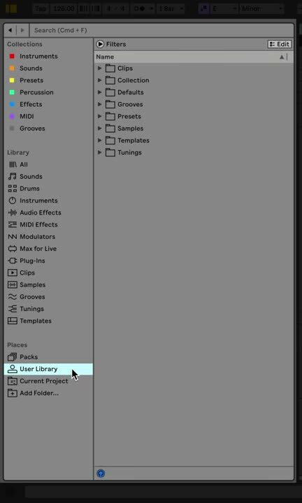

# How to Use Live’s Browser for Sounds, Instruments, and Files

Live’s Browser is where you find installed sounds, devices, presets, Packs, samples, templates, and folders from the computer. Learning its labels, filters, previews, and loading methods makes it faster to turn an idea into a working [Ableton Live](https://www.ableton.com/en/live/) Set.

## Video walkthrough

  <iframe
    src="https://www.youtube-nocookie.com/embed/KcmPBZTwq78?rel=0"
    title="Learn Live 12: Live's Browser"
    allow="accelerometer; autoplay; clipboard-write; encrypted-media; gyroscope; picture-in-picture; web-share"
    referrerpolicy="strict-origin-when-cross-origin"
    allowfullscreen>
  </iframe>

## Show, resize, and read the Browser

Show the Browser with its control at the upper left of Live’s window. You can resize it by dragging its right edge, and use **Full-Height Browser** from the View menu when you need more vertical space.

The Browser has a sidebar on the left and a content pane on the right. The sidebar is organized into **Collections**, **Library**, and **Places**. Select a label in the sidebar to see its contents in the pane.

## Start with Library labels

The **Library** section organizes Live’s included content by type. Typical labels include Sounds, Drums, Instruments, Audio Effects, MIDI Effects, Modulators, Plug-Ins, Clips, Samples, Grooves, Tunings, and Templates. What appears depends on the Live edition, installed Packs, and enabled plug-in formats.

Use **Sounds** when you want a ready-to-play preset. Use **Instruments** when you want to begin with a device and build a sound from its initial state. Open **Audio Effects** or **MIDI Effects** to process the selected track, and use **Samples** to locate audio files.

You can double-click a compatible item to load it to the selected track, press `Enter` for the selected Browser item, or drag it to a track, clip slot, or device chain. Dragging a suitable item into empty space in Session or Arrangement View creates an appropriate new track.

## Use Places for your working content

**Places** provides direct access to content that belongs to you or the current project:

- **Packs** contains Live’s Core Library, installed Packs, and available Pack downloads.
- **User Library** holds saved presets, defaults, clips, grooves, templates, and samples.
- **Current Project** exposes the folder for the open Live project.
- **Add Folder** adds a reference to a selected custom content folder without moving that folder.

Add a discrete sample or sound-library folder rather than an entire drive, Desktop, Downloads folder, or large synchronized folder. Live indexes added folders, and excessively broad locations can make Browser indexing slower.

## Search, filter, and save useful views

Enter text in the Browser search field to narrow the active label. In Live 12, the **Filters** control reveals tags appropriate to the selected category. For example, a search in Sounds can be refined by characteristics or instrument type.

Choose multiple tags in the same group with `Cmd` on macOS or `Ctrl` on Windows. Clear the active filters before moving to a different task so that results do not appear to be missing. If a search-and-filter combination is useful repeatedly, add it as a label to the sidebar.

Collections are another way to mark frequent choices. Add an item to a Collection from its context menu, then rename the Collection to describe its purpose, such as `Favorite drums` or `Starting pads`.

## Preview before loading

Turn on Browser preview, then select a sample, clip, or preset to hear it before placing it in the Set. Live syncs loop previews to the Set when playback is running. Use previewing to reduce trial-and-error, but remember that a preset’s final sound also depends on the selected track, MIDI input, effects, and the Set’s tempo.

Make the Browser a small, intentional library: use Library for supplied content, Places for known locations, tags and search for discovery, and Collections for a short list of favorites. Ableton’s [Working with the Browser manual chapter](https://www.ableton.com/en/live-manual/12/working-with-the-browser/) and [Live 12 Browser guide](https://help.ableton.com/hc/en-us/articles/12927340213660-The-Live-12-Browser) explain the current interface. For the accompanying video, see [Learn Live 12: Live’s Browser](https://www.youtube.com/watch?v=KcmPBZTwq78).
