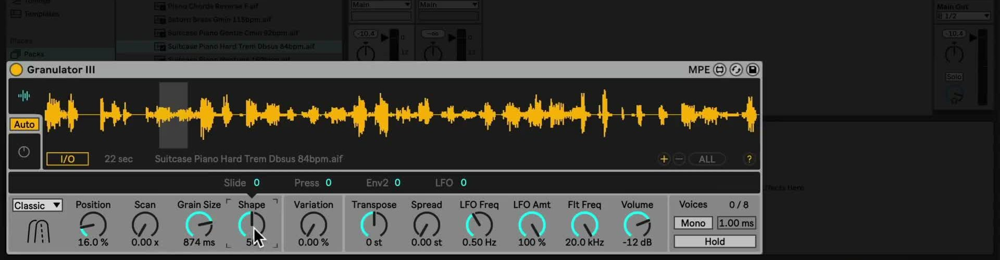
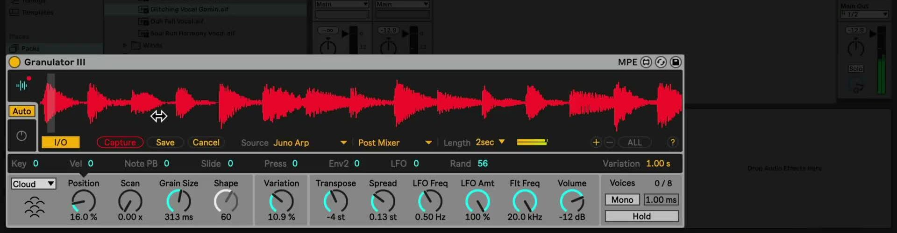

# How to Use Granulator III in Ableton Live

Granulator III is a Max for Live granular synthesizer that turns a sample or captured audio into short, overlapping grains. It is useful for reshaping a phrase into a pad, a drone, a rhythmic loop, or a more abstract texture. Open [Ableton Live](https://www.ableton.com/en/live/) with a MIDI track, a short MIDI clip or controller, and an audio sample to use as source material. Ableton’s [Granulator III Pack page](https://www.ableton.com/en/packs/granulator-iii/) lists Live 12 Standard with Max for Live as the minimum requirement and includes the Pack with Live 12 Suite.

The March 2024 source video covers Granulator III’s initial Live 12 release. The Pack has since received updates, including an LFO Ratio time mode, so this guide distinguishes the video’s original controls from behavior added afterward.

## Video walkthrough

  <iframe
    src="https://www.youtube.com/embed/PqSFu6by6Kk?rel=0"
    title="Learn Live 12: Granulator III"
    allow="accelerometer; autoplay; clipboard-write; encrypted-media; gyroscope; picture-in-picture; web-share"
    referrerpolicy="strict-origin-when-cross-origin"
    allowfullscreen>
  </iframe>

## Install the Pack and load an initial source

If Granulator III is not already available in the Browser, open **Packs** and look in **Available Packs**. Download and install Granulator III, then open its Pack location to find the device, presets, and included samples. Ableton’s current Pack information confirms that Granulator III is a Max for Live device; do not expect it to run in Live 12 Standard without Max for Live.

Add Granulator III to a MIDI track. For a blank starting point, drag a sample from the Browser, Session View, or Arrangement View onto the device’s main display. The source video refers to three parts of the interface: the main display for the sample and synthesis views, the context-sensitive modulation display, and the parameter controls along the bottom. Leave the display in **Auto** mode at first so it follows the control being edited.

## Shape grains in Classic mode

Start in **Classic** mode, which is Granulator III’s most direct granular playback mode. Use a stable, reasonably short source while learning the controls, then hold or loop a MIDI note as you adjust them:

- **Position** chooses the portion of the source sample used by the grains. It can also be changed by dragging in the waveform display.
- **Grain Size** sets how much of the source each grain plays. The played MIDI note still changes playback speed and pitch, so the result is not simply a fixed-duration loop.
- **Scan** moves the playback position through the sample while a note is held. At zero, playback stays at the selected position.
- **Shape** changes the grain envelope. Mid-range values create smoother overlaps; more extreme values produce sharper attacks or ends.
- **Variation** introduces change from grain to grain. Use a small amount before adding other modulation so that the source remains recognizable.

## Tune and balance the instrument

Granulator III plays the source sample across the MIDI keyboard, so a sample whose root pitch is not C may need adjustment. Use **Transpose** and fine tuning as needed, then check the result against another instrument or place Live’s Tuner after Granulator III when exact pitch matters. Do this before designing a detailed sound; changing the source or its tuning later can substantially change the grain behavior.

Use **Spread** to offset the left and right channels and add stereo variation. The filter frequency, LFO amount, and volume controls shape the overall result after the grains are generated. Compare Mono and wider settings in the context of the Set, and use the device’s hold function only when a sustained drone is desired rather than a new note for every grain event.

## Choose Loop or Cloud mode for a different result

Ableton’s current Pack page identifies three granular playback modes. **Loop** is suited to rhythmic material and longer, more conventional sample fragments; its Shape control adjusts the loop crossfade, and its grain controls can expose a reverse-chance option. **Cloud** layers multiple unsynchronized grains for sustained drones and more diffuse textures. In Cloud mode, use Grain Size and Density together to choose how sparse or dense the texture becomes.

Switch modes before making detailed modulation assignments because the same control can behave differently in each mode. Keep the input level and playback volume matched while comparing modes so that a brighter or louder result does not obscure the actual change in grain behavior.

## Add modulation one target at a time

Select a main control to bring up its available sources in the modulation display. Not every parameter exposes the same source set. A practical first patch is a small random amount on **Position**, which lets each new note begin at a slightly different part of the sample. Then add an envelope or LFO to Position, Grain Size, Scan, or filter frequency while listening to a repeating MIDI phrase.

Granulator III also supports per-note MPE control of parameters such as grain position and size. With an MPE controller, use pressure, slide, or note pitch bend as a modulation source and keep the depth modest at first. The interface provides the available sources for the selected target, so use it to confirm that a particular MPE or modulation assignment is supported.

The source video predates the May 2024 Pack update that added **Ratio** as an LFO time mode. Ratio can create FM or AM-style modulation; when it is active, LFO modulation is disabled for grain parameters. Treat that as a current variation rather than a step from the 2024 walkthrough, and consult Ableton’s Pack release notes when the installed device differs from the video.

## Capture live audio as a new source

Granulator III can capture real-time audio in addition to playing files from the Browser. In the source-video layout, open the I/O controls in the sample display, select a track or external input and its tapping point, set a capture length, and trigger **Capture** while the source plays. The captured audio immediately replaces the current source for further granulation.

The original walkthrough also shows **Save** and **Cancel** controls for captured audio. Save a capture when it needs to remain available with the project, and use Cancel if the previous loaded sample should be restored. If labels or control placement differ in the installed Pack, use Info View to confirm the current control; Ableton’s current Pack page confirms the real-time capture capability but does not reproduce every device-panel label.

## Build variations from the source material

The source sample has a large influence on every Granulator III patch. Once a useful balance of position, grain size, scan, and modulation is established, swap in related samples to test the same settings with new material. Save the Set or a device preset before making wider experiments, especially when using live capture or dense Cloud settings.

For current requirements and features, see Ableton’s [Granulator III Pack page](https://www.ableton.com/en/packs/granulator-iii/) and [Packs release notes](https://www.ableton.com/en/release-notes/packs-release-notes/). For the original workflow shown here, see the canonical source video, [Learn Live 12: Granulator III](https://www.youtube.com/watch?v=PqSFu6by6Kk).
