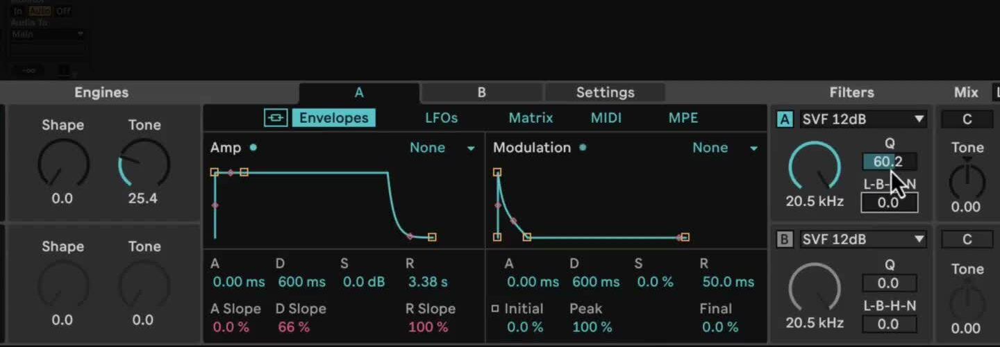
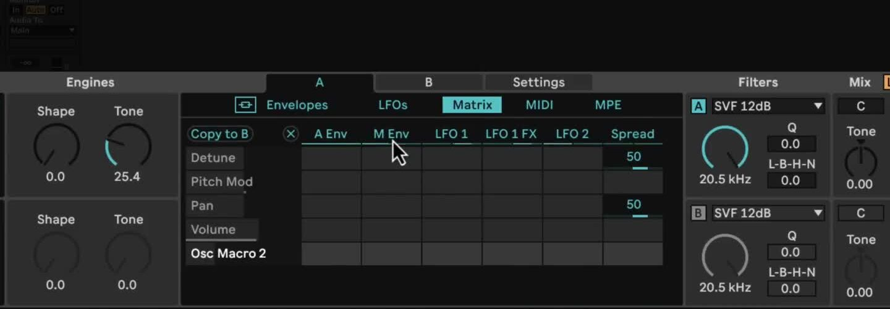

# How to Use Meld in Ableton Live

Meld is Ableton Live 12 Suite's bi-timbral, MPE-capable synthesizer. Its two independent engines can be layered and shaped with their own oscillators, filters, envelopes, and modulation sources. Open [Ableton Live](https://www.ableton.com/en/live/) with a MIDI track and a short MIDI clip or a MIDI controller before following along. Check Ableton's current [edition comparison](https://www.ableton.com/en/live/compare-editions/) first: Meld is available in Live 12 Suite, not Intro or Standard.

The March 2024 source video demonstrates Meld as it shipped with Live 12. Current documentation includes later additions, including the Chord oscillator and the Scrambler LFO 1 effect. Those newer options are noted separately so the video’s original workflow is not mistaken for the complete current feature set.

## Video walkthrough

  <iframe
    src="https://www.youtube.com/embed/CBIOSA8NKz0?rel=0"
    title="Learn Live 12: Meld"
    allow="accelerometer; autoplay; clipboard-write; encrypted-media; gyroscope; picture-in-picture; web-share"
    referrerpolicy="strict-origin-when-cross-origin"
    allowfullscreen>
  </iframe>

## Load Meld and begin with one engine

In the Browser, open **Instruments**, locate **Meld**, and drag it to the MIDI track. Start with a factory preset or Meld's default sound, then play a repeated MIDI phrase while making changes. Leave one engine on and turn the other off initially; isolating one engine makes it easier to hear the result of each control.

Select an oscillator type for the active engine. Each engine has two oscillator macro controls whose names and functions change with the selected oscillator. Set the engine's octave, semitone or scale-degree, and cents controls before adjusting the macros. A filter can be enabled for each engine independently, with its own filter type, cutoff, and type-dependent macros.

Use the Amp envelope to define the sound's duration. Its Attack, Decay, Sustain, and Release values can be adjusted in the graphical display or with the controls beneath it. For a sustained pad, raise Attack and Release; for a short pluck, use a quick attack and shorter decay or release. The Modulation envelope is separate from the Amp envelope, so it can change a target without changing the overall note shape.

## Layer a second engine and set the voice behavior

Turn on the second engine when the first layer has a useful role. Choose a contrasting oscillator or a small pitch offset, then use the Mix section to balance the two layers. Each engine retains its own oscillator, filter, envelopes, LFOs, and matrix assignments. Use **Link Envelopes** when both engines should share amplitude and modulation-envelope changes.

The global **Mono/Poly** switch controls whether Meld plays one note or multiple notes. In Poly mode, choose a voice count from 2 to 12. In Mono mode, **Legato** determines whether a newly played overlapping note continues the existing envelope or retriggers it. Add **Spread** only after it has a useful Matrix assignment, and treat **Stacked Voices** cautiously: every stacked voice duplicates both engines and their processing, so it can raise CPU use substantially.

## Create a focused modulation assignment

Open the **Matrix** tab for the engine you want to edit. Click a control in the device to add it as a Matrix target, then drag vertically in the cell where that target meets a source. Sources are arranged across the top and targets down the side. A small positive or negative depth is usually enough to establish whether the assignment helps the sound.

For a controlled first assignment, use the Modulation envelope or LFO 1 to move an engine's filter frequency. Adjust the Modulation envelope's initial, peak, and final levels to determine how the movement begins and ends. Alternatively, tempo-sync LFO 1 to make the filter repeat with the Set. Remove a target or clear a mapping before adding another one if the result becomes difficult to evaluate.

## Choose the right LFO for the movement

Each engine has two LFOs. **LFO 1** offers Basic Shapes, Ramp, Wander, Alternate, Euclid, and Pulsate waveforms, plus two serial LFO 1 FX slots for more complex motion. **LFO 2** provides straightforward sine, triangle, upward saw, downward saw, rectangle, and random sample-and-hold waveforms.

Set either LFO rate in Hertz for free-running motion or use a tempo-synced value for rhythmic movement. Phase Offset changes where the LFO begins, and **Retrigger** restarts it at that offset with each new note. Treat LFO 1 FX as a separate Matrix source from LFO 1 itself, so an effect-processed shape can drive one target while the original LFO drives another.

## Use MIDI, MPE, and scale-aware controls deliberately

The **MIDI** and **MPE** tabs provide performance inputs for the selected engine. Velocity, pitch, and random note values can be Matrix sources; MPE-capable hardware can also supply note pitch bend, Slide, and Press. Map one source to an obvious target, such as Velocity to an oscillator macro or Press to filter frequency, before building a larger performance setup. If an MPE controller is not available, Live's clip envelopes can still automate those parameters.

Meld can follow Live's current scale when **Use Current Scale** is enabled in its title bar. With scale awareness active, applicable oscillator and filter controls work in the Set's scale, and the engine pitch control changes from semitones to scale degrees. In the **Settings** tab, configure oscillator key tracking, per-engine scale awareness, and glide. With Glide Time above zero, **Glissando** moves between overlapping notes in discrete scale degrees when scale awareness is on; otherwise it moves in semitones.

## Keep later Meld additions separate from the source video

The source video predates some current Meld features. The current manual lists a **Chord** oscillator that layers four sawtooth oscillators, using **Shape** and **Inversion** macros; with Use Current Scale enabled, it follows the Set scale. Current release notes also document the **Scrambler** LFO 1 effect. Explore either option as a separate variation after establishing the original two-engine workflow shown in the video.

## Refine the part in the Set

Build Meld patches in a clear order: establish one engine, layer the second only when it adds a distinct role, then add one modulation or performance assignment at a time. Revisit filter cutoff, Drive, and volume after complex changes so the patch remains balanced in the mix. Save a promising result as a preset before expanding the Matrix or stacked voices further.

For current details, see Ableton's [Live Instrument Reference](https://www.ableton.com/en/live-manual/12/live-instrument-reference/#meld), [Live 12 release notes](https://www.ableton.com/en/release-notes/live-12/), and [Live edition comparison](https://www.ableton.com/en/live/compare-editions/). For the original workflow shown here, see the canonical source video, [Learn Live 12: Meld](https://www.youtube.com/watch?v=CBIOSA8NKz0).
