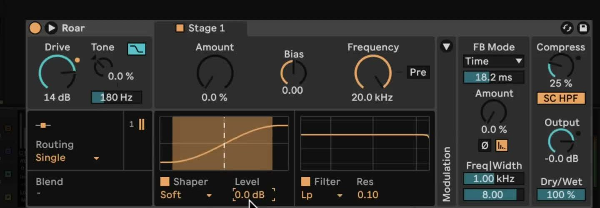
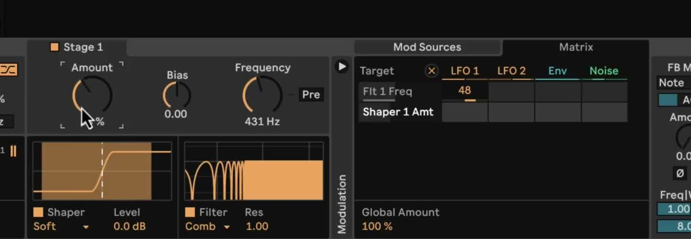

# How to Use Roar in Ableton Live

Roar is Ableton Live 12 Suite's saturation and coloration audio effect. It can add a small amount of harmonic weight, reshape a signal with non-linear shapers, or create heavily modulated feedback effects. Add it to an audio or MIDI track with a clearly audible loop, instrument, or vocal before following along. Confirm that you have Live 12 Suite in Ableton's current [edition comparison](https://www.ableton.com/en/live/compare-editions/), as Roar is not included with Intro or Standard.

The March 2024 source video demonstrates the original Live 12 Roar workflow. Current Live documentation includes additional features, including Delay routing and external audio or MIDI sidechain options. This guide identifies those current options separately rather than treating them as part of the video’s original scope.

## Video walkthrough

  <iframe
    src="https://www.youtube.com/embed/ETzf6O9-6us?rel=0"
    title="Learn Live 12: Roar"
    allow="accelerometer; autoplay; clipboard-write; encrypted-media; gyroscope; picture-in-picture; web-share"
    referrerpolicy="strict-origin-when-cross-origin"
    allowfullscreen>
  </iframe>

## Add Roar and establish a controlled starting point

Open the Browser's **Audio Effects** label, locate **Roar**, and drag it onto the track. A factory preset can provide a useful starting point, but begin by playing the source material and setting the device's **Dry/Wet** control fully wet only while learning the effect. Reduce **Output** before adding substantial Drive or shaping so that louder processing does not appear preferable simply because it is louder.

Keep the device activator available as an A/B check. Turn it off briefly to compare the processed signal with the original at a similar perceived level. Once the basic sound is established, set Dry/Wet to blend the effect with the source when appropriate.

## Shape the input and the first gain stage

Roar's **Drive** control changes the level sent into the gain stages, so it is a quick way to increase or reduce saturation across the device. **Tone** changes the input balance before that processing: positive values emphasize high frequencies and attenuate lows, while negative values do the reverse. **Color Compensation** applies a mirrored version of the Tone filter after the distortion stages, letting the Tone setting influence the saturation without retaining the same overall tonal shift at the output.

For a deliberate first pass:

1. Choose **Single** routing and start with a low Drive value.
2. Turn on the first stage's shaper, choose a curve, and raise **Amount** gradually while the track plays.
3. Use **Bias** only after establishing the basic sound. It offsets the signal and creates asymmetrical distortion; extreme values can make the signal silent.
4. Select a filter type and adjust its cutoff. Enable **Pre** when the filter should shape the signal before the shaper rather than filter the harmonics produced afterward.
5. Match the processed level with **Output**, then set a useful Dry/Wet balance.

The shaper visualization shows where the signal enters the non-linear part of the selected curve. Choose a relatively smooth curve for controlled saturation, then try more extreme curves only after the output is level-matched.

## Choose a routing mode for the job

The original Live 12 workflow in the video includes Single, Serial, Parallel, Multi Band, Mid Side, and Feedback routing. These modes determine how one or more gain stages receive the source signal:

- **Single** uses one stage and is the clearest place to learn the input, shaper, filter, and output controls.
- **Serial** passes Stage 1 into Stage 2. Use **Blend** to move between the sound of Stage 1 and the combined result.
- **Parallel** sends the input to two independent stages. Blend between two contrasting shaper or filter settings without one stage feeding the other.
- **Multi Band** splits the input into Low, Mid, and High bands, each with its own processing. Adjust the two crossover frequencies before changing individual bands.
- **Mid Side** treats the center and sides of a stereo signal separately. Make small changes and compare in mono if the effect is intended for a full mix.
- **Feedback** processes the direct signal and feedback signal separately, which can make Roar behave like an unusual delay or resonator.

The current Roar manual also lists **Delay** routing. In that mode, Stage 2 processes Stage 1's delayed signal, so it can create distorted single repeats, slapbacks, or longer feedback tails. This current option is not demonstrated in the March 2024 video.

## Add movement in the Modulation Matrix

Open Roar's Modulation section to access the **Mod Sources** and **Matrix** tabs. The available sources are LFO 1, LFO 2, the envelope follower, and Noise. In the Matrix, click a device parameter to make it a target, then drag vertically in the intersection with a source to set modulation depth. The **Global Amount** control scales all of the device's matrix assignments at once.

Start with one clearly audible assignment, such as a tempo-synced LFO to a filter cutoff. Set a modest depth, then adjust the LFO's waveform, rate, Morph, or Smooth controls. To make the effect respond to the material itself, assign the envelope follower to a filter frequency or shaper amount and set its threshold, gain, and frequency range. Use the envelope input-listen control when isolating the part of the signal that drives it.

## Use feedback carefully

Roar's feedback feeds processed signal back into the device. Begin with **Amount** close to zero and raise it while monitoring at a comfortable volume. The feedback modes offer free time, tempo-synced values, triplets, dotted values, and a note-based mode. The feedback filter's frequency and width controls limit which part of the signal is recirculated.

When **Feedback Gate** is on, the feedback fades after the input signal stops. Turn it off only when a tail that continues beyond the source is wanted, and be ready to reduce Amount or bypass the device if the result becomes too loud. The device's compressor and its sidechain high-pass filter can help control the feedback path, but they are not a substitute for matching the output level.

## Use the current sidechain options when needed

Current versions of Roar can use an external audio sidechain to drive the envelope follower. Open the device's Sidechain section, enable **External SC**, select a source and tapping point, then adjust Mix and SC Gain. The external audio is a modulation trigger; it does not become audible through Roar simply by increasing SC Gain.

Roar can also take MIDI input to control feedback pitch in Note mode. Enable **MIDI > FB Note**, choose a MIDI source, and use its note data to set the pitch of the feedback. These sidechain workflows were added after the source video, so consult the installed version's controls and the current manual if the device layout differs.

## Refine the result in context

Roar is easiest to control when one processing decision is made at a time: choose a routing mode, shape the tone, then add movement or feedback only if it serves the part. Recheck the output level and Dry/Wet balance after each large change, especially in Multi Band or Feedback modes. Save the result as a preset or use Live's device comparison states when deciding between two variations.

For current details, see Ableton's [Roar reference](https://www.ableton.com/en/live-manual/12/live-audio-effect-reference/#roar), [Live 12 release notes](https://www.ableton.com/en/release-notes/live-12/), and [Live edition comparison](https://www.ableton.com/en/live/compare-editions/). For the original workflow shown here, see the canonical source video, [Learn Live 12: Roar](https://www.youtube.com/watch?v=ETzf6O9-6us).
