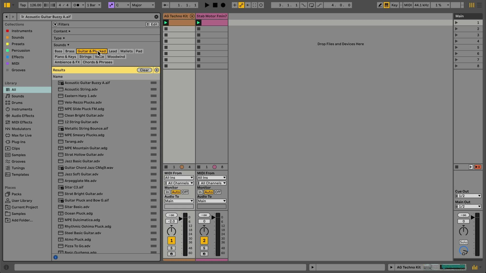
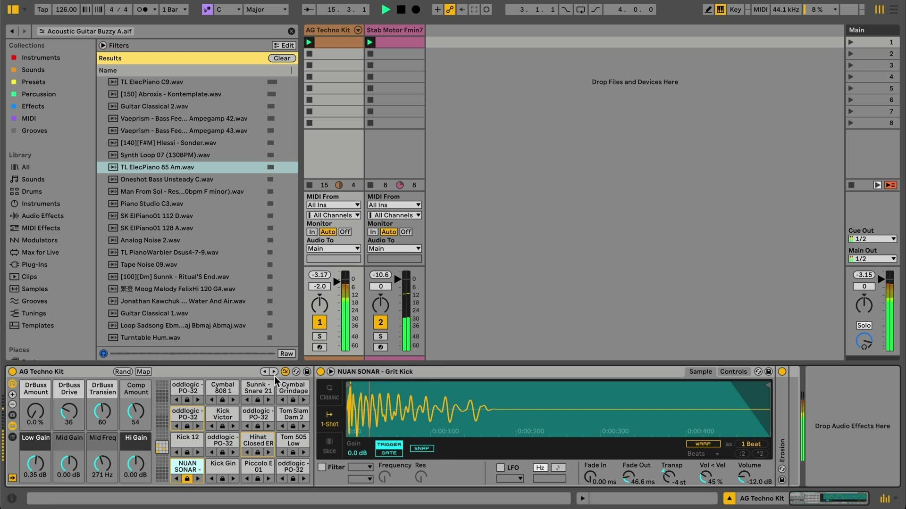

# How to Use Sound Similarity Search in Ableton Live

Sound Similarity Search lets Live suggest Browser content that is related in type and timbre to a selected sound. It is useful when a sample or preset has the right general character but you need an alternative to audition. This guide covers the Live 12 feature shown in Ableton’s Learn Live video. Open [Ableton Live](https://www.ableton.com/en/live/) and show the Browser before following along.

The source video was published with the original Live 12 release. Its interface refers to the control as **Show Similar Sounds**; current Live documentation calls it **Show Similar Files**. The current name and behavior described here take precedence if the installed version differs from the video.

## Video walkthrough

  <iframe
    src="https://www.youtube.com/embed/TF6YD7CFnwY?rel=0"
    title="Learn Live 12: Sound Similarity Search"
    allow="accelerometer; autoplay; clipboard-write; encrypted-media; gyroscope; picture-in-picture; web-share"
    referrerpolicy="strict-origin-when-cross-origin"
    allowfullscreen>
  </iframe>

## Check that the selected content is compatible

Sound Similarity Search is available in Live 12 Intro, Standard, and Suite. It works with audio samples that are 60 seconds or shorter, as well as instrument presets and drum presets that are included with Live’s Core Library or Factory Packs.

The feature also works with personal samples in any folder visible in the Browser. It does not work with user-created device presets or third-party device presets that are not distributed by Ableton. A compatible Browser item shows the Similarity Search icon when selected; a sample longer than 60 seconds does not show the icon.

See Ableton’s current [Live edition comparison](https://www.ableton.com/en/live/compare-editions/) and [Sound Similarity Search FAQ](https://help.ableton.com/hc/en-us/articles/11386675465628-Sound-Similarity-Search-FAQ) for the full availability and content requirements.

## Find similar content in the Browser

Use an existing sample or preset as the reference rather than starting with a broad keyword search.

1. In the Browser, select a compatible sample, instrument preset, or drum preset.
2. Click the **Show Similar Files** icon beside the selected item. Alternatively, right-click the item and choose **Show Similar Files**, or press `Ctrl`-`Shift`-`F` on Windows or `Cmd`-`Shift`-`F` on macOS.
3. Live opens a list of related items in the Browser’s **All** label. The reference item appears in the search field, and the results are ordered from most to least similar.
4. Preview each result, then drag it to a track or device, or double-click it when the intended track or device is selected.

You can apply Browser filters after opening the results to narrow the alternatives further. Treat the ranking as a way to generate candidates, then audition each result in the musical context of the Set.

## Manage background analysis for personal samples

Live analyzes eligible personal samples in the background when they are imported into a Set or added to the User Library or a Browser folder in Places. The Core Library is already analyzed, but a large personal collection can take time before every eligible file is ready for similarity searching.

Check the Status Bar for the similarity-analysis state. Live can show that it is scanning, has work pending, is processing files, is paused, or is done. You can pause and resume the analysis there if needed.

Live analyzes the first two seconds of each eligible sample. You cannot exclude individual folders or files from analysis, but you can disable it globally in **Settings** under **File & Folder** by turning off **Sound Content Analysis**. Re-enable the setting if you later want newly added samples to become available for similarity searches.

## Save a useful similarity-results view

After you have refined a similarity-results list with Browser filters, save it as a custom Browser label if you expect to revisit it. Live remembers the reference sound used for a saved similarity view and restores that reference when you reopen the label.

This is useful for keeping a focused collection of related sounds while you develop a part. It does not create copies of the files or change their locations; it saves the Browser view.

## Swap related samples in Drum Rack and Simpler

Similarity Search also supports replacing samples inside Drum Rack and Simpler. Save the Set or duplicate the device before making a broad swap so that the original combination remains available for comparison.

In **Drum Rack**, turn on the **Show/Hide Sample Swap Buttons** toggle in the device title bar. Live shows controls for cycling all pads to the previous or next similar samples, controls for cycling an individual pad, and an option to lock a pad so it is not changed during an all-pad swap. Hold `Alt` to display these controls temporarily.

In **Simpler**, use **Swap to Previous Similar Sample** or **Swap to Next Similar Sample** beside the Hot-Swap control. You can also press `Ctrl` or `Cmd` with the left and right arrow keys to move through similar samples. Use **Return to Reference** to restore the original sample, or **Save as Similarity Reference** to make the current sample the basis for the next search.

## Use the results to make deliberate variations

Use similarity searching to replace a sound while retaining an intended role in the arrangement: for example, audition a different guitar texture, find an alternative drum hit, or make a new version of a Drum Rack. Compare candidates at matched playback levels and keep the reference sound available until you decide which variation fits the Set.

For current details, see Ableton’s [Sound Similarity Search FAQ](https://help.ableton.com/hc/en-us/articles/11386675465628-Sound-Similarity-Search-FAQ), the [Live 12 release notes](https://www.ableton.com/en/release-notes/live-12/), and the canonical source video, [Learn Live 12: Sound Similarity Search](https://www.youtube.com/watch?v=TF6YD7CFnwY).
