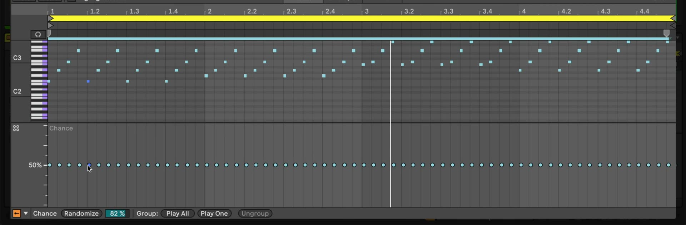

# How to Use Chance Tools and Probability in Ableton Live

Ableton Live 12 can assign a playback probability to individual MIDI notes or to a group of notes. This makes it possible to introduce variation while retaining the same clip structure. Start with a MIDI clip that contains the notes you want to vary, then open it in Clip View. Ableton's [Editing MIDI documentation](https://www.ableton.com/en/live-manual/12/editing-midi/) describes the current Chance Editor and probability-group controls.

## Video walkthrough

  <iframe
    src="https://www.youtube.com/embed/N_icb1Es-b8?rel=0"
    title="Learn Live 12: Chance Tools and Probability"
    allow="accelerometer; autoplay; clipboard-write; encrypted-media; gyroscope; picture-in-picture; web-share"
    referrerpolicy="strict-origin-when-cross-origin"
    allowfullscreen>
  </iframe>

## Show the Chance Editor

Double-click the MIDI clip and select the **Notes** tab in Clip View. Open the **Lane Selector** menu in the Clip Content Toolbar and choose **Chance**. Live adds the Chance Editor below the MIDI Note Editor, where each note has a probability marker.

The editor is hidden by default, so it is useful to leave it open while shaping a pattern. Resize the lower lane if necessary to make the percentage scale and the markers easier to read.

## Set the chance for individual notes

Each marker represents the likelihood that its corresponding MIDI note will play when Live reaches it. Drag a marker up or down to set a value between 0% and 100%:

- **100%** makes the note play every time.
- A lower value makes the note less likely to play.
- **0%** prevents the note from playing without deleting it.

Hovering over a note highlights its marker, which helps when a dense clip contains notes on several pitches. You can also select one or more markers and use the Up and Down Arrow keys to change them in 10% steps; hold `Shift` for finer adjustment. A small triangle in the upper-left corner of a note indicates that its chance is below 100%.

Use individual probabilities for details that can vary independently, such as ghost notes, occasional percussion, or extra notes in a melodic phrase. Keep rhythmic anchors, such as a main kick or snare, at 100% when they need to remain consistent.

## Randomize selected chance values

The **Randomize** control assigns different chance values within a range set by **Randomization Amount**. Select the notes you want to vary, set the amount, and use **Randomize** to generate a new spread of probabilities. A larger amount produces a wider range around each note's current chance; a smaller amount keeps the new values closer to the originals.

When notes are selected, changing the amount can immediately randomize their values. With no notes selected, change the amount first, then use **Randomize** to apply it to the clip. Listen to several repetitions before deciding on a setting: a pattern can sound quite different from one pass to the next even when its visual layout is unchanged.

## Group notes that should behave together

Individual chances are independent. Use a probability group when several notes should share one outcome, such as a complete drum fill or a set of alternate sample triggers.

1. Select the notes to group in the MIDI Note Editor.
2. In the Chance Editor, choose **Play All** or **Play One** in the **Group** controls.
3. Set the group's probability marker to determine how often the group is used.

Live displays a group marker for the selected notes. A diamond identifies a Play All group, while a triangle identifies a Play One group. Selecting any member of a group makes it easier to locate the shared marker.

## Use Play All for optional phrases

Choose **Play All** when every note in the group should either play together or remain silent together. For example, select the notes that make up a one-bar fill and give the group a 65% chance. On each opportunity, Live either plays the full fill or omits it; it does not pick individual notes from that group.

This mode is useful for coordinated events: chord stabs, fills, call-and-response phrases, or layered drum hits that need to stay intact whenever they occur.

## Use Play One for alternatives

Choose **Play One** when the grouped notes are alternatives and only one should play at a time. Stack several notes at the same time position on different Drum Rack pads, group them with Play One, and Live chooses one eligible note at random according to the group's probability.

Use this for alternating percussion samples, different note choices in a chord voicing, or a set of short fills where only one variation should occur. A 100% group chance ensures that one member is chosen whenever the group is reached; reducing the chance also allows the whole group to be skipped.

## Change or remove a probability group

To change an existing group from Play All to Play One, or the reverse, select the group and choose the other group type in the Chance Editor. You can also use the group's context menu. To remove the relationship, select the entire group and choose **Ungroup**; `Ctrl`+`Shift`+`G` on Windows or `Cmd`+`Shift`+`G` on macOS also ungroups selected notes.

After grouping or ungrouping, recheck the markers before playback. Individual-note and group markers represent different playback decisions, so an ungrouped passage may need new individual settings.

## Refine the pattern by listening

Chance settings are evaluated during playback, so audition the clip repeatedly with the rest of the Set. Begin with a few low-probability details rather than changing every note, then use groups where a musical event needs to remain coordinated. This approach preserves a recognizable pattern while allowing it to develop over time.

## References

- [Ableton Live 12 Reference Manual: Editing MIDI](https://www.ableton.com/en/live-manual/12/editing-midi/)
- [Ableton Live 12 Reference Manual: Live Keyboard Shortcuts](https://www.ableton.com/en/manual/live-keyboard-shortcuts/)
- [Learn Live 12: Chance Tools and Probability](https://www.youtube.com/watch?v=N_icb1Es-b8)
