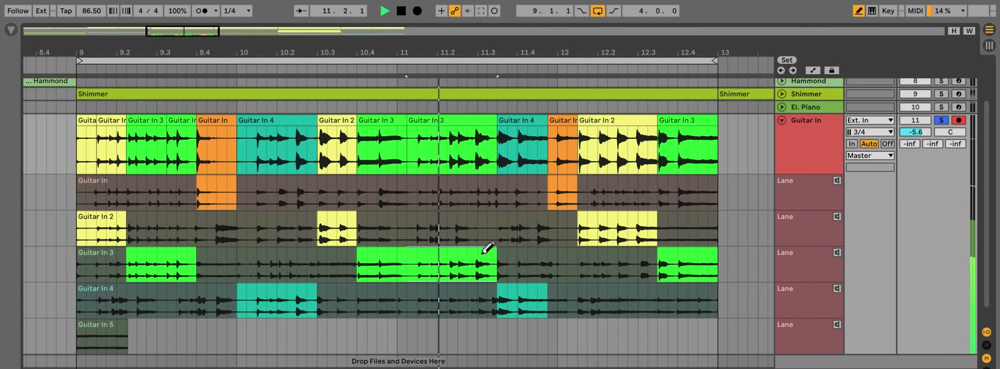

# How to Use Comping in Ableton Live

Comping lets you combine the strongest moments from several audio or MIDI performances into one composite part. In Live 12, comping works in Arrangement View and is available in every edition, including Live Lite. Start with an armed audio or MIDI track and a section of the Arrangement where you can record several passes. Ableton's [Comping documentation](https://www.ableton.com/en/live-manual/12/comping/) describes the current take-lane workflow.

## Video walkthrough

  <iframe
    src="https://www.youtube.com/embed/uSzDKw-GFIU?rel=0"
    title="Learn Live: Comping"
    allow="accelerometer; autoplay; clipboard-write; encrypted-media; gyroscope; picture-in-picture; web-share"
    referrerpolicy="strict-origin-when-cross-origin"
    allowfullscreen>
  </iframe>

## Understand the main lane and take lanes

An Arrangement track has a **main lane**, which is the version heard during normal playback. A track can also contain any number of **take lanes** beneath it. Take lanes hold alternate recordings or clips and are silent unless you audition one.

When material from a take lane is used in the main lane, Live highlights the corresponding source region in the take lane. This makes it possible to see which portions of each performance contribute to the comp.

## Record several takes in Arrangement View

To capture choices for a comp, record into the Arrangement rather than a Session View clip slot.

1. Create or select an audio or MIDI track, choose its input, and arm the track.
2. Set the Arrangement Loop Brace over the passage you want to perform, or set an appropriate punch-in and punch-out range.
3. Start Arrangement recording and perform several passes.
4. Stop recording, then listen to the last pass in the main lane.

While recording new clips in Arrangement View, Live creates take lanes for armed audio and MIDI tracks. Recording over existing material, including loop recording, adds a lane for each new pass. The last recorded clip is copied to the main lane so there is always an immediately audible version to begin with.

## Show and organize take lanes

Open a track header's context menu and choose **Show Take Lanes**, or use the Show/Hide Take Lanes control in the track's main lane. The shortcut is `Ctrl`+`Alt`+`U` on Windows or `Cmd`+`Option`+`U` on macOS.

You can drag lane headers to reorder take lanes, rename them from a lane header's context menu, or resize them by dragging their edges. Take lanes are not visible while Automation Mode is active; showing them exits that mode.

## Audition a take before using it

Click the speaker-shaped **Audition Take Lane** button in a take lane's header to hear it alongside the rest of the Set. Select a take lane and press `T` as a keyboard alternative. Live can audition take lanes on different tracks at the same time, but only one take lane per track.

Audition complete passes first, then narrow the focus to the specific phrase you want to replace. Comparing like-for-like time ranges makes timing, articulation, and tuning differences easier to judge.

## Copy selected passages into the main lane

Select a useful area of a clip in a take lane and press `Enter`. Live copies that selection to the main lane, updating the composite performance without changing the original take. Repeat this for the strongest phrase, note, or gesture from each pass.

For a faster visual workflow, enable Draw Mode with `B`. Drag across material in a take lane to copy that range to the main lane in one gesture. If a time selection already exists in the main lane, click a take lane in Draw Mode to replace the selected portion with the corresponding part of that take.

The clips in the main lane are independent copies. You can edit, move, crop, or consolidate the comp without altering the source clips in its take lanes.

## Refine transitions and compare alternatives

After assembling the comp, treat the clips in the main lane like any other Arrangement clips. Adjust their boundaries so the edit occurs at a natural point, then inspect the transition in context. For adjacent audio clips, add or adjust fades when needed to avoid clicks; Live can also create four-millisecond crossfades automatically when **Create Fades on Clip Edges** is enabled in the Record, Warp & Launch settings.

To replace part of a comp without opening the take lanes, select a clip header or make a time selection, hold `Ctrl` on Windows or `Cmd` on macOS, and press the Up or Down Arrow key. Live substitutes the selected range with the previous or next nonempty take lane.

## Add take lanes manually when recordings are not involved

Take lanes can also organize alternate material that was not recorded in the Set. Select one or more Arrangement tracks and choose **Insert Take Lane** from the Create menu or a track header's context menu. The shortcut is `Shift`+`Alt`+`T` on Windows or `Shift`+`Option`+`T` on macOS.

Drag alternative samples or MIDI files onto the lanes, then use the same auditioning and selection process to build a new phrase. This is useful for comparing different edits, sample choices, or arrangement variations without placing every option in the audible main lane.

## Keep the selected performance editable

Comping is non-destructive: the original takes stay in their lanes while the main lane contains editable copies. Leave take lanes available until the performance is settled, then hide them to return to a compact Arrangement. Reopen the lanes later whenever a different take or alternate phrase is worth comparing.

## References

- [Ableton Live 12 Reference Manual: Comping](https://www.ableton.com/en/live-manual/12/comping/)
- [Ableton Help: Comping in Live FAQ](https://help.ableton.com/hc/en-us/articles/360019092580-Comping-in-Live-FAQ)
- [Ableton Live 12 Reference Manual: Live Keyboard Shortcuts](https://www.ableton.com/en/manual/live-keyboard-shortcuts/)
- [Learn Live: Comping](https://www.youtube.com/watch?v=uSzDKw-GFIU)
