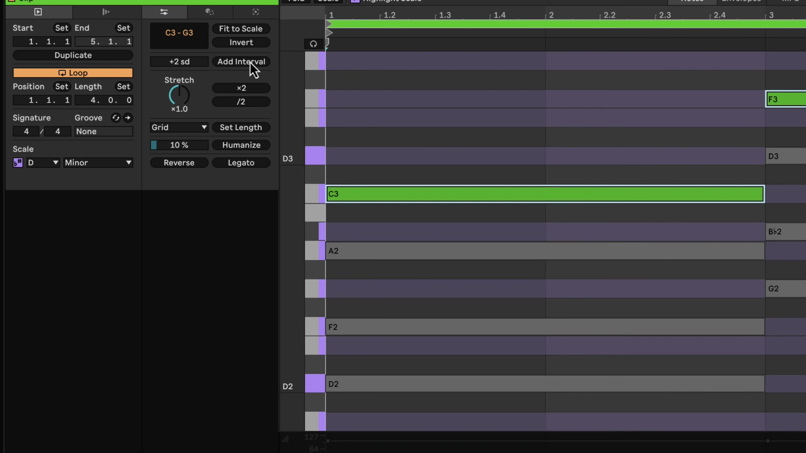
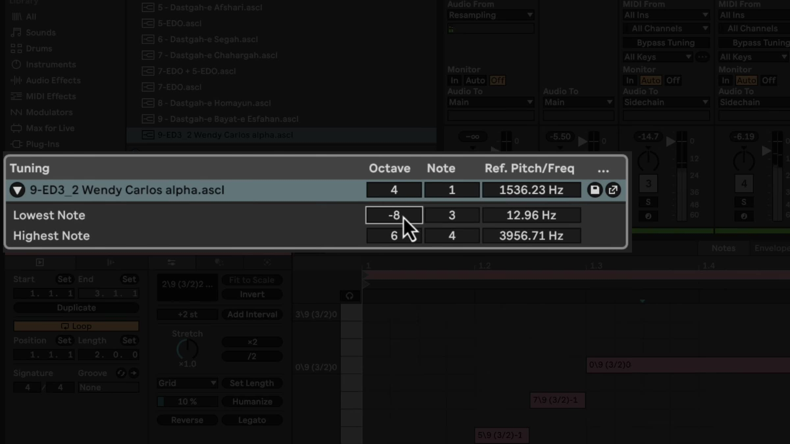

# How to Use Keys, Scales, and Tuning Systems in Ableton Live

Live 12 provides two distinct ways to organize pitch. Scale Mode gives individual MIDI clips a root note and scale that can guide note editing and scale-aware devices. Tuning systems change the pitch structure of the entire Set and can move beyond the default twelve-tone equal temperament (12TET) system. Begin with a MIDI clip and an instrument so you can hear the result as you work. Ableton’s [Scale Awareness documentation](https://www.ableton.com/en/live-manual/12/live-concepts/) and [Tuning Systems documentation](https://www.ableton.com/en/live-manual/12/using-tuning-systems/) describe the current Live 12 behavior.

## Video walkthrough

  <iframe
    src="https://www.youtube-nocookie.com/embed/tDR2AIUaHAE?rel=0"
    title="Learn Live 12: Keys and Scales, Tuning Systems"
    allow="accelerometer; autoplay; clipboard-write; encrypted-media; gyroscope; picture-in-picture; web-share"
    referrerpolicy="strict-origin-when-cross-origin"
    allowfullscreen>
  </iframe>

## Set a key and scale for a MIDI clip

Select a MIDI clip, then enable **Scale Mode** in the Control Bar or in Clip View. Choose its root note and scale name with the adjacent choosers. The Control Bar reflects the selected clip’s scale settings; it is not a global key control for every clip in the Set.

Changes made while a clip is selected apply to that clip. Select multiple clips first when they should receive the same setting. If no clip is selected, the Control Bar’s scale settings establish the scale for subsequently created clips or selected empty clip slots.

Enabling Scale Mode sets a pitch reference, but it does not automatically rewrite the notes already in the clip. Use **Fit to Scale** only when you want Live to change existing notes to match the selected scale.

## Use the scale as a visual and editing guide

With Scale Mode active, use **Highlight Scale** in the MIDI Note Editor to show the scale’s key tracks in purple. Use **Fold to Scale** to display only the key tracks that belong to the selected scale. The keyboard shortcuts are `K` for Highlight Scale and `G` for Fold to Scale while the MIDI Note Editor has focus.

Existing notes outside the scale remain visible when Fold to Scale is on, so they can be reviewed and corrected. Right-click the piano ruler to choose whether pitch names use sharps, flats, or both; the same menu can show MIDI note numbers instead of pitch names.

## Apply the scale to notes and pitch tools

When a scale is active, **Fit to Scale** in Clip View’s Pitch and Time Utilities panel moves the selected notes to the closest scale degree. If no notes or time range are selected, the command affects the entire clip. Use it deliberately: it changes note pitches, unlike Scale Mode’s visual reference.

The same panel’s pitch operations respond to the active scale. For example, **Add Interval** can add notes in scale degrees rather than semitones, which is useful for building scale-consistent chords from a melodic line. The Interval Size control and pitch transformations apply to the current note or time selection; if nothing is selected, button controls apply to the whole clip.

## Make MIDI effects and instruments scale aware

Live’s **Arpeggiator**, **Chord**, **Pitch**, **Random**, and **Scale** MIDI effects have a **Use Current Scale** toggle in their device title bars. When it is enabled, the effect follows the current clip’s active scale and its pitch-related controls use scale degrees instead of semitones.

This can keep generated intervals within the intended harmonic material while you change the clip’s root or scale. It also means that a scale change can alter the pitches produced by a scale-aware device, even if the MIDI notes in the clip have not changed. Meld can also use Live’s scale awareness for its oscillators and filters.

Audition changes in context, especially when several clips are playing. The same root and scale should be set on the clips that need to share a harmonic reference; clips that are not selected are not changed by the Control Bar’s scale controls.

## Load a Set-wide tuning system

Scale Mode describes a conventional pitch collection for a clip. A tuning system instead changes how Live maps pitches across the entire Set. Live uses 12TET by default, while the Core Library includes alternative tuning systems under the Browser’s **Tunings** label.

Show the Browser’s Tuning section from its view control menu if it is not visible. Then double-click a tuning file, or select it and press `Enter`, to load it into the Set. You can also add `.scl` or `.ascl` files to a folder in Live’s Places, or drag an external file into the Tuning section.

Loading a tuning changes the note names shown in the MIDI Note Editor and the pitch each piano-roll position produces. By default, existing note positions stay in place, so their musical pitches can change. The **Retune Set On Loading Tuning Systems** option attempts to preserve the original pitches, but it can modify, shorten, or remove notes when different pitches map to the same note in the new tuning. Save the Set before testing a new tuning system.

Scale Mode controls and the **Use Current Scale** toggles on scale-aware devices are unavailable while a tuning system is loaded. Choose either the clip-scale workflow or the Set-level tuning workflow for the pitch task at hand.

## Adjust tuning settings and track behavior

Expand the triangle beside the loaded tuning’s name in the Tuning section to access its settings. The section shows the tuning name, reference octave and note, **Ref. Pitch/Freq**, and the lowest and highest notes. Changing the reference frequency raises or lowers the Set’s pitch; changing only the reference octave or note updates the displayed frequency without an immediate audible change.

Use the save button to store the current configuration as an `.ascl` file in the Tunings label. Live’s built-in instruments support tuning systems. MPE-enabled plug-ins or external Max for Live instruments can also work when their pitch-bend range is set to 48 semitones; instruments without MPE support or with a different range may play out of tune.

With a tuning loaded, MIDI tracks show **Bypass Tuning** in their I/O section. Enable it only for tracks that should retain 12TET note mapping. Tracks containing Drum Racks bypass the loaded tuning automatically. If a controller layout no longer matches the edited piano roll, use the track’s Tuning MIDI Controller Layout options to choose or configure an appropriate mapping.

## Choose the appropriate pitch workflow

Use Scale Mode when a MIDI clip needs an ordinary musical key, visual scale guidance, or scale-aware pitch processing. Use a tuning system when the Set needs an alternative pitch structure and the instruments and controllers in use are compatible with it.

Start with one clip or a copy of the Set, then listen to every relevant instrument after changing a scale or tuning. This keeps the creative benefit of alternate pitch organization while making pitch changes intentional and reversible.

## References

- [Ableton Live 12 Reference Manual: Live Concepts — Scale Awareness](https://www.ableton.com/en/live-manual/12/live-concepts/)
- [Ableton Live 12 Reference Manual: Editing MIDI](https://www.ableton.com/en/live-manual/12/editing-midi/)
- [Ableton Live 12 Reference Manual: Using Tuning Systems](https://www.ableton.com/en/live-manual/12/using-tuning-systems/)
- [Ableton Help: Keys and Scales in Live 12 FAQ](https://help.ableton.com/hc/en-us/articles/11425083250972-Keys-and-Scales-in-Live-12-FAQ)
- [Learn Live 12: Keys and Scales, Tuning Systems](https://www.youtube.com/watch?v=tDR2AIUaHAE)
