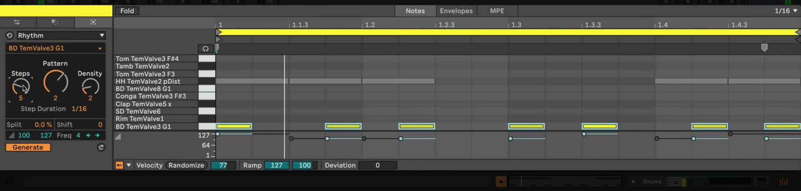

# How to Use MIDI Generators in Ableton Live

Ableton Live 12 MIDI Generators create new notes from musical constraints rather than modifying selected notes. They are useful for developing a rhythmic part, a melodic sketch, or a chord progression directly in a MIDI clip. Begin with a MIDI track that has an instrument or Drum Rack, then open a MIDI clip in Clip View. Ableton’s [MIDI Tools documentation](https://www.ableton.com/en/live-manual/12/midi-tools/) describes the current generator controls and behavior.

## Video walkthrough

  <iframe
    src="https://www.youtube.com/embed/Z9z1QFyVVCo?rel=0"
    title="Learn Live 12: MIDI Generators"
    allow="accelerometer; autoplay; clipboard-write; encrypted-media; gyroscope; picture-in-picture; web-share"
    referrerpolicy="strict-origin-when-cross-origin"
    allowfullscreen>
  </iframe>

## Open the Generate panel and define the target range

Double-click a MIDI clip to show Clip View, select the **Notes** tab, then open the **Generate** panel. Choose a generator from the **Generator Selector**. The native Live 12 generators are **Rhythm**, **Seed**, **Shape**, and **Stacks**.

Generators create notes in the selected time range. If there is no time selection, they use the clip loop instead. Plan the target area before generating: notes that do not overlap the result remain alongside it, but existing notes that overlap generated notes are replaced. Use an empty clip or a short time selection when you want to explore without affecting the rest of an arrangement.

## Preview settings with Auto Apply or apply deliberately

The **Generate** button is the generator’s Auto Apply switch. It is enabled by default, so changes to a generator’s parameters immediately update the notes in the target range. This makes it practical to listen while adjusting a pattern, pitch range, density, or rhythm.

Turn Auto Apply off when you want to adjust controls without changing the clip. Turning it off restores the notes to their original state. Then press **Apply** to create notes using the current settings, or use `Ctrl`+`Enter` on Windows or `Cmd`+`Enter` on macOS. Apply again to produce another result where the generator includes randomness.

Use Live’s Undo and Redo commands to reverse or restore generated MIDI notes. The **Reset** button resets the selected generator’s parameters only; it does not restore notes that have already been generated.

## Generate a beat with Rhythm

Choose **Rhythm** for repeating note patterns and Drum Rack parts. Select the target pitch or drum pad with the **Pitch** control. You can also hold `Alt` on Windows or `Option` on macOS and click a piano-ruler key or Drum Rack pad to select it.

Start with the following controls:

- **Steps** sets how many steps make up the pattern, up to 16.
- **Density** sets how many of those steps contain notes.
- **Pattern** changes the placement of those notes; the available patterns depend on the Steps and Density settings.
- **Step Duration** controls how often the pattern repeats across the selected time range.

Use **Shift** to move the result earlier or later in time, then set velocity and accent behavior to give the part an appropriate dynamic shape. The **Split** control introduces a probability that a step will be divided into equally sized notes. Begin with a single pad, such as a hi-hat or kick, and generate separate patterns for other pads so each part remains easy to refine.

## Constrain random ideas with Seed

**Seed** generates random notes within selected pitch, duration, and velocity ranges. Set the **Minimum** and **Maximum Pitch** controls, or drag the Pitch Range handles, to define the register. When a clip scale is enabled, pitch-related controls use scale degrees, which keeps the generated notes within that scale.

Set duration and velocity ranges next, then use **Voices** to limit the maximum number of simultaneous notes and **Density** to control the overall amount of generated material. Reapply Seed until the result is useful, then edit or delete individual notes as needed. A narrow pitch range and modest density are a reliable starting point when a generated part needs to leave space for other instruments.

## Draw a melodic contour with Shape

**Shape** generates a sequence whose pitches follow a contour. Choose a preset from the Shape Presets menu or draw directly in the Shape display. Define the register with the minimum and maximum pitch controls, then set the amount of material with **Density**.

Use **Rate** to set the minimum note length. **Tie** determines the probability that a generated note will extend into the next note, and **Jitter** introduces random pitch deviation while keeping notes inside the chosen pitch range. Shape is useful when a line needs an overall rise, fall, arc, or custom contour without manually placing every note.

## Build scale-aware chords with Stacks

Choose **Stacks** to add individual chords or produce a chord progression. It fills the selected time range or the clip loop when no range is selected. Use the Chord Selector Pad to choose a chord pattern; Live shows details for the hovered pattern in the Status Bar.

Set the clip scale before generating if the progression should follow a particular key. Stacks uses that scale for its chord decisions, so changing the clip’s root or scale changes the harmonic context. Apply it to an empty range first, then adjust chord durations, offsets, roots, or inversions in the MIDI editor when the progression needs further shaping.

## Extend the selection with Max for Live generators

Live Standard and Suite include **Euclidean**, a Max for Live generator that creates Euclidean rhythms for up to four voices. It can assign each voice a pitch or Drum Rack pad, then use its steps, density, division, and rotation controls to shape the result.

Native generators are built into Live and their internal properties cannot be edited. Suite, or Standard with the Max for Live add-on, can also use, edit, or build compatible third-party Max for Live MIDI Tools. To make a third-party generator appear in the Generate panel, save its `.amxd` file in `User Library/MIDI Tools/Max Generators` or in a folder available through Live’s **Places** section.

## Turn generated notes into an arrangement

Treat each result as MIDI material, not a fixed performance. Listen to it with the other tracks, then make ordinary note edits, adjust velocity, or generate only a smaller time range. Duplicating a clip before a broad experiment provides a quick comparison point.

Generators work best when their constraints serve an arrangement: use Rhythm for a defined pulse, Seed for constrained variations, Shape for a clear contour, and Stacks for a harmonic starting point. Once an idea fits, continue editing it as any other MIDI clip.

## References

- [Ableton Live 12 Reference Manual: MIDI Tools](https://www.ableton.com/en/live-manual/12/midi-tools/)
- [Ableton Live 12 Reference Manual: Clip View](https://www.ableton.com/en/live-manual/12/clip-view/)
- [Ableton Help: MIDI Tools and Device Updates in Live 12 FAQ](https://help.ableton.com/hc/en-us/articles/11535349458588-MIDI-Tools-and-Device-Updates-in-Live-12-FAQ)
- [Learn Live 12: MIDI Generators](https://www.youtube.com/watch?v=Z9z1QFyVVCo)
