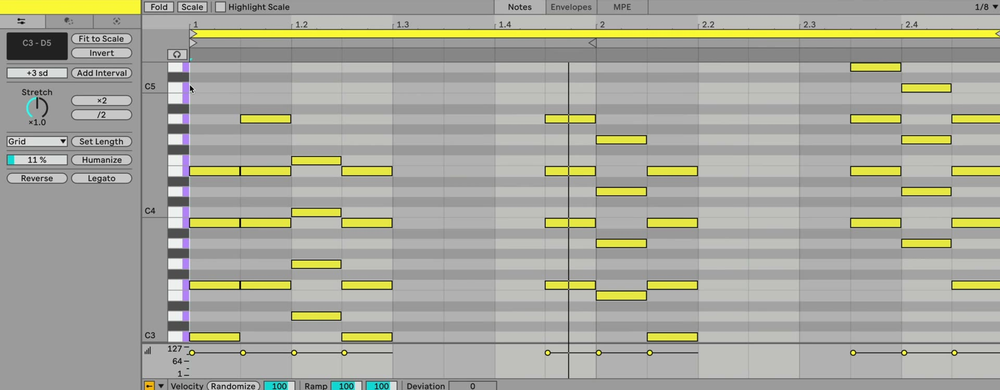

# How to Use MIDI Pitch and Time Tools in Ableton Live

Ableton Live 12’s Pitch and Time Utilities change existing MIDI notes without requiring manual edits to every note. Start with a MIDI clip on a track that has an instrument, then use the MIDI Note Editor to target the notes or time range you want to change. Ableton’s [Editing MIDI documentation](https://www.ableton.com/en/live-manual/12/editing-midi/) describes the current Live 12 controls and their behavior.

## Video walkthrough

  <iframe
    src="https://www.youtube.com/embed/GdBsL1X5AOI?rel=0"
    title="Learn Live 12: MIDI Pitch and Time"
    allow="accelerometer; autoplay; clipboard-write; encrypted-media; gyroscope; picture-in-picture; web-share"
    referrerpolicy="strict-origin-when-cross-origin"
    allowfullscreen>
  </iframe>

## Open Pitch and Time Utilities

Double-click a MIDI clip to show Clip View, then select the **Notes** tab to open the MIDI Note Editor. In Clip View’s MIDI tools area, open the **Pitch and Time Utilities** tab. Its controls are grouped by pitch, timing, note duration, and variation, so it is useful for trying a broad musical change before refining individual notes.

## Choose the notes that a tool will affect

The utilities are selection-aware. Drag across notes to select them, or drag in an empty part of the MIDI Note Editor to select a time range. Most button controls then change only that selection. If no notes or time range are selected, the buttons apply their operation to the entire clip.

Use this behavior deliberately. For example, select only the final bar before applying **Reverse**, or clear the selection when you want to rework a complete pattern. Clip-wide actions are still reversible with Live’s Undo command, but a focused selection makes it easier to compare a new idea with the surrounding material.

## Change pitch without redrawing notes

Use the **Transpose** control to move selected notes or a selected time range up or down. Enter or drag to set the amount in semitones. When the clip has Scale Mode enabled, the control works in scale degrees instead, which can preserve the clip’s selected scale.

If Scale Mode is active, **Fit to Scale** moves notes in the selection to the nearest degree in the clip’s scale. In the event of an equal choice above and below a note, Live uses the lower scale degree. The button is unavailable until a scale is active, so choose the clip’s root and scale first when this is the intended result.

Use **Invert** to flip the pitch shape of a melody vertically: high notes become low and low notes become high. With a clip scale active, Live calculates the inversion using the scale’s degrees. This is a pitch operation, not the separate **Invert Selection** command that changes which notes are selected.

To build harmony from a line, set an **Interval Size** and use **Add Interval**. With notes already selected, changing Interval Size immediately creates and selects the added notes. With nothing selected, choose the interval first, then press Add Interval to add it above every note in the clip. The interval is measured in semitones unless the clip uses Scale Mode, in which case it is measured in scale degrees.

## Reshape the timing of a phrase

The **Stretch** factor changes the duration of selected notes. Use the **×2** and **/2** buttons for immediate doubling or halving of the selected note duration, time selection, or loop region. The Stretch factor itself does not change the loop region’s length, so use the buttons or edit the loop directly when the clip loop must change.

For a more visual alternative, select several notes or a time range in the MIDI Note Editor and drag its Note Stretch markers. Live scales the notes proportionally in time, including their relative spacing. This is useful when a phrase should occupy more or less time while retaining its internal rhythm.

## Set consistent note lengths

Use the **Duration** chooser and **Set Length** button to give selected notes one common duration. The chooser can use the current grid, fit notes to the selected time range, or apply one of Live’s available note values. Press Set Length only after checking the target: with no selection, it changes the length of every note in the clip.

This is useful after creating chords with Add Interval or after recording notes of uneven lengths. When a phrase needs connected notes instead, select the relevant notes and press **Legato**. Each note is extended or shortened to reach the next note’s start; the final selected note extends to the end of the clip loop.

## Add variation or reverse a pattern

Set a value with **Humanize Amount**, then press **Humanize** to vary note start times. At 100%, each offset can be as much as one quarter of the current grid division before or after the original position. Begin with a low amount and listen in context, particularly when the clip already contains intentional timing offsets.

Press **Reverse** to mirror the order of notes in the selection horizontally in time. When nothing is selected, it reverses the entire clip. Reverse changes note positions rather than playing the original phrase backward, so audition the result after applying it, especially where notes overlap or have different durations.

## Review the result and retain control

Pitch and Time Utilities make direct edits to MIDI notes. Play the clip with its instrument and adjacent clips, then undo and try a smaller selection or different setting if the change does not serve the arrangement. Saving a version of the Set or duplicating a clip before a large, clip-wide experiment also makes comparisons straightforward.

Use these controls as fast starting points: transpose or fit a phrase, create intervals, reshape the rhythm, then refine the few notes that still need individual attention. This keeps broad changes efficient while preserving deliberate musical decisions.

## References

- [Ableton Live 12 Reference Manual: Editing MIDI](https://www.ableton.com/en/live-manual/12/editing-midi/)
- [Ableton Live 12 Reference Manual: Clip View](https://www.ableton.com/en/live-manual/12/clip-view/)
- [Ableton Live 12 Reference Manual: Live Concepts — Scale Awareness](https://www.ableton.com/en/live-manual/12/live-concepts/)
- [Learn Live 12: MIDI Pitch and Time](https://www.youtube.com/watch?v=GdBsL1X5AOI)
