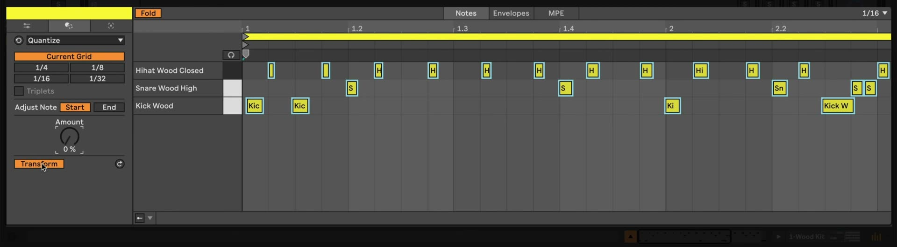

# How to Use MIDI Transformations in Ableton Live

Ableton Live 12 MIDI Transformations reshape notes that are already present in a MIDI clip. They can tighten timing, change articulation, connect a phrase, alter chord timing, or rearrange note properties while keeping the work in the MIDI Note Editor. Start with a MIDI clip containing notes and select the notes or time range you intend to change. Ableton’s [MIDI Tools documentation](https://www.ableton.com/en/live-manual/12/midi-tools/) describes the current transformation tools and their behavior.

## Video walkthrough

  <iframe
    src="https://www.youtube.com/embed/E5rHIzm8sck?rel=0"
    title="Learn Live 12: MIDI Transformations"
    allow="accelerometer; autoplay; clipboard-write; encrypted-media; gyroscope; picture-in-picture; web-share"
    referrerpolicy="strict-origin-when-cross-origin"
    allowfullscreen>
  </iframe>

## Open the Transform panel and choose a target

Double-click the MIDI clip to open Clip View, select the **Notes** tab, then open the **Transform** panel. Choose a tool from the **Transformation Selector**. Transformations use existing MIDI notes as input: they affect a note selection, a time selection, or the clip loop when neither selection is active. The original notes in that target are replaced by the transformed notes.

Choose the target before selecting a transformation. For example, select only a hi-hat row before adding ornaments, a short passage before changing its timing, or the entire loop before rearranging a pattern. This makes it easier to test an idea without changing the rest of the clip.

## Preview changes or apply them manually

**Auto Apply** is active by default in a MIDI Transformation. While it is on, moving a parameter updates the result immediately in the MIDI Note Editor. This is useful for listening to a timing, articulation, or pattern change as it develops.

Turn off Auto Apply when you want to configure a tool before changing the notes. Live restores the original notes when the control is turned off. Then press **Apply** to commit the current settings, or press `Ctrl`+`Enter` on Windows or `Cmd`+`Enter` on macOS. Standard Undo and Redo commands can reverse or restore resulting MIDI notes; the tool’s **Reset** control only restores that tool’s parameters.

## Match the transformation to the musical task

The Transformation Selector contains tools for different kinds of edits. This compact guide can help identify a useful starting point.

| Goal | Transformation | Useful starting controls |
| --- | --- | --- |
| Tighten or reshape timing | **Quantize**, **Chop**, **Time Warp** | Grid value and Amount; note divisions; speed curve |
| Fill or develop a melodic line | **Connect**, **Arpeggiate** | Density, Rate, Tie; Style, Distance, Steps |
| Change note articulation | **Ornament**, **Span**, **Strum** | Flam/Grace Notes; legato/tenuto/staccato; strum offsets and tension |
| Rearrange an existing idea | **Recombine** | Position, pitch, duration, or velocity; Shuffle, Mirror, or Rotate |
| Add MPE expression | **Glissando**, **LFO** | Pitch bend curve; pitch bend, slide, or pressure modulation |

Use one transformation at a time when learning the tools. Each result remains editable MIDI, so you can follow a broad transformation with smaller manual corrections or another focused transformation.

## Tighten, divide, or stretch timing

Use **Quantize** to move note starts, ends, or both toward the current grid or a chosen rhythmic value. Its **Amount** control allows partial quantization, which can retain some of the original timing. This makes it suitable for correcting an uneven performance without making it completely rigid.

**Chop** divides selected notes into parts according to its division pattern. It can create quick rhythmic subdivisions from sustained notes or introduce intentional gaps and variations.

Use **Time Warp** when a selection needs a gradual change in note spacing, such as an accelerando or ritardando. Shape its speed curve in the display, then enable **Quantize** if the result should align to the grid. **Preserve Time Range** keeps the transformed result within the original selected span; **Include Note End** makes original note endings part of the calculation.

## Add movement and articulation to notes

**Connect** fills the gaps between existing notes with interpolated notes. Set **Rate** for the new notes’ length, **Density** for how much empty space is filled, **Spread** for their pitch variation, and **Tie** when notes should extend into one another. It is useful for turning sparse melody or chord material into a more active line.

**Ornament** adds detail at the beginning of selected notes. **Flam** adds one extra note, while **Grace Notes** adds several. Their position controls decide whether the ornament precedes or replaces the start of the original note; velocity and pitch settings determine how the embellishment relates to it.

For note lengths, **Span** offers legato, tenuto, and staccato articulation types. Use **Offset** to lengthen or shorten notes and **Variation** for randomized length changes. For chords, **Strum** offsets individual note starts with low and high strum controls; **Tension** curves the spacing between those notes rather than leaving it even.

## Rework patterns with arpeggiation and recombination

**Arpeggiate** redistributes selected notes into a pattern. Choose a **Style**, then use **Distance** and **Steps** to set the transposition pattern, while **Rate** and **Gate** control the timing and duration of the new notes. When a clip scale is enabled, pitch-related controls use scale degrees instead of semitones.

**Recombine** rearranges the position, pitch, duration, or velocity values among the selected notes. Choose the property to reorganize, then use **Shuffle** for a random permutation, **Mirror** to reverse the value order, or **Rotate** to move values through the selection. It can produce variations while retaining a familiar outline; for example, leave note positions in place while recombining pitches or velocities.

## Use MPE and Max for Live transformations when appropriate

**Glissando** and **LFO** are MPE MIDI Transformations. Glissando adds pitch-bend curves between successive notes, while LFO can apply a shaped modulation to pitch bend, slide, or pressure. View their resulting expression data in the MIDI Note Editor’s **MPE** view mode or its corresponding expression lanes.

**Velocity Shaper** is a Max for Live transformation included with Live Standard and Suite. It uses an adjustable envelope to set selected-note velocities. Live Suite, or Live Standard with the Max for Live add-on, can also use compatible third-party Max for Live MIDI Tools saved in the User Library or a folder available through **Places**.

## Refine the result in context

Audition each transformation with the other clips in the Set. If a result changes too much, undo it and reduce the scope, adjust the amount, or use a smaller time selection. Keep a duplicate clip when comparing contrasting rhythmic or harmonic variations.

Transformations are most effective as deliberate edits to existing material: use Quantize to control a performance, Ornament or Span to shape articulation, Time Warp or Strum to change motion, and Recombine or Arpeggiate to make structured variations. The generated result remains ordinary MIDI that can be edited note by note.

## References

- [Ableton Live 12 Reference Manual: MIDI Tools](https://www.ableton.com/en/live-manual/12/midi-tools/)
- [Ableton Live 12 Reference Manual: Clip View](https://www.ableton.com/en/live-manual/12/clip-view/)
- [Ableton Help: MIDI Tools and Device Updates in Live 12 FAQ](https://help.ableton.com/hc/en-us/articles/11535349458588-MIDI-Tools-and-Device-Updates-in-Live-12-FAQ)
- [Learn Live 12: MIDI Transformations](https://www.youtube.com/watch?v=E5rHIzm8sck)
