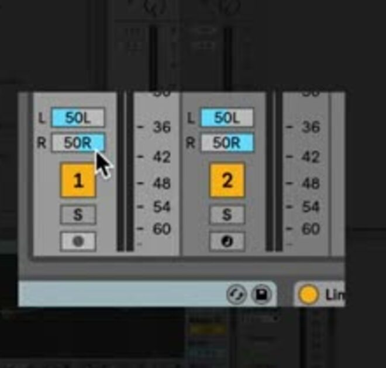

# How to Pan Tracks in Ableton Live

Panning positions a track’s output across the left and right channels of a stereo mix. It can help distinguish parts that occupy a similar frequency range, while volume continues to determine their relative level. Open [Ableton Live](https://www.ableton.com/en/live/) with several audible tracks and listen through a stereo speaker setup or headphones before following along.

## Video walkthrough

  <iframe
    src="https://www.youtube.com/embed/-g9qyHVSd_k?rel=0"
    title="Learn Live: Panning"
    allow="accelerometer; autoplay; clipboard-write; encrypted-media; gyroscope; picture-in-picture; web-share"
    referrerpolicy="strict-origin-when-cross-origin"
    allowfullscreen>
  </iframe>

## Find the Pan control in the Mixer

The **Pan** control is part of each track strip in Live’s Mixer. Show the Mixer with its lower-right view control in either Session View or Arrangement View. In Session View, the track strips appear below the clip grid; in Arrangement View, they appear below the tracks when the Mixer is visible.

The Pan control is applied to the selected track’s output after its devices, so it changes playback positioning without editing the clip or device preset. Its treatment of the left and right channels depends on the active pan mode.

Start playback, then adjust a track’s Pan control while listening to the whole mix. Double-click the control to reset it to its default center position. When several tracks are selected, adjusting one track’s Pan control adjusts the others as well, so deselect unrelated tracks before making an individual change.

## Use the default Stereo Pan Mode

**Stereo Pan Mode** is Live’s default. Its single Pan control balances a track’s output toward the left or right speaker: moving it in one direction increases the level of that side and decreases the level of the other side. At the center position, both sides retain their normal level relationship.

This is a straightforward choice for placing a mono sound, such as a single percussion hit or a vocal recording, in the stereo field. It is also useful for changing the balance of a stereo source, but it does not independently reposition the source’s left and right channels.

Use small movements first, then listen with the rest of the Set playing. A hard-left or hard-right setting can be appropriate for a deliberate contrast, but it removes the track from the opposite channel entirely.

## Position the left and right channels independently

Use **Split Stereo Pan Mode** when a stereo track needs separate control of its left and right channels. Right-click the track’s Pan control and choose **Split Stereo Pan Mode**. The single control changes to separate left and right sliders.

Move either slider to position that channel without changing the level of the other channel. This is useful when a stereo recording, layered instrument, or two-channel source needs a different width or placement while preserving independent control over its channels. To return to the normal single-control behavior, use the Pan control’s context menu and choose **Stereo Pan Mode**.

The source video calls these modes Balance and True Stereo panning. In current Live 12 documentation and the context menu, they are named Stereo Pan Mode and Split Stereo Pan Mode.

## Pan as part of a level-balanced mix

Panning is most useful after a basic level balance is in place. Adjust track volume first, then use Pan to give different parts distinct positions without making one track seem louder merely because it moved closer to one speaker.

A practical pass is to keep the essential elements at or near the center, move only the parts that benefit from separation, and compare the result with the full mix playing. Check both speakers or headphones after each meaningful change. When the mix might be played in mono, also check that the important material remains clear after the left and right channels are combined.

Panning does not replace routing, effects, or level adjustment. If a part remains difficult to hear after a sensible Pan adjustment, examine its level, frequency content, arrangement, and processing rather than continuing to move it farther to one side.

## Check and reset panning choices

When revisiting a Set, look at the Mixer’s Pan controls before assuming that a track is centered. A nonzero setting may be intentional, may have been copied with a track, or may have been changed while several tracks were selected. Double-click a Pan control to restore its default center position, then decide whether the track needs a new placement.

Use Stereo Pan Mode for ordinary left-to-right balancing and Split Stereo Pan Mode only when independent channel placement is required. Make final panning decisions while listening to the complete arrangement, rather than to a soloed track alone.

For current details, see Ableton’s [Mixing](https://www.ableton.com/en/live-manual/12/mixing/), [Split Stereo Pan Mode](https://help.ableton.com/hc/en-us/articles/360000103324-Split-Stereo-Pan-Mode), and [Live Manual](https://help.ableton.com/hc/en-us/articles/206769450-Live-Manual). The source walkthrough is Ableton’s [Learn Live: Panning](https://www.youtube.com/watch?v=-g9qyHVSd_k).
