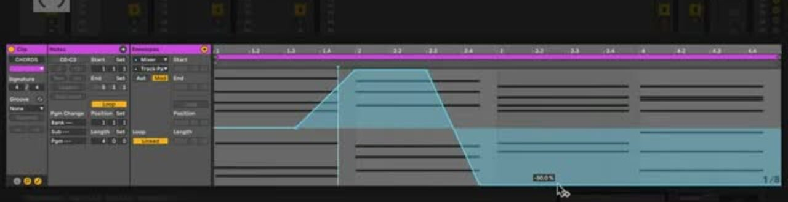

# How to Use Modulation in Session View

Modulation lets a Session clip move a mixer or device parameter relative to its current setting. This makes it possible to give a looping clip repeated movement while retaining control of the parameter’s base value. Open [Ableton Live](https://www.ableton.com/en/live/) in Session View with a playing audio or MIDI clip and at least one mixer or device parameter you want to vary.

## Video walkthrough

  <iframe
    src="https://www.youtube.com/embed/fFLsYd2q_Ao?rel=0"
    title="Learn Live: Modulation in Session View"
    allow="accelerometer; autoplay; clipboard-write; encrypted-media; gyroscope; picture-in-picture; web-share"
    referrerpolicy="strict-origin-when-cross-origin"
    allowfullscreen>
  </iframe>

## Start with a Session clip and a base value

Modulation is clip-specific: it is played when its Session clip plays and affects the parameter selected for that clip. Unlike automation, it does not set a parameter to an exact value. It changes the parameter relative to its current base value or any automation already defining that value.

Set the parameter to a useful starting point before drawing an envelope. For example, center a track’s Pan control before making a wide left-to-right movement, or set a filter cutoff near the desired average brightness before adding a repeating sweep. Changing that base value later changes the audible range while preserving the modulation pattern.

## Open the clip Envelope editor

1. In Session View, select the clip that should contain the modulation.
2. Open Clip View at the bottom of Live’s window, then open its **Envelopes** tab.
3. Use the **Device** chooser to select the Mixer or the device that contains the target parameter.
4. Use the **Control** chooser to select the parameter, such as Pan, a Send, filter frequency, or a device control.
5. Select **Modulation** below the choosers.

The Automation and Modulation toggles are available for selected Session clips. A blue indicator in a chooser identifies a parameter that already has a modulation envelope. This is separate from the red indicator used for automation.

## Draw a modulation envelope

Use the Envelope Editor to add and edit breakpoints across the clip’s timeline. Draw a simple rising and falling curve first, then launch the clip and listen to the result. The envelope repeats with the clip’s loop, so one short gesture can create an ongoing change in a Session performance.

Right-click in the editor to use a predefined shape when a ramp, curve, or other repeated form is a better starting point than individual breakpoints. You can then adjust its timing and values to fit the clip.

The blue envelope in this source-derived example changes a parameter relative to its base value. The video shows an earlier Live interface; use the current **Modulation** toggle in a selected Session clip’s Envelopes tab in Live 12.

## Adjust the range with the parameter control

The modulation envelope supplies relative movement, so the parameter’s base control remains part of the result. After drawing the envelope, change the target control while the clip plays. The pattern continues, but its range changes around the new base value.

This is especially clear with Pan. When the Pan control is centered, its modulation can move across the full stereo field. Moving the Pan control toward one side reduces the available modulation range in that direction. The same principle applies to device parameters: a filter modulation can sound more restrained or more pronounced as you change the filter’s base cutoff.

If the target parameter reaches the end of its permitted range, modulation cannot extend it farther. Set a practical base value before increasing the envelope’s depth, and check the result with the full scene playing.

## Manage several modulated controls

A clip can contain modulation envelopes for multiple mixer and device parameters. Select each target from the Device and Control choosers when you need to review or edit its curve. To reduce the chooser lists to the controls that have been changed, select **Only show adjusted envelopes** from either chooser.

Build layers deliberately. A filter sweep, a small pan movement, and a changing send level can all support a clip, but several large movements at once can obscure the musical result. Start with one target, set its base value and envelope range, then add another only after listening to the combined playback.

## Use modulation to make Session clips adaptable

Use clip modulation for movement that should remain reusable across different versions of a sound or scene. The clip retains the envelope, while the mixer or device control lets you adapt the behavior to the current Set. This is useful for evolving loops, variations of a repeated clip, and performance-oriented adjustments that should not overwrite the relative pattern.

For a fixed parameter value at a fixed time, use automation instead. For current details, see Ableton’s [Clip Envelopes](https://www.ableton.com/en/manual/clip-envelopes/), [Working with Automation and Modulation](https://help.ableton.com/hc/en-us/articles/209070629-Working-with-Automation-and-Modulation), and [Live Manual](https://help.ableton.com/hc/en-us/articles/206769450-Live-Manual). The source walkthrough is Ableton’s [Learn Live: Modulation in Session View](https://www.youtube.com/watch?v=fFLsYd2q_Ao).
