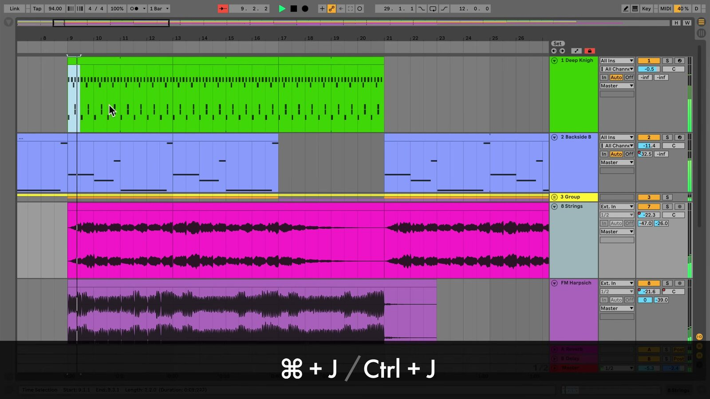

# Arrangement View Keyboard Shortcuts in Ableton Live

Arrangement View shortcuts speed up editing on Live’s linear timeline. They can split and combine clips, change time across the whole Arrangement, control the view, and switch into automation editing. Open a Set in [Ableton Live](https://www.ableton.com/en/live/) and show Arrangement View before trying the commands.

## Video walkthrough

  <iframe
    src="https://www.youtube-nocookie.com/embed/WW_DnCnEggA?rel=0"
    title="Learn Live: Arrangement View shortcuts"
    allow="accelerometer; autoplay; clipboard-write; encrypted-media; gyroscope; picture-in-picture; web-share"
    referrerpolicy="strict-origin-when-cross-origin"
    allowfullscreen>
  </iframe>

## Establish the right focus and selection

Click a clip, track, or time range in Arrangement View before using an edit command. You can move keyboard focus there with `Alt`+`2` on Windows or `Option`+`2` on macOS. A clip selection affects the selected clips, while a time selection can affect the selected range across tracks.

Many shortcuts are view-specific. For example, `Ctrl`+`E` on Windows or `Cmd`+`E` on macOS splits clips in Arrangement View, while the same shortcut adds or removes a Stop Button in Session View. Check the active view and selection before applying an edit.

## Split, combine, and reshape clips

Use these shortcuts when editing clips on the timeline:

| Task | Windows | macOS |
| --- | --- | --- |
| Split a clip at the selection | `Ctrl`+`E` | `Cmd`+`E` |
| Consolidate selected material into a clip | `Ctrl`+`J` | `Cmd`+`J` |
| Crop selected clips | `Ctrl`+`Shift`+`J` | `Cmd`+`Shift`+`J` |
| Resize a clip edge at the insert marker | `Enter` + Left or Right Arrow | `Enter` + Left or Right Arrow |
| Nudge the selection left or right | Left or Right Arrow | Left or Right Arrow |
| Reverse the selected audio clip | `R` | `R` |

To consolidate, select adjacent material in one or more tracks and use the shortcut. Live creates a new clip for each selected track, making the result easier to move, loop, or reuse. Reverse applies to audio clip selections; it does not reverse MIDI notes.

*The source walkthrough uses an earlier Live version, where the terminal track is labeled Master. Live 12 uses the Main track label, but the clip-editing workflow shown here remains the same.*

## Change time and loop a passage

Use the Arrangement Loop to work repeatedly on a selected passage. After making a time selection, press `Ctrl`+`L` on Windows or `Cmd`+`L` on macOS to set and enable the loop brace. Use `Ctrl`+`Shift`+`L` or `Cmd`+`Shift`+`L` to select the material inside the current loop brace.

The following **Time** commands apply to all tracks, unlike ordinary cut, copy, paste, or duplicate operations. Use them when the song’s overall structure needs to change.

| Task | Windows | macOS |
| --- | --- | --- |
| Insert silence at the insert marker | `Ctrl`+`I` | `Cmd`+`I` |
| Cut time | `Ctrl`+`Shift`+`X` | `Cmd`+`Shift`+`X` |
| Copy time | `Ctrl`+`Shift`+`C` | `Cmd`+`Shift`+`C` |
| Paste time | `Ctrl`+`Shift`+`V` | `Cmd`+`Shift`+`V` |
| Duplicate time | `Ctrl`+`Shift`+`D` | `Cmd`+`Shift`+`D` |
| Delete time | `Ctrl`+`Shift`+`Delete` | `Cmd`+`Shift`+`Delete` |

For example, **Duplicate Time** inserts a copy of the selected timespan and shifts later material to the right. **Delete Time** removes the selected range and closes the gap across the Arrangement.

## Navigate a large Arrangement efficiently

These commands help keep a large Set readable while you edit:

| Task | Windows | macOS |
| --- | --- | --- |
| Fold or unfold selected tracks | `U` or Left/Right Arrow | `U` or Left/Right Arrow |
| Unfold all tracks | `Alt`+`U` | `Option`+`U` |
| Optimize Arrangement height | `H` | `H` |
| Optimize Arrangement width | `W` | `W` |
| Zoom to the current time selection | `Z` | `Z` |
| Return to the previous zoom level | `X` | `X` |
| Scroll the display to follow playback | `Ctrl`+`Shift`+`F` | `Option`+`Shift`+`F` |

`H` fits track heights to the window, while `W` fits the complete Arrangement horizontally. Use `Z` after selecting a short edit range, then press `X` to step back through prior zoom levels. The current Live 12 manual lists `Alt`+`U` or `Option`+`U` as **Unfold All Tracks**; it is not a toggle for folding the complete Arrangement.

## Edit automation from the keyboard and pointer

Press `A` to toggle Automation Mode and reveal the current track automation. Press `B` to toggle Draw Mode; holding `B` while using the pointer temporarily changes the drawing mode.

When editing automation with the pointer:

- Hold `Shift` while dragging vertically to make finer value adjustments.
- Hold `Alt` on Windows or `Option` on macOS while dragging a line segment to create a curved segment.
- Right-click a breakpoint and choose **Edit Value** to enter an exact value, or right-click a preview breakpoint and choose **Add Value** to create one precisely.
- Right-click a time selection in an automation lane to insert one of Live’s predefined automation shapes.

Automation shortcuts are most useful after the broad clip structure is in place. Use them to make controlled parameter changes without losing the timeline context.

## Combine structural and detailed edits

Start with a time selection when changing song structure, then use clip shortcuts for local edits. Use `H`, `W`, `Z`, and `X` to move between the complete arrangement and a precise edit range. Finally, enable Automation Mode only when you are ready to shape parameter changes. This sequence keeps structural, clip, and automation edits distinct.

For current shortcut details, see Ableton’s [Live Keyboard Shortcuts](https://www.ableton.com/en/manual/live-keyboard-shortcuts/), [Arrangement View](https://www.ableton.com/en/live-manual/12/arrangement-view/), and [Automation and Editing Envelopes](https://www.ableton.com/en/live-manual/12/automation-and-editing-envelopes/) documentation. For the source walkthrough, see Ableton’s [Learn Live: Arrangement View shortcuts](https://www.youtube.com/watch?v=WW_DnCnEggA) video.
