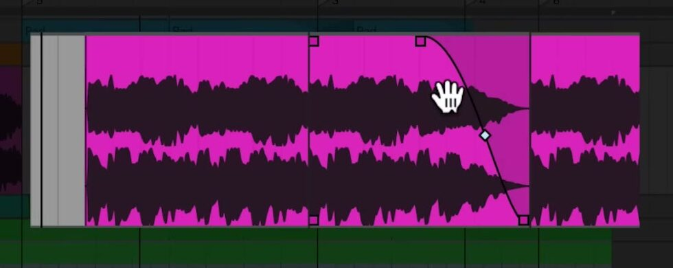

# How to Edit Clips in Arrangement View

Arrangement View lets you arrange audio and MIDI clips on a linear timeline, then edit their timing, length, and transitions without leaving the Live Set. Begin with a Set that contains clips in Arrangement View; press `Tab` if you need to switch from Session View. This guide uses the current Live 12 workflow described in Ableton’s [Arrangement View documentation](https://www.ableton.com/en/manual/arrangement-view/).

## Video walkthrough

  <iframe
    src="https://www.youtube-nocookie.com/embed/xdwZpIpN6ys?rel=0"
    title="Learn Live: Editing clips in Arrangement View"
    allow="accelerometer; autoplay; clipboard-write; encrypted-media; gyroscope; picture-in-picture; web-share"
    referrerpolicy="strict-origin-when-cross-origin"
    allowfullscreen>
  </iframe>

## Select, move, and resize a clip

Click a clip to select it. Drag its clip bar to move it to a different song position or track, and drag either clip edge to change its length. Live snaps these edits to the current editing grid and to nearby clip edges, locators, and time-signature changes.

The clip bar is the movable part of the clip. Dragging in an audio waveform or MIDI display instead selects time within the clip, which is useful when an edit applies only to part of it. Hold `Shift` while clicking or using the arrow keys to extend an existing selection.

## Split a clip where the arrangement changes

Use Split to turn a single clip into independently editable pieces.

1. Click at the point where the clip should divide, or drag across the part that should become its own clip.
2. Press `Ctrl` + `E` on Windows or `Cmd` + `E` on macOS. You can also choose **Split** from the clip context menu.
3. Move, resize, deactivate, or delete the resulting pieces as needed.

When a time selection is made in the middle of a clip, Split isolates that selection between two new clip edges. This is useful for separating an intro, fill, or unwanted phrase without cutting the original audio file in an external editor.

## Consolidate adjacent material into one clip

Select adjacent clips or a time range that you want to treat as one new clip, then choose **Consolidate** from the **Edit** menu or clip context menu. The shortcut is `Ctrl` + `J` on Windows or `Cmd` + `J` on macOS.

Consolidate works per track and can be applied across several tracks at once. For audio, Live creates a new sample that includes the selected clip-level timing, pitch, attenuation, and envelope changes, but not the track’s device and mixer processing. Save the Set before or after a consolidation pass so the new audio is kept with the project.

## Duplicate or deactivate an arrangement idea

To make a copy of selected material, use **Duplicate** from the **Edit** menu or press `Ctrl` + `D` on Windows or `Cmd` + `D` on macOS. For a structural repeat that should insert time across the Arrangement, use **Duplicate Time** with `Ctrl` + `Shift` + `D` on Windows or `Cmd` + `Shift` + `D` on macOS; this increases the Arrangement’s duration by the selected timespan.

Press `0` to deactivate selected material without deleting it. Deactivation is useful for auditioning an alternate section or silencing a short passage while preserving the edit. Press `0` again to reactivate it. Be careful when a track header is selected: the same shortcut deactivates the entire track.

## Reverse audio and adjust clip transitions

To reverse only part of an audio arrangement, select the desired time range and choose **Reverse Clip(s)** from the clip context menu, or press `R`. The selection must contain audio material only. Live makes a reversed sample and retains the clip’s existing settings as far as possible, so listen again for any warp-marker or envelope changes that need adjustment.

Audio clips in Arrangement View also have editable fade controls. Hover over an audio clip and use the small square at its beginning or end to set a fade length; drag the curve handle to change the fade shape. The track must be tall enough for the handles to be visible. If Automation Mode is enabled, hold `F` while hovering over an automation lane to reveal the fade controls temporarily.

To create a crossfade, drag a fade handle over the edge of the adjacent audio clip on the same track, then adjust its curve handle. You can also select a range that includes a clip edge or boundary and use `Ctrl` + `Alt` + `F` on Windows or `Cmd` + `Option` + `F` on macOS to create a fade or crossfade. Short default fades can also be enabled with the **Create Fades on Clip Edges** setting to help prevent clicks at audio clip boundaries.

## Review the edited passage

After an edit, play a short loop around the changed area and check timing, transitions, and clip boundaries. Use deactivation to compare alternatives before deleting anything, and use **Undo** if a split, consolidation, or fade does not produce the intended result. This approach keeps the Arrangement readable while leaving each structural decision easy to revisit.

For current details, see Ableton’s [Arrangement View](https://www.ableton.com/en/manual/arrangement-view/), [Clip View](https://www.ableton.com/en/manual/clip-view/), and [Live Keyboard Shortcuts](https://www.ableton.com/en/manual/live-keyboard-shortcuts/) documentation. The source walkthrough is Ableton’s [Learn Live: Editing clips in Arrangement View](https://www.youtube.com/watch?v=xdwZpIpN6ys).
