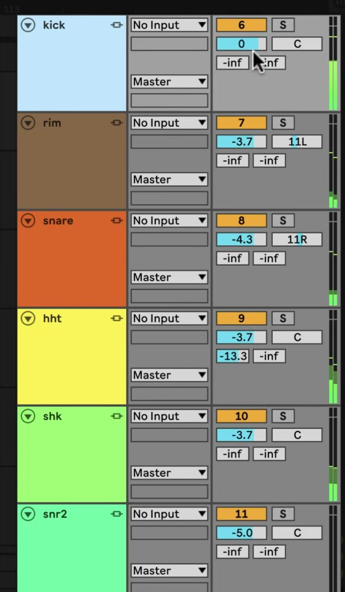

# How to Edit Linked Tracks in Ableton Live

Linked-track editing lets you apply selected Arrangement View edits to several related tracks at the same timeline position. It is useful for recordings that must stay aligned, such as multiple microphones recording one performance, and for comping related takes. Start with the tracks arranged in [Arrangement View](https://www.ableton.com/en/manual/arrangement-view/); linking is a coordinated-editing feature, not the same as grouping tracks.

## Video walkthrough

  <iframe
    src="https://www.youtube-nocookie.com/embed/UuRDpqBsmD0?rel=0"
    title="Learn Live: Linked-Track Editing"
    allow="accelerometer; autoplay; clipboard-write; encrypted-media; gyroscope; picture-in-picture; web-share"
    referrerpolicy="strict-origin-when-cross-origin"
    allowfullscreen>
  </iframe>

## Choose tracks that must remain aligned

Link tracks when an edit must occur at the same musical time across every selected track. For example, cuts in close and room microphone recordings should normally stay aligned so the relationship between their recorded signals is preserved. The feature is an Arrangement View workflow, so first place the relevant clips or take lanes in the Arrangement.

Linked tracks remain separate tracks. Use a link to coordinate supported timeline edits rather than to create a track hierarchy.

## Link the selected track headers

1. In Arrangement View, select the headers for the tracks you want to edit together.
2. Right-click one of the selected headers and choose **Link Tracks**.
3. Find the linked-track indicator button in the affected track headers. Hover over an indicator to highlight every member of that linked set, or click it to select all of its linked tracks.

The screenshot is from the source walkthrough and shows the earlier Live interface. Current Live documentation still identifies the linked-track indicator in each linked track header as the way to identify and select a linked set.

You can create more than one linked set in a Live Set, but a track can belong to only one linked set at a time. Keep a set limited to tracks that genuinely require synchronized edits; that makes the result easier to predict and review.

## Make synchronized Arrangement edits

After linking, work in one track as usual and Live applies the following Arrangement operations across the linked tracks:

- Moving or resizing clips.
- Selecting clips and time, including **… Time** commands.
- Splitting and consolidating clips.
- Creating and editing audio-clip fades. Fades can be adjusted together only when they begin at the same timeline position.
- Arming or disarming tracks.
- Renaming, inserting, or deleting take lanes, and enabling or disabling take-lane Audition Mode.

For a controlled edit, select a short shared time range, perform one operation such as **Split**, then inspect each affected track before moving on. Use Undo immediately if the selection included a track that should not have been part of the edit.

## Add, remove, or organize linked tracks

To add tracks to an existing linked set, select the tracks to add. Hold `Ctrl` on Windows or `Cmd` on macOS while choosing **Link Tracks** from a linked track's header context menu. To remove tracks, select the tracks to unlink, right-click a selected track header or Group Track header, and choose **Unlink Track(s)**.

Tracks inside a Group Track can also be linked: open the Group Track header context menu and choose **Link Tracks**. Grouping and linking solve different problems—use a group to organize related tracks and use a link when Arrangement edits must stay synchronized.

## Use linked tracks when comping related recordings

When several recordings capture the same performance, use linked tracks before organizing or auditioning their take lanes. The linked editing behavior keeps take-lane names, insertions, deletions, and Audition Mode changes coordinated across the set, which helps you review matching material together.

Play the edited passage after a cut, fade, or comping change. Listen for the intended transition, and inspect the edits on every linked track before unlinking them or continuing with unrelated arrangement work.

For current details, see Ableton’s [Arrangement View and linked-track editing documentation](https://www.ableton.com/en/manual/arrangement-view/) and [Comping documentation](https://www.ableton.com/en/manual/comping/). The source walkthrough is Ableton’s [Learn Live: Linked-Track Editing](https://www.youtube.com/watch?v=UuRDpqBsmD0).
