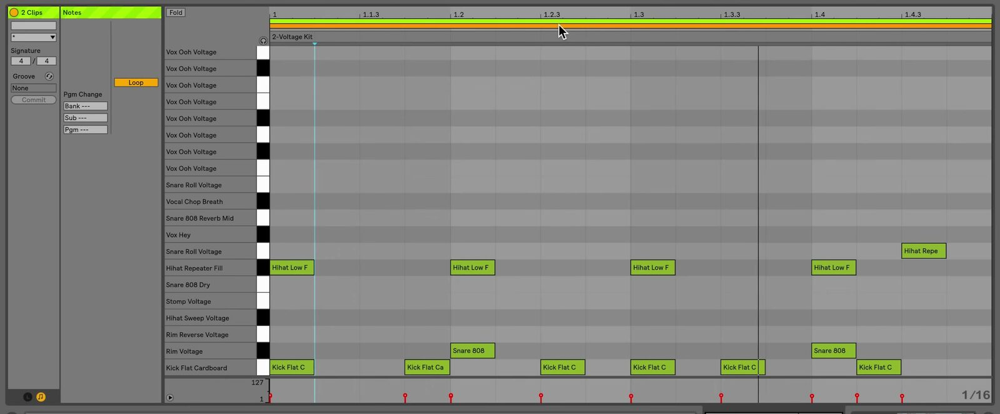

# How to Edit Multiple Clips at Once in Ableton Live

Live can show and edit the MIDI notes from several selected clips in one MIDI Note Editor. This multi-clip workflow is useful for lining up a bass part with drums, comparing variations, or changing related patterns without constantly switching clips. It applies to MIDI clips; a multi-selection can also expose Clip View properties shared by other clip types. Start with two or more MIDI clips, then consult Ableton’s current [Editing MIDI documentation](https://www.ableton.com/en/manual/editing-midi/) for the Live 12 reference.

## Video walkthrough

  <iframe
    src="https://www.youtube-nocookie.com/embed/lxDYmYaaIk0?rel=0"
    title="Learn Live: Multi-Clip Editing"
    allow="accelerometer; autoplay; clipboard-write; encrypted-media; gyroscope; picture-in-picture; web-share"
    referrerpolicy="strict-origin-when-cross-origin"
    allowfullscreen>
  </iframe>

## Select the MIDI clips to compare

Select one MIDI clip, then hold `Shift` to add a contiguous range or `Ctrl` on Windows / `Cmd` on macOS to add individual clips. Open Clip View if it is hidden. The MIDI Note Editor displays the notes from the selected clips together, using each clip’s color.

The selection limits depend on the main view:

- In Session View, you can select up to eight looped MIDI clips. The loop bars are ordered by track and then by scene.
- In Arrangement View, you can select MIDI clips from up to eight tracks within a selected time range. The loop bars are ordered by track and by their position in time.

Use the selection to compare related material rather than assuming every command will affect every clip. Live makes the active editing scope visible in the MIDI Note Editor.

## Read the multi-clip loop bars

Loop bars appear above the MIDI Note Editor when more than one MIDI clip is selected. Each bar matches a selected clip’s color and represents its loop region. Click a loop bar or one of its notes to make that clip the foreground clip for identification and detailed editing.

The source frame shows the earlier Live interface’s two colored loop bars. Live 12 uses updated styling, but retains the color-matched loop-bar workflow for a multi-clip selection.

To change loop regions, drag a selected loop bar’s marker. Hold `Ctrl` on Windows or `Cmd` on macOS while clicking or dragging loop markers to select multiple loop bars; hold `Shift` to select a contiguous range. You can duplicate selected loop bars with `Ctrl` + `D` on Windows or `Cmd` + `D` on macOS.

## Edit together or use Focus Mode

With **Focus Mode** off, all selected clips’ notes appear in their own colors and are active. You can select, move, copy, cut, paste, duplicate, or delete notes across the selected clips and their loop boundaries. In Arrangement View, you can also draw notes continuously across clip boundaries while Focus Mode is off.

Turn on **Focus Mode** with the Focus button or press `N` when you want to edit only one selected clip while keeping the others visible for reference. The active clip remains in color and the other clips appear gray. Click a different clip’s note or loop bar to make it active. Hold `N` while using the mouse to toggle Focus Mode temporarily.

Use Focus Mode when you are writing a variation against a reference pattern. Turn it off when the same note operation should apply across the selected clips.

## Change shared clip settings carefully

When multiple clips are selected, Clip View shows only properties the clips have in common. Depending on the selection, you can edit settings such as looping, time signature, groove, and scale for all selected clips.

Knobs and sliders may show a range when the selected clips have different values. Moving a control changes the selected values while retaining their differences until you move it to an absolute minimum or maximum, which makes the values identical. Check the resulting clip settings before continuing playback.

Velocity and Chance edits are an exception: their markers are shown for the foreground clip only, and changes there do not apply to the notes in every selected clip.

## Use a controlled multi-clip workflow

Start by selecting only the clips that form one musical relationship, such as a drum pattern and bass line. Compare their notes with Focus Mode on, create or move notes in a single foreground clip, then turn Focus Mode off only for edits that genuinely belong across the selection. Play the section after each shared edit and use **Undo** if a change affected more clips than intended.

For current details, see Ableton’s [Multi-Clip Editing](https://www.ableton.com/en/manual/editing-midi/), [Clip View properties for multiple clips](https://www.ableton.com/en/manual/clip-view/), and [Live Keyboard Shortcuts](https://www.ableton.com/en/manual/live-keyboard-shortcuts/) documentation. The source walkthrough is Ableton’s [Learn Live: Multi-Clip Editing](https://www.youtube.com/watch?v=lxDYmYaaIk0).
