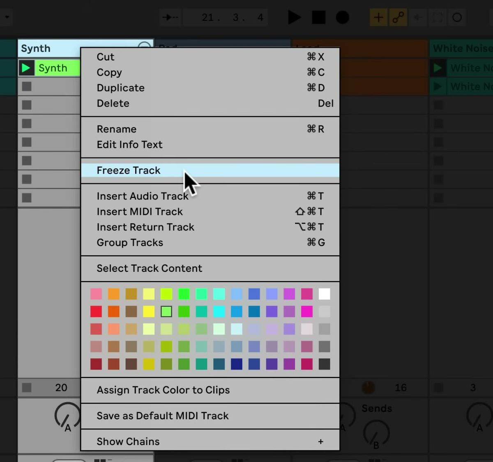

# How to Freeze a Track in Ableton Live

Freezing temporarily renders a track’s clips so Live can play the resulting sample files instead of repeatedly calculating processor-intensive device and clip settings. It is a reversible way to reduce the CPU demand of a large Set. Start with a track that holds clips; [Ableton’s current computer-audio documentation](https://www.ableton.com/en/live-manual/12/computer-audio-resources-and-strategies/) notes that Group Tracks cannot be frozen.

## Video walkthrough

  <iframe
    src="https://www.youtube-nocookie.com/embed/a-0gOTm6Qdk?rel=0"
    title="Learn Live: Freezing"
    allow="accelerometer; autoplay; clipboard-write; encrypted-media; gyroscope; picture-in-picture; web-share"
    referrerpolicy="strict-origin-when-cross-origin"
    allowfullscreen>
  </iframe>

## Identify a track worth freezing

Use **Freeze Track** for a track whose instruments, effects, or clip settings contribute significant processing demand, but whose sound you do not need to change immediately. It is most useful after the part and its device chain are established, while other tracks still need active editing.

Freezing is not a substitute for finding the cause of an overloaded Set. Check the CPU meter and, in Session View, the Performance Impact section when available. Freeze one demanding track at a time and listen after each change so that it is clear which action improved playback.

## Freeze the track

1. Select the header of the audio or MIDI track that holds the clips you want to freeze.
2. Choose **Freeze Track** from the **Edit** menu, or right-click the track header or a clip and choose **Freeze Track**.
3. Wait for Live to render the track. Freezing is normally quick, but a track using an External Audio Effect or External Instrument with hardware may need to be rendered in real time.

The screenshot is from the source walkthrough and uses an earlier Live interface. The **Freeze Track** command remains available in Live 12’s Edit menu and track or clip context menus.

When freezing completes, Live creates a sample file for every Session View clip on that track and one for the Arrangement. Those clips play their freeze files instead of calculating the track’s processor-intensive settings in real time.

## Keep working with a frozen track

Freezing does not prevent all work on the track. You can still launch clips and use mixer controls such as volume, pan, and sends. Live also allows you to edit, cut, copy, paste, duplicate, trim, and consolidate clips; draw and edit mixer automation or mixer clip envelopes; and record Session View launches into the Arrangement.

Unfreeze the track before changing a device or clip setting that determines the rendered sound. Make the change, listen to the result, then freeze the track again if you still need to reduce processing demand.

## Account for effect tails and looping clips

An Arrangement clip on a frozen track can include audio that extends beyond the clip, such as a reverb or delay tail. Live displays this material as a crosshatched temporary clip beside the source clip. When moving the source clip, select and move its frozen tail too, or the audible result may no longer occur at the intended time.

For Session View clips, Live includes two loop cycles in the frozen file. A loop that uses unlinked clip envelopes can therefore sound different after the second cycle while frozen. Audition a repeating clip after freezing rather than assuming it behaves exactly like its live device chain.

## Unfreeze or use the current bounce command

To return to live processing, select the frozen track and choose **Unfreeze Track** from the **Edit** menu. This restores access to the original device and clip settings so you can revise the sound and freeze it again later.

Do not confuse unfreezing with committing a rendered result. In Live 12.2, the former **Flatten** and **Freeze and Flatten Track** commands were renamed **Bounce Track in Place**. Use that command only when you intend to bounce the track to audio; use **Freeze Track** when you need the reversible performance workflow described here.

## Apply freezing as part of a performance workflow

Freeze finished, processor-heavy tracks first, then replay the busy section of the Set to confirm that audio remains stable. Keep the Set saved before making major rendering decisions, and unfreeze only the track that needs a sound or device adjustment. This preserves working CPU capacity while keeping the original track configuration available for further editing.

For current details, see Ableton’s [Computer Audio Resources and Strategies](https://www.ableton.com/en/live-manual/12/computer-audio-resources-and-strategies/) and [Live 12 release notes on bouncing tracks to audio](https://www.ableton.com/en/release-notes/live-12/). The source walkthrough is Ableton’s [Learn Live: Freezing](https://www.youtube.com/watch?v=a-0gOTm6Qdk).
