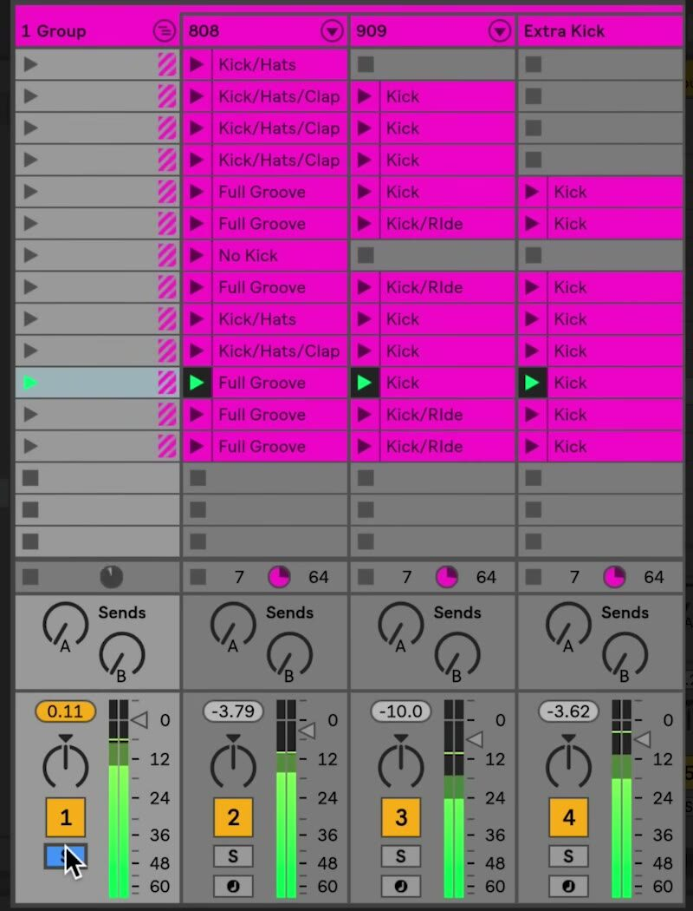

# How to Group Tracks in Ableton Live

A Group Track is a summing container for related audio or MIDI tracks. It helps organize a large Live Set and provides one place to control the subgroup’s level, processing, and visibility. Start with at least two tracks that you want to manage together; the current Live 12 workflow is described in Ableton’s [Mixing documentation](https://www.ableton.com/en/manual/mixing/).

## Video walkthrough

  <iframe
    src="https://www.youtube-nocookie.com/embed/rCEHZ8pTKc4?rel=0"
    title="Learn Live: Grouping tracks"
    allow="accelerometer; autoplay; clipboard-write; encrypted-media; gyroscope; picture-in-picture; web-share"
    referrerpolicy="strict-origin-when-cross-origin"
    allowfullscreen>
  </iframe>

## Decide what belongs in a group

Group tracks that form one musical role or that need shared control, such as a drum kit, layered vocals, background textures, or several instruments that make up a section. A Group Track is not a track for placing clips directly: the clips stay on the audio or MIDI tracks inside it.

Because a Group Track has mixer controls and can host audio effects, it can work as a submix. For example, use the individual tracks to balance a drum kit, then use the group’s fader, effects, and routing to manage the kit as one signal.

## Create a Group Track

1. Select the title bars of the tracks to include. To select a contiguous range, click the first track title bar and `Shift`-click the last.
2. Choose **Edit** > **Group Tracks**, or press `Ctrl` + `G` on Windows or `Cmd` + `G` on macOS.
3. Live creates a parent Group Track around the selected tracks. Rename it with `Ctrl` + `R` on Windows or `Cmd` + `R` on macOS, then type a descriptive name such as `Drums` or `Vocals`.

The group becomes a track in its own right. Its contained tracks remain available for their own clips, instruments, level adjustments, and effects.

## Use the group as a submix

When tracks are added to a group, Live normally assigns their **Audio To** routing to that Group Track. Tracks that already have custom routing are left as they are, so inspect their **Audio To** choosers if you expect every selected track to feed the group.

Adjusting the Group Track’s mixer controls affects the combined group signal. Add an audio effect to the Group Track when you want it to process the subgroup after the child tracks have been combined. Keep track-specific effects on the individual tracks when they should affect only one sound.

## Fold and inspect a group

Use the **Unfold Group** button in the Group Track title bar to show or hide its contained tracks. In the current keyboard shortcuts, `+` shows grouped tracks, `-` hides them, and `U` collapses or expands grouped tracks.

In Arrangement View, a Group Track displays an overview of clips from its contained tracks. In Session View, a group slot can launch or stop the clips available in its contained tracks for that scene. Folding the group changes the workspace organization, not the tracks’ audio content or playback behavior.

The source screenshot uses an earlier version of Live, but it illustrates the parent Group Track at the left and the individual tracks it contains. Current Live 12 uses updated interface styling while retaining this group relationship.

## Build nested groups and reorganize tracks

You can create a hierarchy by selecting existing Group Tracks and applying **Group Tracks** again. This is useful when, for example, separate percussion and drum groups need a single rhythm-group submix. Use nested groups only when the additional shared control or organization is useful; shallow groups are easier to inspect during mixing.

After creating a group, you can drag tracks into or out of it. Check the routing again after reorganizing, especially if a track uses a non-default destination.

## Ungroup safely

To return a group to its individual tracks, select the Group Track and choose **Ungroup Tracks** from the **Edit** menu, or press `Ctrl` + `Shift` + `G` on Windows or `Cmd` + `Shift` + `G` on macOS. This is different from deleting the Group Track: deleting a group also deletes everything inside it.

Before restructuring a finished section, save the Live Set and confirm that the group’s routing and effects are intentional. Use **Undo** if the resulting hierarchy or signal flow is not what you expected.

## Apply a consistent grouping approach

Name groups by function, keep related tracks together, and fold groups that are not being edited. Use individual tracks for detailed sound design and balance, then use the Group Track for shared level control, processing, and routing. This keeps both Session View and Arrangement View manageable as the Set grows.

For current details, see Ableton’s [Group Tracks](https://www.ableton.com/en/manual/mixing/) and [Live Keyboard Shortcuts](https://www.ableton.com/en/manual/live-keyboard-shortcuts/) documentation. The source walkthrough is Ableton’s [Learn Live: Grouping tracks](https://www.youtube.com/watch?v=rCEHZ8pTKc4).
