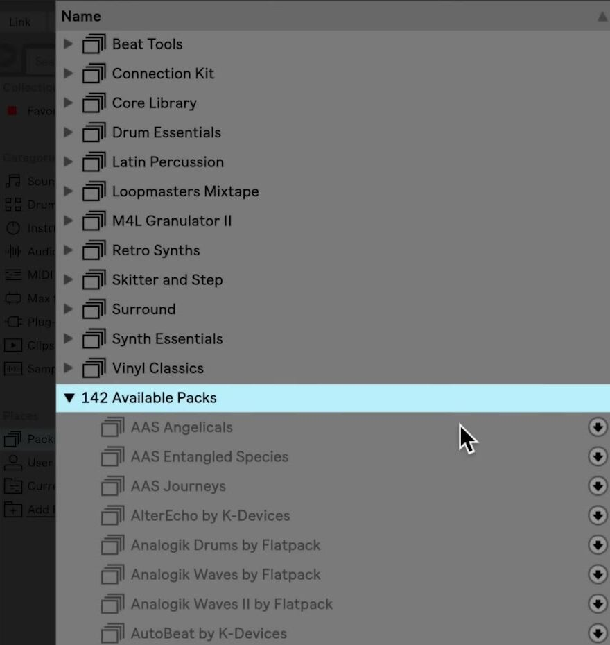

# How to Install Ableton Live Packs

Ableton Live Packs add organized collections of sounds, samples, presets, Live Clips, and sometimes devices or lessons to Live. In Live 12, install Packs from the **Packs** label under Places when Live is authorized online, or install a Pack file you have already downloaded. See Ableton’s current [Installing Live Packs documentation](https://help.ableton.com/hc/en-us/articles/115001930644-Installing-Live-Packs) before choosing an installation method.

## Video walkthrough

  <iframe
    src="https://www.youtube-nocookie.com/embed/2VLrGqbYZ5w?rel=0"
    title="Learn Live: Installing Packs"
    allow="accelerometer; autoplay; clipboard-write; encrypted-media; gyroscope; picture-in-picture; web-share"
    referrerpolicy="strict-origin-when-cross-origin"
    allowfullscreen>
  </iframe>

## Choose the installation method

Use Live’s Browser when the Pack is listed with your authorized Live license or in your account’s purchased content. This is the normal method for downloading an available Pack or an update directly into Live.

Use a downloaded `.alp` package when the Browser’s Pack downloads are unavailable, such as with an offline authorization, or when you have downloaded the Pack from Ableton’s Packs website or your Ableton account. Both methods place the finished Pack in the same Packs label in Live.

## Download and install a Pack from the Browser

1. In the Browser’s Places section, select **Packs**.
2. Expand **Available Packs** to view Packs you own but have not installed. Expand **Updates** when you want to update an installed Pack instead.
3. Click the download icon beside the Pack you want. The icon becomes a pause control and shows download progress; you can pause and resume it if needed.
4. When the download is complete, click **Install**. Live shows a progress bar while it installs the Pack.

The screenshot is from the source walkthrough and shows an earlier Live interface. Live 12 retains the **Available Packs** section and download-then-install workflow, though the Browser’s layout and Pack list may differ.

Before downloading a large Pack, use the Browser’s Content Options menu to show Pack sizes in **Available Packs** or **Updates**. This makes it easier to choose a Pack that fits the available disk space. You can select multiple available Packs and start their downloads together.

## Find and use the installed content

After installation, the Pack appears as a folder in the **Packs** label. Expand it to browse its contents. The Pack’s presets, samples, and Live Clips also appear in the appropriate Library labels, so you may encounter its content while browsing Sounds, Instruments, Clips, or Samples.

Load a preset, sound, or clip in the usual way: drag it to a track, clip slot, or Arrangement timeline, or double-click it when that action is appropriate. To read an installed Pack’s description or tutorial material, choose **Show Pack Info** from the Pack’s context menu; the Help menu’s Pack Overview also lists Pack information pages.

## Install a downloaded `.alp` Pack file

1. Download the Pack from its Ableton Packs page or from the relevant Live license in your Ableton account. The downloaded package uses the `.alp` file extension.
2. Double-click the `.alp` file to open it in Live, or drag the file anywhere into Live’s window.
3. Wait for the installation to finish, then open **Places → Packs** and confirm that the Pack appears.

After you have verified that the Pack is installed, the `.alp` installer package is no longer needed for Live to use the Pack. Keep it only if you want a separate copy of the downloaded installer; deleting the package does not remove the installed Pack.

## Check updates and resolve installation problems

Installed Pack updates appear under **Packs → Updates** and use the same download-and-install sequence. In Live 12, updating a Factory Pack can overwrite the version previously stored for an older Live release. If you regularly open the same content in earlier Live versions, use separate Pack installation locations for each version before updating.

If available Packs or updates do not appear, confirm that Live is authorized online and that the **Show Downloadable Packs** option is enabled in Library Settings. Browser downloads are disabled with an offline authorization, but a compatible `.alp` file can still be installed manually. If installation reports that the Pack needs a newer version of Live, update Live or download the Pack version that matches your licensed Live version.

## Keep the Pack library manageable

Install Packs intentionally, especially large sample collections. Use the Packs label to review what is already installed, open a Pack’s context menu to remove content you no longer need, and return to **Available Packs** if you want to install it again later. After each installation, load one preset or clip to confirm that the content is available and works in the current Set.

For current details, see Ableton’s [Working with the Browser](https://www.ableton.com/en/live-manual/12/working-with-the-browser/), [Installing Live Packs](https://help.ableton.com/hc/en-us/articles/115001930644-Installing-Live-Packs), [Updated Packs in Live 12](https://help.ableton.com/hc/en-us/articles/12955161906076-Updated-Packs-in-Live-12), and [Pack installation troubleshooting](https://help.ableton.com/hc/en-us/articles/360000146344-Packs-installation-could-not-be-completed). The source walkthrough is Ableton’s [Learn Live: Installing Packs](https://www.youtube.com/watch?v=2VLrGqbYZ5w).
