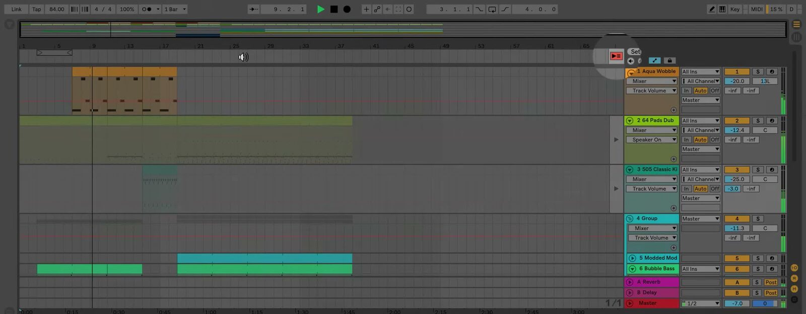

# How to Move Between Session View and Arrangement View

Session View and Arrangement View provide two ways to work with the same tracks in an Ableton Live Set. Session View is a clip-launching grid, while Arrangement View places clips on a linear timeline. Knowing how to move between them lets you develop an idea without interrupting playback, then turn that idea into a song structure. Open a Set in [Ableton Live](https://www.ableton.com/en/live/) before following the steps below.

## Video walkthrough

  <iframe
    src="https://www.youtube-nocookie.com/embed/OaQpybm5Pcw?rel=0"
    title="Learn Live: Moving between Session and Arrangement Views"
    allow="accelerometer; autoplay; clipboard-write; encrypted-media; gyroscope; picture-in-picture; web-share"
    referrerpolicy="strict-origin-when-cross-origin"
    allowfullscreen>
  </iframe>

## Understand what the two views share

Session View and Arrangement View use the same set of tracks, devices, mixer settings, and project. The clips in each view are separate collections: Session clips occupy track columns and clip slots, while Arrangement clips occupy horizontal time on the corresponding tracks.

Changing the visible view changes only the interface. It does not stop playback, change the current play position, or move a clip automatically. This makes it possible to inspect or edit the Arrangement while a Session performance continues, and vice versa.

## Switch views in a single Live window

Use either the Session View and Arrangement View controls in the upper-right corner of the Live window, or press `Tab`, to show the other view. In a single-window workspace, `Tab` is the quickest way to compare a Session idea with its timeline context.

If `Tab` moves keyboard focus between controls instead of switching views, **Use Tab to Move Focus** is enabled. Turn that option off in Live’s Navigate menu or Display & Input Settings to restore `Tab` as the view-switch shortcut. You can also select a view directly with `Alt`+`1` on Windows or `Option`+`1` on macOS for Session View, and `Alt`+`2` on Windows or `Option`+`2` on macOS for Arrangement View.

## Work with Session and Arrangement at the same time

Open a second Live window with `Ctrl`+`Shift`+`W` on Windows or `Cmd`+`Shift`+`W` on macOS. Set one window to Session View and the other to Arrangement View when you need to see the clip grid and timeline together. This is useful for checking which tracks are active while arranging or for moving material directly between the two views.

With two windows open, pressing `Tab` swaps Session View and Arrangement View between the windows rather than toggling one window. Use the view controls in either window when you want to choose a specific view without swapping the layout.

## Return a track to Arrangement playback

Although the views share tracks, a track can play a Session clip or an Arrangement clip at a given time, never both. A launched Session clip takes precedence over the Arrangement clip on that track. The other tracks can continue following the Arrangement.

When this happens, the Back to Arrangement button lights to show that one or more tracks are being overridden by Session clips. Click the global button in the Main track in Session View or at the upper-right of the Arrangement scrub area to return all tracks to Arrangement playback. In Arrangement View, each track also has its own Back to Arrangement button, so you can return selected tracks while leaving other Session clips running.

*The source walkthrough uses an earlier Live version, where the terminal track is labeled Master. Current Live 12 documentation calls this the Main track; the Back to Arrangement workflow remains the same.*

## Bring Session ideas into the Arrangement

### Record a Session performance

To capture a clip-launching performance in the timeline, switch to Session View, activate Arrangement Record in the Control Bar, and launch clips or scenes. Live records the resulting Session state into Arrangement View. Press `Tab` or select Arrangement View afterward to review the captured structure and refine the clips.

### Move existing clips between views

Use copy and paste to transfer selected clips between Session and Arrangement View. You can also drag clips over the target view selector, then place them in the destination view. If the Second Window is open, drag clips directly from one window to the other.

When pasting Arrangement material into Session View, Live places the clips into scenes in a top-to-bottom order that preserves their temporal structure. This can be useful when turning a linear passage back into a set of launchable variations.

## Use each view for its intended task

Use Session View to test clip combinations, launch sections, or perform without committing to a timeline. Use Arrangement View to review the result in time, organize it into a complete structure, and make detailed edits. When a Session clip takes over a track, use the Back to Arrangement controls deliberately so the intended source remains in control.

For current behavior and shortcuts, see Ableton’s [Live Concepts: Arrangement and Session](https://www.ableton.com/en/live-manual/12/live-concepts/), [Session View](https://www.ableton.com/en/live-manual/12/session-view/), and [Live Keyboard Shortcuts](https://www.ableton.com/en/manual/live-keyboard-shortcuts/) documentation. For the source walkthrough, see Ableton’s [Learn Live: Moving between Session and Arrangement Views](https://www.youtube.com/watch?v=OaQpybm5Pcw) video.
