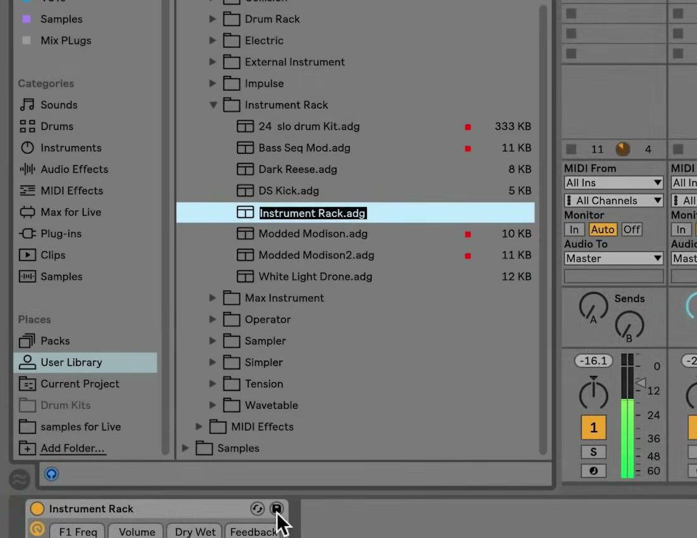

# How to Save Presets in Ableton Live

A preset stores the current settings of a Live device so it can be loaded again in another Set. Use a regular preset for a sound or effect setting you want to recall deliberately; use a Default only when every new instance of a device should begin with those settings. In Live 12, reusable presets are saved in the User Library, while the Browser also lets you save a device directly into the current Project. Ableton’s [Working with Instruments and Effects](https://www.ableton.com/en/live-manual/12/working-with-instruments-and-effects/) manual explains the current preset behavior.

## Video walkthrough

  <iframe
    src="https://www.youtube-nocookie.com/embed/Keafog2wB4E?rel=0"
    title="Learn Live: Saving presets"
    allow="accelerometer; autoplay; clipboard-write; encrypted-media; gyroscope; picture-in-picture; web-share"
    referrerpolicy="strict-origin-when-cross-origin"
    allowfullscreen>
  </iframe>

## Choose the right type of saved setting

Before saving, decide where and how the setting should be reused:

- A **User Library preset** is available to other Sets and projects on the same Live installation. Use it for an instrument sound, effect setting, or Rack you expect to load again.
- A **Project preset** belongs with the current project. Use it for a sound or configuration that should travel with that project without becoming part of the general library.
- A **default preset** replaces a device’s generic starting state whenever you add that device. It is not a collection of named alternatives.
- A **Live Clip** stores clip data and can also include the associated device settings. Save a clip when the musical material and its sound should stay together.

An Instrument, Drum, Audio Effect, or MIDI Effect Rack can also be saved as one preset. This is useful when a sound depends on several devices, effects, or Macro mappings rather than one device alone.

## Save a reusable preset to the User Library

Select the device or Rack in Device View and adjust it until it has the settings you want to retain. Then use the **Save Preset** button in the device header.

1. Click **Save Preset**. Live redirects the Browser to the appropriate location in the User Library.
2. Type a clear name, or press `Enter` to accept Live’s suggested name.
3. Press `Enter` to confirm. Press `Esc` instead if you decide not to save the preset.

The screenshot is from the source walkthrough and shows an earlier Live interface. In Live 12, the Browser layout and Library labels differ, but the User Library remains the location for custom device and Rack presets.

The saved item contains the current device settings, including custom Info Text. If you are comparing the device’s A and B states, the state currently selected when you save is the one Live uses for the stored preset.

## Save to the current Project or another folder

The Save Preset button is appropriate for a reusable User Library item. To choose a different destination, drag the device by its title bar into a compatible folder in the Browser’s Places section. Drop it on **Current Project** to save it with the open project, or use a User Library or added folder when a more specific organization is useful.

Live lets you rename the item after dropping it. You can also move a saved preset between folders later by dragging it in the Browser. Saving a project-specific preset is useful for a sound design that relies on material or conventions unique to one project; saving it to the User Library is more appropriate when it should be available everywhere.

## Preserve referenced samples when needed

Presets for devices such as Simpler, Sampler, Drum Rack, or sample-based Max for Live devices may depend on audio files. In **Settings → Library**, check the **Collect Files on Export** Browser Behavior setting before saving or moving such a preset.

- **Always**, the default, copies referenced samples into the destination when required.
- **Ask** lets you decide at the time of export whether to copy the files.
- **Never** retains the original file references instead of copying dependencies.

When a dependent sample is copied to the User Library, Live stores it in the User Library’s Samples folder. Copying dependencies is useful when the preset will be moved to another computer or shared; retaining external references can leave the preset unable to find its samples if the original files are moved.

## Load and verify the saved preset

Saved User Library items also appear under the relevant Library labels, such as Instruments, Audio Effects, MIDI Effects, or Max for Live. Search for the name, select the destination track, and then press `Enter`, double-click the preset, or drag it into the device chain.

To replace an existing preset, drag the new preset onto the existing device in the device chain. Reload the newly saved preset in a test track before relying on it in a larger project. For sample-based presets, confirm that every sample loads and plays as expected.

## Keep defaults and plug-in states distinct

To make a Live instrument, audio effect, MIDI effect, or Rack open with the same settings every time, open the device header’s context menu and choose **Save as Default Preset**. This updates the corresponding User Library Defaults folder, and Live asks before overwriting an existing default. Remove the saved default file from that folder if you need to restore the factory starting state.

Third-party plug-ins need additional care. **Save as Default Configuration** saves the collection and arrangement of plug-in controls exposed in Live’s panel; it does not save the plug-in’s current sound or parameter state. To retain a particular plug-in state as a reusable Live preset, group the plug-in in a Rack and save the Rack to the User Library. A plug-in’s own preset or bank controls are separate from Live’s device-preset system.

Use a regular preset for a named, reusable sound; save it to Current Project when it is project-specific; and use a default only for a starting state you want automatically. After saving, load the item once from the Browser and verify its sample dependencies so the result is reliable in the next Set.

For current details, see Ableton’s [Working with Instruments and Effects](https://www.ableton.com/en/live-manual/12/working-with-instruments-and-effects/), [Working with the Browser](https://www.ableton.com/en/live-manual/12/working-with-the-browser/), [Managing Files and Sets](https://www.ableton.com/en/live-manual/12/managing-files-and-sets/), [Using defaults](https://help.ableton.com/hc/en-us/articles/209071029-Using-defaults), and [Saving plug-in parameter configurations](https://help.ableton.com/hc/en-us/articles/209073089-Saving-plug-in-parameter-configurations) documentation. The source walkthrough is Ableton’s [Learn Live: Saving presets](https://www.youtube.com/watch?v=Keafog2wB4E).
