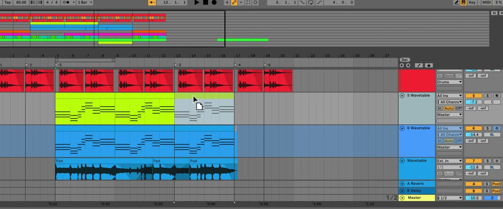

# How to Use Arrangement View in Ableton Live

Arrangement View is Ableton Live’s linear workspace for structuring a song or project over time. It places audio and MIDI clips on a left-to-right timeline, making it useful for arranging sections, recording performances, and refining a complete piece. Open a Set in [Ableton Live](https://www.ableton.com/en/live/) and press `Tab` if Session View is showing.

## Video walkthrough

  <iframe
    src="https://www.youtube-nocookie.com/embed/riOD-fnyCsg?rel=0"
    title="Learn Live: Arrangement View"
    allow="accelerometer; autoplay; clipboard-write; encrypted-media; gyroscope; picture-in-picture; web-share"
    referrerpolicy="strict-origin-when-cross-origin"
    allowfullscreen>
  </iframe>

## Recognize the linear layout

In Arrangement View, tracks are stacked vertically and time moves from left to right. Each track has a main lane that contains its audio or MIDI clips. Together, all of the clips placed across those lanes make up the Arrangement.

The Arrangement Overview at the top of the view shows the entire clip layout. Its outlined region represents the portion currently visible below. Beneath the Overview, the beat-time ruler provides a bars-beats-sixteenths timeline, while the scrub area contains playback controls, locators, and the automation controls. The Arrangement track controls at the right side provide track-specific mixer and routing access.

*The source walkthrough uses an earlier Live version. Live 12 has updated visual details and labels, but the linear Arrangement layout shown here remains the same.*

## Navigate and zoom the timeline

Use the Overview to move through a large arrangement without losing context. Drag within its outline horizontally to scroll the timeline, or drag vertically to zoom. Double-click inside the outline to fit the full Arrangement into view.

The beat-time ruler supports the same horizontal navigation and vertical zooming. You can also use `+` and `-` to zoom around the current selection. Press `Z` to zoom fully into the current time selection, and press `X` to return to the previous zoom level.

For a practical starting point, zoom out to find the song section you need, then select a short time range and zoom in before moving or editing clips. This keeps structural decisions and detailed edits separate.

## Place and arrange clips on tracks

Drag audio or MIDI material from the Browser into the intended track lane and song position. You can also record directly into Arrangement View or record a Session View performance into the Arrangement.

Clicking in an empty portion of a track creates the flashing insert marker, which establishes a play position. Click and drag across a track to select a timespan, including the same range across multiple tracks when needed.

To make basic structural changes:

1. Drag a clip by its clip bar to move it to a different song position or track.
2. Drag a clip’s left or right edge to change its length.
3. Use the editing grid to keep clips aligned to the musical timing. Clips also snap to useful locations such as neighboring clip edges and locators.
4. Select a timespan before using commands that affect the song structure, such as **Duplicate Time** or **Delete Time**. These commands insert or remove time across all tracks, unlike ordinary copy, paste, or delete actions that only affect the selection.

For more detailed clip operations such as splitting, consolidating, fades, and crossfades, use the relevant clip-editing commands after the broad structure is in place.

## Mark sections with locators

Locators mark useful positions in the Arrangement, such as an intro, verse, chorus, or mix revision. Add a locator by placing the insert marker or making a time selection, then click the Set Locator button. You can also right-click in the scrub area and choose **Add Locator**.

Rename a selected locator from the Edit menu or with `Ctrl`+`R` on Windows or `Cmd`+`R` on macOS. Click a locator to start playback from it, or use the Previous and Next Locator buttons to move between sections. When you trigger locators during playback, Live follows the Control Bar’s global launch quantization setting when moving between them.

## Loop a passage while you work

The Arrangement Loop lets you rehearse or refine one part of the song without manually restarting playback. Select the time you want to repeat, then press `Ctrl`+`L` on Windows or `Cmd`+`L` on macOS to set and enable the loop brace for that selection.

Drag either edge of the loop brace to change its start or end, or drag the brace itself to move the repeated range without changing its length. Use the Arrangement Loop toggle in the Control Bar to turn looping on or off.

## Keep Arrangement playback in control

Arrangement and Session View share tracks, but a track can play material from only one view at a time. If you launch a Session clip while an Arrangement clip is playing on that track, the Session clip takes precedence. The Back to Arrangement button lights up to show that one or more tracks are not currently following the Arrangement.

Click Back to Arrangement at the upper-right side of the Arrangement scrub area to return all tracks to the Arrangement. Individual track buttons let you return selected tracks without interrupting Session playback on the others.

## Build a song from broad structure to detail

Start by placing the main clip blocks along the timeline, then add locators for song sections and use the Arrangement Loop to review each transition. When the structure is clear, use the editing and automation tools to refine the musical details. This sequence makes it easier to evaluate the complete song while working on individual parts.

For current details, see Ableton’s [Arrangement View](https://www.ableton.com/en/live-manual/12/arrangement-view/), [Live Concepts: Arrangement and Session](https://www.ableton.com/en/live-manual/12/live-concepts/), and [Live Keyboard Shortcuts](https://www.ableton.com/en/manual/live-keyboard-shortcuts/) documentation. For the source walkthrough, see Ableton’s [Learn Live: Arrangement View](https://www.youtube.com/watch?v=riOD-fnyCsg) video.
