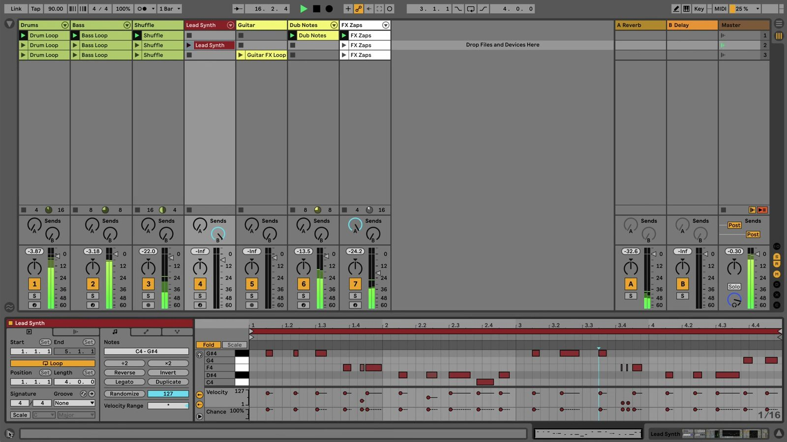

# How to Use Detail View in Ableton Live

Detail View is the lower working area of Ableton Live where you edit the selected clip or adjust the devices on the selected track. In current Live 12 terminology, its two main parts are **Clip View** and **Device View**; they can be selected individually or displayed together. Open [Ableton Live](https://www.ableton.com/en/live/) with a Set that contains at least one clip and one device before following along.

## Video walkthrough

  <iframe
    src="https://www.youtube-nocookie.com/embed/qCFsda-XTSg?rel=0"
    title="Learn Live: Detail View"
    allow="accelerometer; autoplay; clipboard-write; encrypted-media; gyroscope; picture-in-picture; web-share"
    referrerpolicy="strict-origin-when-cross-origin"
    allowfullscreen>
  </iframe>

## Open Clip View or Device View

Use **Clip View** when you need to work on an individual audio or MIDI clip. Double-click a clip in Session View or Arrangement View to open it, or click the Clip View Selector in the lower-right corner of Live’s window. The Clip View Toggle next to the selector can also show or hide the view.

Use **Device View** when you need to inspect or adjust the instruments and effects on a track. Select the track, then double-click its title bar or click the Device View Selector. The view shows the device chain for the selected track.

The current shortcuts to show or hide the views are:

| View | Windows | macOS |
| --- | --- | --- |
| Clip View | `Ctrl` + `Alt` + `3` | `Cmd` + `Option` + `3` |
| Device View | `Ctrl` + `Alt` + `4` | `Cmd` + `Option` + `4` |

When only one view is displayed, `Shift` + `Tab` or `F12` switches between Clip View and Device View. If **Use Tab to Move Focus** is enabled in Live’s Settings, `Shift` + `Tab` is reserved for keyboard focus navigation instead.

## Edit the selected clip in Clip View

Clip View contains clip panels on the left and an editor on the right. Its contents change with the selected clip type:

- An **audio clip** provides the Sample Editor for its waveform and the Envelope Editor for automation or modulation. Its panels include clip and loop settings, plus audio-specific controls such as warping.
- A **MIDI clip** provides the MIDI Note Editor for notes and velocities, along with Envelope and MPE editors when applicable. Its panels include clip settings, pitch and time utilities, and MIDI tools.

Click the editor mode tabs to choose the information you need to work on. Use the Clip View’s top border to give the panels and editor more vertical space.

The source video uses an earlier Live 11 interface. It shows a MIDI clip’s properties and Note Editor together in the lower Clip View; the current Live 12 selectors and panel labels may look different.

## Adjust instruments and effects in Device View

Device View displays the devices loaded on the selected track. A MIDI track can contain MIDI effects, instruments, and audio effects. Audio, group, return, and Main tracks can contain audio effects.

Select a device in the chain to reveal its controls, then adjust only the parameters needed for the task. When a clip is selected, switch to Device View to edit the track’s sound without changing the clip’s notes or audio settings. Return to Clip View when you need to edit the source material again.

## Show Clip View and Device View together

Live 12 can stack Clip View above Device View so you can edit a clip while monitoring its track’s devices. Use the triangle toggles next to the Clip View and Device View Selectors in the lower-right corner to show both views. You can also hold `Alt` on Windows or `Option` on macOS while clicking either view toggle.

With both views visible, `Shift` + `Tab` moves keyboard focus between them when **Use Tab to Move Focus** is off. This is useful when editing with the keyboard, but clicking the relevant view is often clearer when working with the mouse.

## Use Info View to identify controls

Info View is a related reference panel rather than a clip or device editor. Show or hide it with the control in the lower-left corner of the Live window, or press `Shift` + `?`. Hover over a control to read its name, purpose, and, where available, its keyboard shortcut.

Keep Info View open when an unfamiliar Clip View panel or device control is selected. It can help distinguish between a setting that changes the clip and one that changes the track’s processing.

## Keep the lower workspace focused

Use Detail View according to the change you are making: select a clip for its content and properties, or select a track for its device chain. Resize the lower workspace when detailed editing needs more room, and hide a view when it is not needed. When a task requires both notes or audio and sound design adjustments, stack Clip View and Device View instead of repeatedly switching between them.

For current details, see Ableton’s [Clip View](https://www.ableton.com/en/manual/clip-view/), [Working with Instruments and Effects](https://www.ableton.com/en/manual/working-with-instruments-and-effects/), and [Live Keyboard Shortcuts](https://www.ableton.com/en/manual/live-keyboard-shortcuts/) documentation. The source walkthrough is Ableton’s [Learn Live: Detail View](https://www.youtube.com/watch?v=qCFsda-XTSg).
