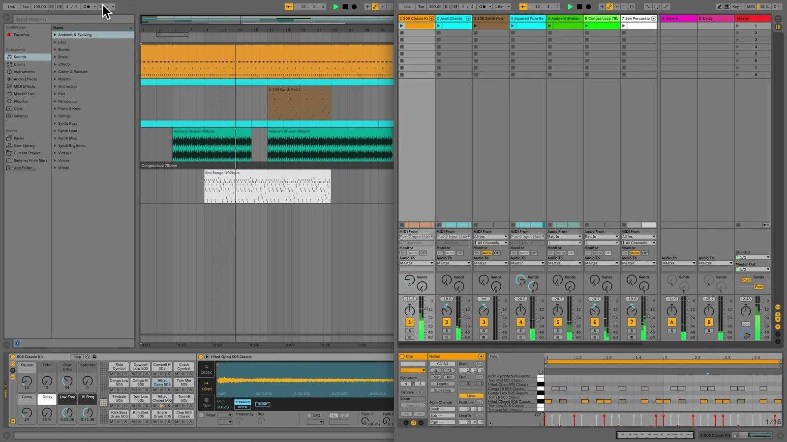

# How to Use Dual Screen Mode in Ableton Live

Dual Screen Mode is the older name for working with Live’s **Second Window**. A second window lets you keep complementary parts of the same Live Set visible at once, whether you use two monitors or one large display. Review Ableton’s current [Dual Monitor Support documentation](https://help.ableton.com/hc/en-us/articles/209071749-Dual-Monitor-Support) before setting up a layout.

## Video walkthrough

  <iframe
    src="https://www.youtube-nocookie.com/embed/bsMMhegTKH0?rel=0"
    title="Learn Live: Dual Screen Mode"
    allow="accelerometer; autoplay; clipboard-write; encrypted-media; gyroscope; picture-in-picture; web-share"
    referrerpolicy="strict-origin-when-cross-origin"
    allowfullscreen>
  </iframe>

## Open Live’s Second Window

Open an existing Live Set, then choose **View → Second Window**. You can also toggle the second window with `Ctrl` + `Shift` + `W` on Windows or `Cmd` + `Shift` + `W` on macOS.

Move the new window to a second display, or resize the two windows so they fit on one large display. The Browser and Info View remain in Live’s main window, so place that window where access to sounds, files, and contextual help will be most useful.

## Keep Session and Arrangement visible together

Choose **Arrangement View** in one window and **Session View** in the other. Both windows show the same Live Set, but this layout removes the need to hide one main view before working in the other.

The screenshot is from the source walkthrough and shows an earlier version of Live. The current Second Window feature retains the same purpose: keeping Session and Arrangement available at the same time.

Press `Tab` to swap Session View and Arrangement View between the two windows. If **Use Tab Key to Navigate** is enabled in Live’s Display & Input Settings, `Tab` navigates controls instead of swapping the views. In that case, use `Alt` + `1` on Windows or `Option` + `1` on macOS for Session View, and `Alt` + `2` on Windows or `Option` + `2` on macOS for Arrangement View.

## Dedicate one window to detailed clip editing

Use a second window to keep Clip View open while you select clips from a broader Session or Arrangement layout in the other window. When you open Clip View while using two windows, it opens in the currently focused window. The Clip View always reflects the currently selected clip, even when that clip is selected in the other window.

Press `F12` to move Clip View to the other window. If **Use Tab Key to Navigate** is off, `Shift` + `Tab` can also move it between windows. Live cannot show Clip View or Device View in both windows at the same time, so decide which detailed view needs the dedicated space.

This layout is useful when editing MIDI notes or audio-clip settings while maintaining an overview of the surrounding musical structure.

## Move material between views without hiding either one

With Session and Arrangement visible together, you can drag clips directly between the two windows. This is an alternative to copy and paste or dragging over a view selector when moving material between Session View and Arrangement View.

Keep the source and destination visible before you begin dragging. For an arrangement workflow, place the Session window beside the part of the Arrangement where the clips should land. Check the resulting playback behavior after moving material, especially if Session playback has overridden the Arrangement.

## Adjust the layout for the task

Use the window arrangement that matches the immediate job rather than treating two windows as a permanent requirement. Common layouts include:

- Arrangement View beside Session View when arranging clips from an improvised Session.
- A broad Session or Arrangement overview beside Clip View for detailed MIDI or audio editing.
- A main window with the Browser available beside a second window focused on clip and device work.

Live’s Display & Input Settings can set the zoom amount for the main window and an open second window independently. When the extra window no longer improves the workflow, choose **View → Second Window** again or use the same toggle shortcut to close it.

For current details, see Ableton’s [Dual Monitor Support](https://help.ableton.com/hc/en-us/articles/209071749-Dual-Monitor-Support), [Live Concepts](https://www.ableton.com/en/live-manual/12/live-concepts/), [Clip View](https://www.ableton.com/en/live-manual/12/clip-view/), and [Live Keyboard Shortcuts](https://www.ableton.com/en/manual/live-keyboard-shortcuts/) documentation. The source walkthrough is Ableton’s [Learn Live: Dual Screen Mode](https://www.youtube.com/watch?v=bsMMhegTKH0).
