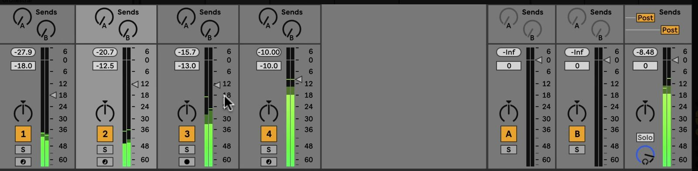

# How to Use Live’s Mixer

Ableton Live’s Mixer controls the level, stereo position, routing, and recording state of the tracks in a Set. It is available in both Session View and Arrangement View, so the same mix settings apply whichever view you are using. Open [Ableton Live](https://www.ableton.com/en/live/) with several tracks and a playing clip before following along.

## Video walkthrough

  <iframe
    src="https://www.youtube-nocookie.com/embed/P1Y1FEcw2xQ?rel=0"
    title="Learn Live: Live's Mixer"
    allow="accelerometer; autoplay; clipboard-write; encrypted-media; gyroscope; picture-in-picture; web-share"
    referrerpolicy="strict-origin-when-cross-origin"
    allowfullscreen>
  </iframe>

## Show the Mixer in the current view

In Session View, the Mixer appears below the clip grid. In Arrangement View, it appears beneath the tracks, while related track controls can also be shown alongside the Arrangement. Use the Mixer View control in the lower-right corner of Live’s window to show or hide the Mixer in either view.

You can also choose **View > Mixer** or use `Ctrl` + `Alt` + `M` on Windows or `Cmd` + `Option` + `M` on macOS. Session View and Arrangement View remember their Mixer visibility independently, so it is possible to keep it open in one view and hidden in the other.

Use the drop-down menu beside the Mixer View control to show only the sections you need. The available options include In/Out, Sends, Volume, Track Options, Crossfader, Performance Impact, and Return Tracks.

## Read and adjust a track strip

Each track has its own mixer strip. The principal controls are:

- **Meter** shows peak and RMS levels. While a track is monitoring an input, it shows the input levels instead of the output levels.
- **Volume** changes the track’s output level. Select multiple tracks first when you need to make a relative adjustment to them together.
- **Pan** positions the track in the stereo field. Double-click the Pan control to return it to its default value; its context menu also provides Split Stereo Pan Mode.
- **Track Activator** turns the track output on or off without deleting its clips or devices.
- **Solo** isolates the selected track by muting the other tracks. The default shortcut is `S`.
- **Arm Recording** makes an audio or MIDI track ready to record. Its behavior with more than one track depends on the Exclusive Arm setting; hold `Ctrl` on Windows or `Cmd` on macOS to arm additional tracks when needed.

The source video uses an earlier Live 11 interface. The individual track-strip controls remain the same in Live 12, although the final output track is now labeled Main rather than Master.

## Send tracks to shared effects

The **Send** controls above each track strip determine how much of that track’s signal is sent to a corresponding Return Track. This is useful for effects that several tracks should share, such as a reverb or delay.

For example, place a reverb on a Return Track, then raise the matching send control on each source track that should use it. The return track processes the combined sent signal and adds it back to the mix. This lets several tracks use one effect while retaining separate amounts of that effect.

Return Tracks and the single **Main** track appear at the right side of Session View’s Mixer and at the bottom of Arrangement View. The Main track is the default destination for the other tracks, so devices placed there process the mixed signal before it reaches the configured output.

## Balance levels with the meters

Start by using track Volume controls to establish the relative level of the parts in the Set. Use Solo to examine a track in context, then return to the full mix before making final level decisions. Pan only when the material benefits from a stereo position rather than using it as a substitute for level balance.

The meters help identify sudden peak changes and the general loudness of each signal. Internal tracks have substantial headroom, but the Main track and any physical or rendered output still need attention: a signal that leaves Live above the available output range can clip.

Drag upward on the Mixer’s top edge when you need taller meters, numeric volume fields, and resettable peak indicators. Widening a track in this expanded state also adds a decibel scale beside its meter.

## Reveal routing and diagnostic controls when needed

Keep the basic Mixer visible for level and pan work, then use the Mixer View menu to reveal the specialized sections for a particular task:

- **In/Out** shows a track’s signal source, destination, and monitoring choices.
- **Track Options** provides controls such as Track Delay. This is for compensating timing differences, not for ordinary rhythmic edits.
- **Crossfader** lets you assign tracks to its A or B side for transitions. Tracks with neither assignment are unaffected.
- **Performance Impact** displays a six-segment CPU indicator for each track. If one track has the largest impact, freezing it or reducing its devices can lower the Set’s CPU load.

Hide these sections again when they are not part of the task. A compact Mixer makes it easier to focus on the track controls that matter during balancing.

## Use a repeatable mixing pass

For a practical first pass, show the Mixer, balance track volumes, check the Main track, and then make only the pan and send changes needed to clarify the arrangement. Solo tracks briefly to identify a problem, but judge the final adjustment with the complete Set playing. Use return tracks for shared processing and open routing or performance controls only when you need to diagnose a specific issue.

For current details, see Ableton’s [Mixing](https://www.ableton.com/en/live-manual/12/mixing/), [Navigation and View Options in Live 12](https://help.ableton.com/hc/en-us/articles/12243771208092-Navigation-and-View-Options-in-Live-12-FAQ), and [Live Keyboard Shortcuts](https://www.ableton.com/en/manual/live-keyboard-shortcuts/) documentation. The source walkthrough is Ableton’s [Learn Live: Live’s Mixer](https://www.youtube.com/watch?v=P1Y1FEcw2xQ).
