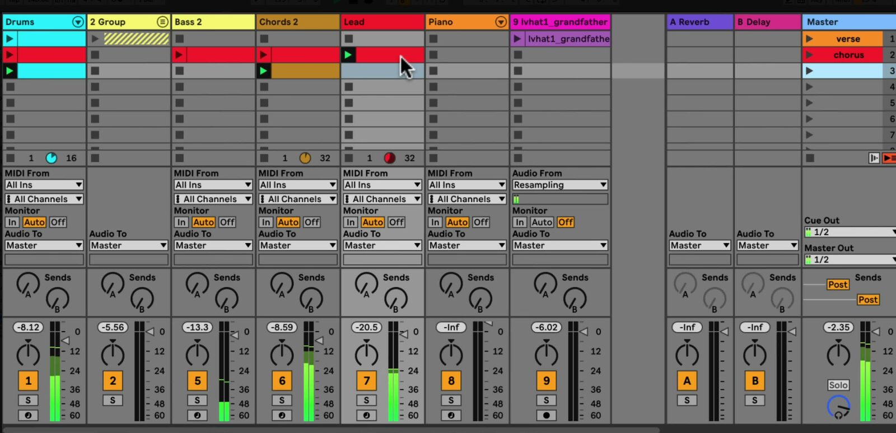

# How to Use Session View in Ableton Live

Session View is Ableton Live’s non-linear workspace for developing and performing with clips. It lets you combine musical ideas in any order before deciding on a fixed timeline. This tutorial uses the current Live 12 terminology; open a Set in [Ableton Live](https://www.ableton.com/en/live/) and press `Tab` if Arrangement View is showing.

## Video walkthrough

  <iframe
    src="https://www.youtube-nocookie.com/embed/qv_N3plJYx4?rel=0"
    title="Learn Live: Session View"
    allow="accelerometer; autoplay; clipboard-write; encrypted-media; gyroscope; picture-in-picture; web-share"
    referrerpolicy="strict-origin-when-cross-origin"
    allowfullscreen>
  </iframe>

## Understand the Session View grid

Session View arranges clips in a grid rather than on a timeline. Each vertical column is a track, and each horizontal row is a scene. A track can play one Session View clip at a time, while clips on different tracks can play together.

Each populated clip slot has a triangular Clip Launch button. The row’s Scene Launch button is in the Main track at the right side of the grid; it launches every clip in that row. Empty slots can include square Clip Stop buttons, which determine whether launching a scene stops the material already playing on that track.

*The image is from the source walkthrough, which uses Live’s earlier **Master** track label. In Live 12, this track is named **Main**.*

## Add and organize clips

Use Session View to collect alternatives that can be combined during playback. Audio tracks contain audio clips, and MIDI tracks contain MIDI clips. A single clip can be a short one-shot, a loop, or a longer recording.

To build a small working grid:

1. Create or select the audio and MIDI tracks you need.
2. Drag an audio file, sample, or other compatible item from the Browser to an empty clip slot on the appropriate track.
3. To make a blank MIDI clip, select an empty slot on a MIDI track and press `Ctrl`+`Shift`+`M` on Windows or `Cmd`+`Shift`+`M` on macOS.
4. Drag clips between slots to reorganize them. Use the clip context menu to rename or color-code clips that represent alternatives, variations, or song sections.

Keep mutually exclusive parts in the same track. For example, place several bass variations in one column, then use separate tracks for drums, chords, and lead sounds. This makes it clear which clips will replace one another when launched.

## Launch and stop clips in time

Click a clip’s Clip Launch button to start it, or select the clip and press `Enter`. When Live is playing, the Global Quantization setting in the Control Bar determines when a launch takes effect. For example, a one-bar setting waits for the next bar, helping clips on different tracks stay synchronized.

Launching another clip in the same track replaces the clip that is already playing in that track. Clips on other tracks continue unless you launch or stop them. Click the square Clip Stop button in a slot or the track’s Track Status display to stop that track’s current clip.

Individual clips can use the Global Quantization setting or a clip-specific value. Open a Session clip in Clip View and use its Launch settings when a clip needs different timing or trigger behavior.

## Build and launch scenes

A scene is a horizontal collection of clips that can be started together. Use scenes to represent complete combinations, such as an intro, verse, chorus, or breakdown.

1. Place the clips for a section on the same row.
2. Right-click the scene in the Main track and choose **Rename**. Give it a meaningful section name, then choose a color if it will help identify the section while performing.
3. Click that row’s Scene Launch button to launch its clips together.

By default, a scene can also stop a track when its corresponding slot has a Clip Stop button. If a part should continue while you launch the next scene, right-click the relevant stop button and choose **Remove Stop Button**. This lets a loop continue across scenes that do not contain a replacement clip for it.

## Record a new clip in the Session

Session View can record a performance directly into a clip slot. Set Global Quantization to a value other than **None** when you want the recorded clip to be cut cleanly to the musical grid. Then arm the destination track and either click a Clip Record button in an empty slot or use the Session Record button to record into the selected scene on all armed tracks.

Click Session Record again to stop recording and continue playback of the newly recorded clip. You can then launch it alongside the other clips, edit it in Clip View, or move it to another slot.

## Capture a Session performance in Arrangement View

When an improvised sequence is worth keeping, record the Session performance into Arrangement View. Enable the Arrangement Record button in the Control Bar, start playback, and launch clips or scenes as needed. Live writes the launched clips and their changes into the Arrangement at the corresponding song positions.

Press `Tab` to inspect the result in Arrangement View. If Session clips are still overriding Arrangement playback, use the Back to Arrangement control in the Main track to resume the recorded arrangement.

## Use Session View as a practical starting point

Start with a few clips on separate tracks, create two or three named scenes, and use a musical Global Quantization value before launching combinations. This makes it possible to audition sections quickly without committing them to a linear structure. Once a sequence works, record it into Arrangement View and refine it there.

For current details, see Ableton’s [Session View](https://www.ableton.com/en/live-manual/12/session-view/), [Launching Clips](https://www.ableton.com/en/live-manual/12/launching-clips/), and [Recording New Clips](https://www.ableton.com/en/live-manual/12/recording-new-clips/) chapters. For the source walkthrough, see Ableton’s [Learn Live: Session View](https://www.youtube.com/watch?v=qv_N3plJYx4) video.
