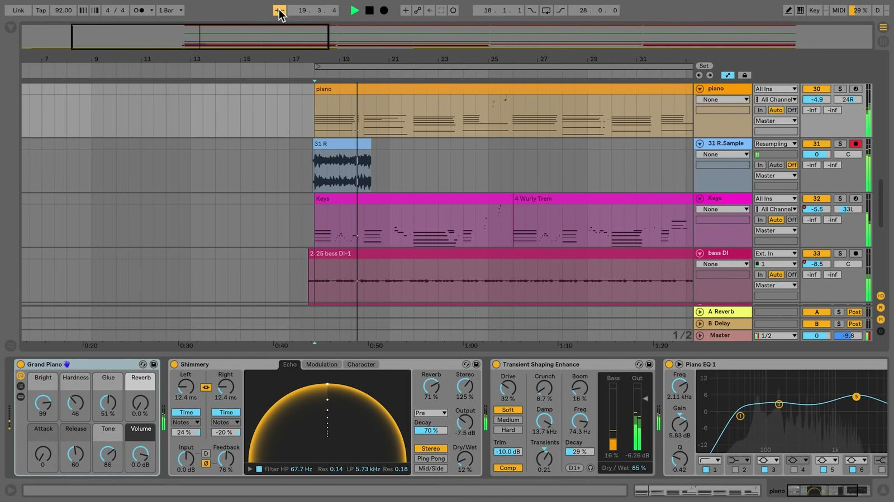

# How to Use the Transport Bar and Follow Behavior

The Transport Bar controls when a Live Set plays, stops, records, and returns to a chosen Arrangement position. In the current Live 12 manual, this area is called the **Control Bar**. It also contains the Follow switch, which keeps the display moving with playback. Open [Ableton Live](https://www.ableton.com/en/live/) with an Arrangement containing clips before following along.

## Video walkthrough

  <iframe
    src="https://www.youtube-nocookie.com/embed/m84wUU8CQnY?rel=0"
    title="Learn Live: Transport bar and Follow behavior"
    allow="accelerometer; autoplay; clipboard-write; encrypted-media; gyroscope; picture-in-picture; web-share"
    referrerpolicy="strict-origin-when-cross-origin"
    allowfullscreen>
  </iframe>

## Recognize the Control Bar transport area

The Control Bar runs across the top of Live’s window. Its Transport Controls section contains the main **Play**, **Stop**, and **Arrangement Record** controls. The nearby Follow and Arrangement Position section lets you manage how Arrangement playback is displayed and where it starts.

The Control Bar also holds other global Set controls, including tempo, time signature, metronome, global quantization, Arrangement looping, automation recording, Capture MIDI, and the Session Record control. These controls affect the Set rather than one selected clip or track.

## Start, stop, and record the Arrangement

Click **Play** to start Arrangement playback and **Stop** to stop it. Press `Space` to toggle between those actions. To continue from the point where playback last stopped instead of returning to the insert marker, press `Shift` + `Space`.

Use **Arrangement Record** when you want armed tracks to record into the Arrangement. Confirm the intended audio or MIDI tracks are armed before starting recording. The Control Bar also has a separate Session Record control for creating clips in Session View; it does not replace Arrangement Record.

To return the Arrangement insert marker to its starting position, double-click the Stop button. You can also use `Home` on Windows, or `Home` or `Function` + left arrow on macOS.

## Set the Arrangement playback position

Click within an Arrangement track to place the flashing insert marker and make playback start from that point. The Arrangement Position fields in the Control Bar show the position in bars, beats, and sixteenths.

Adjust a position field by dragging it up or down, entering a value and pressing `Enter`, or using the up and down arrow keys. Changing the fields also moves the insert marker.

When the **Permanent Scrub Areas** setting is enabled, clicking the scrub area above the tracks starts playback from that point. The jump follows the global quantization setting. If the setting is off, hold `Shift` while clicking in the scrub area or Beat-Time Ruler to scrub the Arrangement.

## Use Follow to keep playback in view

Turn on the **Follow** switch in the Control Bar when you want the Arrangement display to scroll automatically and keep the current song position visible. This is useful while monitoring a long Arrangement or during a recording pass.

Follow pauses when you edit or scroll horizontally in Arrangement View, or when you click the Beat-Time Ruler. It begins again after you stop or restart playback, or click in the Arrangement or Clip View scrub area. Toggle the current Control Bar Follow behavior with `Alt` + `Shift` + `F` on Windows or `Option` + `Shift` + `F` on macOS.

The source video shows an earlier Live interface. Its highlighted Follow switch serves the same display-following purpose, but current Live 12 uses updated control labels and shortcuts.

## Distinguish Follow from other Live features

The Follow switch described here only controls whether a display follows playback. It does not change the clips that play or the Set tempo.

- **Session Follow Actions** determine what a Session clip does after it plays for a specified time.
- **Tempo Follower** listens to an audio input and can adapt Live’s tempo to it.
- **Back to Arrangement** returns tracks that are playing Session clips to their Arrangement clips.

Keeping these features separate makes it easier to diagnose whether a change affects the display, clip launching, tempo, or playback source.

## Use a predictable playback workflow

Before a recording or playback pass, set the tempo and global quantization, place the insert marker, and verify which tracks are armed. Start playback with the Play button or `Space`, and use Follow when you need the view to remain with the playhead. Turn Follow off when you need to inspect or edit another part of the Arrangement without the display moving away. Stop playback, review the result, and return the insert marker to the start before repeating the pass.

For current details, see Ableton’s [Live Concepts: The Control Bar](https://www.ableton.com/en/manual/live-concepts/), [Arrangement View](https://www.ableton.com/en/manual/arrangement-view/), and [Live Keyboard Shortcuts](https://www.ableton.com/en/manual/live-keyboard-shortcuts/) documentation. The source walkthrough is Ableton’s [Learn Live: Transport bar and Follow behavior](https://www.youtube.com/watch?v=m84wUU8CQnY).
