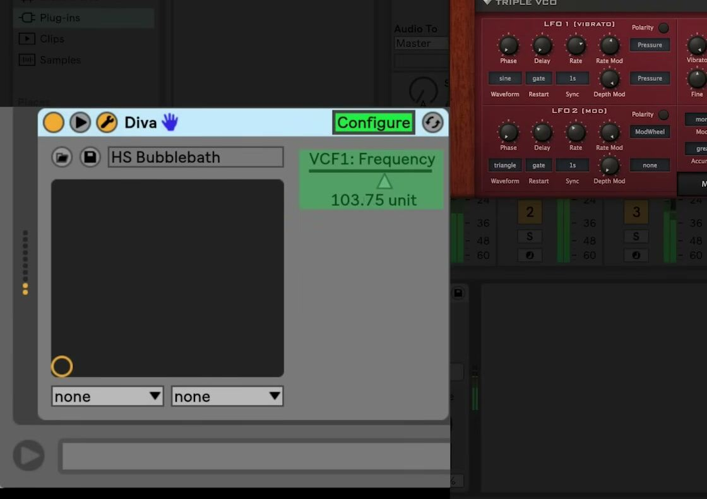

# How to Use Third-Party Plug-ins in Ableton Live

Third-party plug-ins extend Ableton Live with instruments and audio effects from other developers. In Live 12, install a compatible, authorized plug-in first, then activate its source so Live can scan it and list it in the Browser. Live supports 64-bit VST2 and VST3 plug-ins on macOS and Windows, plus Audio Unit version 2 and 3 plug-ins on macOS. Review Ableton’s current [supported plug-in formats](https://help.ableton.com/hc/en-us/articles/5937501570460-Supported-Plug-in-Formats) before choosing an installer.

## Video walkthrough

  <iframe
    src="https://www.youtube-nocookie.com/embed/r8RmTlFvdPA?rel=0"
    title="Learn Live: Using third-party plug-ins"
    allow="accelerometer; autoplay; clipboard-write; encrypted-media; gyroscope; picture-in-picture; web-share"
    referrerpolicy="strict-origin-when-cross-origin"
    allowfullscreen>
  </iframe>

## Install a compatible plug-in

Download and run the current installer supplied by the plug-in developer. Use the developer’s installer or product-management application when it is available, and complete any authorization it requires before opening Live. Installing an individual plug-in file from an old backup can leave required components, libraries, or licensing software behind.

Choose a format that Live supports on the current computer:

- **VST2** and **VST3** are available on macOS and Windows, but Live requires 64-bit versions.
- **Audio Units (AUv2 and AUv3)** are available only on macOS.
- **AAX, RTAS, DirectX, and 32-bit VST2** are not supported by Live.

If more than one format of the same plug-in is installed, use one format consistently throughout a Set. This prevents the Set from containing, for example, both VST3 and Audio Unit instances of the same device. On an Apple silicon Mac, also confirm with the developer that the VST version is compiled for Apple silicon before expecting native Live to recognize it.

## Activate plug-in sources and scan them

Open Live’s Plug-Ins Settings with `Cmd`+`,` on macOS or `Ctrl`+`,` on Windows. In **Plug-In Sources**, turn on the source that matches the installed plug-in. The available sources vary by operating system:

- On Windows, enable the VST3 system folder for normally installed VST3 plug-ins. Choose and enable a dedicated custom folder only when the developer installed a VST2 or VST3 plug-in elsewhere.
- On macOS, enable the applicable VST and Audio Units sources. A custom VST folder is optional when the plug-in is not in a standard system folder.

Do not point more than one source at the same location, and keep VST2 and VST3 files in separate folders. Plug-in folders should contain only valid plug-in files rather than presets, sample libraries, or unrelated files.

Live scans an active source and adds eligible devices to the Browser. If a newly installed plug-in does not appear after scanning finishes, return to Plug-Ins Settings and click **Rescan**. Hold `Alt` on Windows or `Option` on macOS while clicking **Rescan** only when a normal rescan does not help; this performs a clean scan after deleting Live’s plug-in database.

## Find and load the plug-in on the right track

Open the Browser’s **Plug-Ins** label under Library. Search by name, or use the Browser’s filters to narrow the list. In Live 12, the Format filter helps distinguish VST2, VST3, and Audio Unit versions when more than one is available.

Select a destination track, then drag the device to its Device View or double-click it to add it to the selected track. A plug-in instrument belongs on a MIDI track, where it receives MIDI and produces audio. An audio-effect plug-in belongs on an audio track, return track, or Main track; on a MIDI track, place it after an instrument so it receives audio.

Check the device order after loading it. Signals travel from left to right in Live’s device chain, so MIDI effects precede an instrument and audio effects follow it. This order applies to third-party devices in the same way it applies to Live’s built-in devices.

## Use the original window and Configure Mode

Select the plug-in in Device View and use its **Show/Hide Plug-In Window** button to open the developer’s original interface in a floating window. Changes in that window and in Live’s device panel affect the same plug-in instance.

To bring a small set of useful controls into Live’s panel:

1. Click **Configure** in the plug-in device header.
2. Click, or when required change, a control in the plug-in’s floating window to add it to Live’s panel.
3. Reorder the exposed controls in Live’s panel if needed, then click **Configure** again to leave the mode.

The screenshot is from the source walkthrough and shows an earlier Live interface. Configure Mode remains available in Live 12, though the device-panel layout and button appearance may differ.

The configured controls are specific to that plug-in instance and are saved with the Set. Controls that a plug-in publishes to Live can be automated, modulated with clip envelopes, or mapped to MIDI, keys, or Rack Macros. Some plug-in controls cannot be exposed if the developer has not made them available to the host application.

## Manage plug-in windows and troubleshoot safely

In Plug-Ins Settings, the **Auto-Open Plug-In Windows**, **Multiple Plug-In Windows**, and **Auto-Hide Plug-In Windows** options control how floating plug-in interfaces behave. Use the View menu’s **Show/Hide Plug-In Windows** command to hide or reveal open plug-in windows; its shortcut is `Cmd`+`Option`+`P` on macOS or `Ctrl`+`Alt`+`P` on Windows. The command affects windows that were previously opened manually or through Auto-Open.

If Live crashes while scanning or a plug-in causes a problem, launch Live while holding `Alt` on Windows or `Option` on macOS to skip plug-in scanning temporarily. Then update, reinstall, or remove the affected plug-in through its developer’s supported process. For a missing device, first verify its format, authorization, source location, and scan status before attempting a deep rescan.

Third-party plug-ins are not copied into a Live Project by **Collect All and Save**. When moving a Set to another computer, install the same plug-in and version there. If that is not possible, use Live 12’s Bounce command to render the processed audio before transferring the project.

Start with one current plug-in and a simple test Set: confirm it loads, plays or processes audio, and exposes the controls you need. This catches compatibility or scanning problems before the device becomes part of a larger project.

For current details, see Ableton’s [Working with Instruments and Effects](https://www.ableton.com/en/live-manual/12/working-with-instruments-and-effects/), [Using VST plug-ins on Windows](https://help.ableton.com/hc/en-us/articles/209071729-Using-VST-plug-ins-on-Windows), [Using AU and VST plug-ins on macOS](https://help.ableton.com/hc/en-us/articles/209068929-Using-AU-and-VST-plug-ins-on-macOS), and [Plug-ins Tips and Troubleshooting](https://help.ableton.com/hc/en-us/articles/5232428442002-Plug-ins-Tips-and-Troubleshooting) documentation. The source walkthrough is Ableton’s [Learn Live: Using third-party plug-ins](https://www.youtube.com/watch?v=r8RmTlFvdPA).
