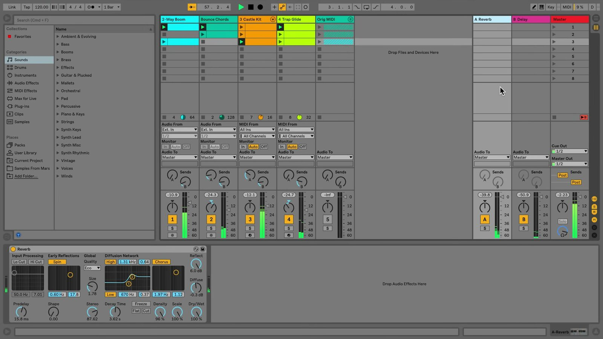

# How to Use Tracks in Ableton Live

Tracks organize the clips, devices, routing, and mixer controls in an Ableton Live Set. The same tracks appear in Session View and Arrangement View, so a change to a track is available in either view. This guide uses the current Live 12 terminology; open [Ableton Live](https://www.ableton.com/en/live/) with a Set before following along.

## Video walkthrough

  <iframe
    src="https://www.youtube-nocookie.com/embed/nFFYXMEG7NE?rel=0"
    title="Learn Live: Tracks"
    allow="accelerometer; autoplay; clipboard-write; encrypted-media; gyroscope; picture-in-picture; web-share"
    referrerpolicy="strict-origin-when-cross-origin"
    allowfullscreen>
  </iframe>

## Recognize tracks in both views

Session View presents each clip track as a vertical column, while Arrangement View presents it as a horizontal lane along the timeline. These are two representations of the same track, not separate copies. A clip added to a track in one view is therefore available on that track in the other view.

A clip track can play only one clip at a time. When a Session clip is launched on a track, it takes priority over that track's Arrangement playback until you return the track or the Set to Arrangement playback with Back to Arrangement.

## Choose the appropriate track type

### Audio tracks and MIDI tracks

Use an **Audio Track** for audio clips, such as recorded sound, imported samples, or rendered audio. Audio tracks can also host audio effects.

Use a **MIDI Track** for MIDI clips. A MIDI track usually contains an instrument that converts the MIDI notes into sound, followed by effects as needed. Audio clips and MIDI clips are different types, so they cannot be placed on each other's track type.

### Group tracks

Use a **Group Track** to keep related audio and MIDI tracks together, such as all drums or all backing vocals. A group does not contain clips itself; it contains tracks. It provides its own mixer controls and can host audio effects, which makes it useful for processing or balancing a submix.

### Return tracks and the Main track

Use a **Return Track** to process signals sent from one or more clip or group tracks. For example, place a reverb on a return track, then use each source track's send control to choose how much signal reaches that reverb. Return tracks do not play clips.

The single **Main** track is the default output destination for the other tracks. Devices on the Main track process the combined signal before it reaches its configured output. Earlier versions of Live labeled this track **Master**; Live 12 uses **Main**.

The source video shows an earlier Live interface, where the Main track is labeled Master. The clip tracks are at the left, with the return tracks and final output track at the right.

## Add a track or create one from content

Create a blank track from the **Create** menu or by right-clicking an empty area in either main view and choosing the required track type. The current default shortcuts are:

| Track type | Windows | macOS |
| --- | --- | --- |
| Audio Track | `Ctrl` + `T` | `Cmd` + `T` |
| MIDI Track | `Ctrl` + `Shift` + `T` | `Cmd` + `Shift` + `T` |
| Return Track | `Ctrl` + `Alt` + `T` | `Cmd` + `Option` + `T` |

The Browser can also create the appropriate clip track while loading content. Double-clicking or pressing `Enter` on compatible Browser content loads it onto a suitable track. Dragging a clip, sample, or device into an empty area of Session View or below the existing tracks in Arrangement View creates a track when needed.

When you drag an existing clip to an unused area, Live creates a new track for that clip and copies the source track's devices to the new track. Check the new track's routing and devices before treating it as an independent part of the Set.

## Name, arrange, and select tracks

Give tracks names that describe their role in the Set. Click a track title bar and use `Ctrl` + `R` on Windows or `Cmd` + `R` on macOS to rename it. Press `Tab` while renaming to move to the next track title.

You can also organize the workspace directly from the title bars:

- Drag a title bar to reorder tracks.
- Drag the edge of a title bar to resize it: change width in Session View and height in Arrangement View.
- Select adjacent tracks with `Shift`-click, or non-adjacent tracks with `Ctrl`-click on Windows or `Cmd`-click on macOS.
- Group a selection of related audio or MIDI tracks when you need a shared submix or a less crowded workspace.

## Use the track controls while working

The Mixer gives every track its own volume, pan, Track Activator, Solo, and record-arm controls. In Session View, show the Mixer below the clip grid; in Arrangement View, show it below the tracks when you need more detailed control.

Use these controls for the task at hand:

- Turn off the **Track Activator** to silence a track without deleting its clips or devices.
- Use **Solo** to monitor a track or selection of tracks. The default shortcut is `S`.
- Arm an audio or MIDI track before recording into it. Depending on the Set preferences, holding `Ctrl` on Windows or `Cmd` on macOS allows multiple tracks to be armed or soloed.
- Adjust a track's output routing when it must feed a different destination instead of the Main track.

## Build a track layout that supports the Set

Start with separate audio and MIDI tracks for the musical parts you need, then name and order them before the Set becomes crowded. Add return tracks for effects that several tracks should share, and use group tracks when a collection needs common level control or processing. This structure keeps Session experimentation and Arrangement editing connected without duplicating the work.

For current details, see Ableton's [Live Concepts: Tracks](https://www.ableton.com/en/live-manual/12/live-concepts/) and [Mixing](https://www.ableton.com/en/live-manual/12/mixing/) documentation. The source walkthrough is Ableton's [Learn Live: Tracks](https://www.youtube.com/watch?v=nFFYXMEG7NE).
