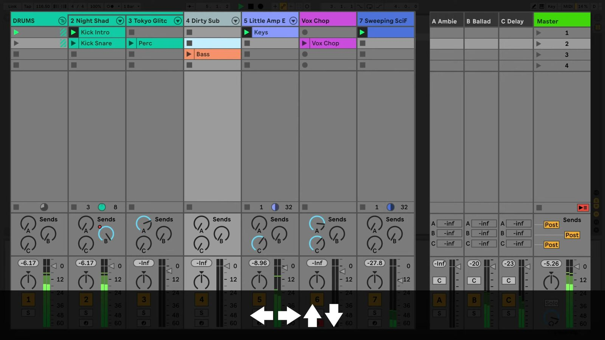

# Session View Keyboard Shortcuts in Ableton Live

Keyboard shortcuts make it possible to navigate Session View, launch clips, and create new material without repeatedly reaching for the pointer. This guide uses the current Live 12 shortcut set. Open a Set in [Ableton Live](https://www.ableton.com/en/live/) and show Session View before trying the commands.

## Video walkthrough

  <iframe
    src="https://www.youtube-nocookie.com/embed/1Fm2vyDURhw?rel=0"
    title="Learn Live: Session View shortcuts"
    allow="accelerometer; autoplay; clipboard-write; encrypted-media; gyroscope; picture-in-picture; web-share"
    referrerpolicy="strict-origin-when-cross-origin"
    allowfullscreen>
  </iframe>

## Focus Session View before using shortcuts

Click a clip slot, track title bar, or scene number to establish the part of Session View that should receive keyboard input. You can also move focus to Session View with `Alt`+`1` on Windows or `Option`+`1` on macOS. This is useful when another panel, such as the Browser or Clip View, currently has focus.

Live 12 can use `Tab` for keyboard navigation when **Use Tab to Move Focus** is enabled in the Navigate menu or Display & Input Settings. In that mode, `Tab` and `Shift`+`Tab` move between controls rather than switching Session and Arrangement View. Use the direct Session View focus shortcut when you want to return to the clip grid without changing that setting.

## Navigate and launch clip slots

Once a clip slot is selected, the arrow keys move the selection around the Session grid. Press `Enter` to launch the selected clip. If a scene number is selected, `Enter` launches that entire scene. When the transport is running, Live launches the clip or scene according to the global quantization setting.

| Task | Windows | macOS |
| --- | --- | --- |
| Move focus to Session View | `Alt`+`1` | `Option`+`1` |
| Select a neighboring clip or slot | Arrow keys | Arrow keys |
| Launch the selected clip, slot, or scene | `Enter` | `Enter` |
| Move between scenes one at a time | Up or Down Arrow | Up or Down Arrow |
| Move between scenes eight at a time | Page Up or Page Down | Page Up or Page Down |
| Stop clips in the selected track | `Ctrl`+`Enter` | `Cmd`+`Enter` |
| Jump to the highlighted track title bar | `Esc` | `Esc` |

*The source walkthrough uses an earlier Live version, where the terminal track is labeled Master. Live 12 uses the Main track label, but the Session View grid and arrow-key navigation remain the same.*

## Select, copy, and change clip slots

Use the standard editing shortcuts when clips or slots are selected. `Ctrl`+`A` on Windows or `Cmd`+`A` on macOS selects all clips and slots in Session View. `Ctrl`+`D` or `Cmd`+`D` duplicates the current selection, and `Delete` removes it.

To copy a clip into another slot with the pointer, hold `Ctrl` while dragging on Windows or `Option` while dragging on macOS. This creates a copy rather than moving the original clip.

Session View also has several commands that depend on the selected slot:

| Task | Windows | macOS |
| --- | --- | --- |
| Add or remove a Stop Button | `Ctrl`+`E` | `Cmd`+`E` |
| Deactivate or reactivate the selected clip | `0` | `0` |
| Solo the selected chain | `S` | `S` |

The `Ctrl`+`E` or `Cmd`+`E` command has a different purpose in Arrangement View, where it splits a clip. Confirm that Session View has focus before using it. Deactivating a clip with `0` leaves the clip in place and lets you restore it with the same key.

## Insert clips and scenes from the keyboard

Select an empty slot on a MIDI track, then press `Ctrl`+`Shift`+`M` on Windows or `Cmd`+`Shift`+`M` on macOS to insert an empty MIDI clip. This gives you a starting point for recording or editing MIDI without opening a menu.

Scenes can be created and captured with the following shortcuts:

| Task | Windows | macOS |
| --- | --- | --- |
| Insert a new scene | `Ctrl`+`I` | `Cmd`+`I` |
| Insert a scene that captures the currently playing clips | `Ctrl`+`Shift`+`I` | `Cmd`+`Shift`+`I` |

Use an inserted scene to make space for another variation. Use an inserted captured scene when a useful combination of launched clips is already playing and you want to preserve that combination as a new scene.

## Control recording and follow actions

Session View also offers shortcuts for two performance-oriented tasks:

| Task | Windows | macOS |
| --- | --- | --- |
| Start or stop recording to Session View | `Ctrl`+`Shift`+`F9` | `Cmd`+`Shift`+`F9` |
| Toggle Follow Actions for selected clips | `Shift`+`Enter` | `Shift`+`Enter` |
| Create a Follow Action Chain | `Ctrl`+`Shift`+`Enter` | `Cmd`+`Shift`+`Enter` |

Follow Actions determine what a Session clip does after it has played for its configured duration. Use these shortcuts after selecting the clips whose launch behavior you want to inspect or change.

## Build the shortcuts into a Session workflow

Begin by moving focus to Session View, then use the arrow keys and `Enter` to audition the grid without the pointer. When a promising combination is playing, capture it as a scene, insert a MIDI clip for a new part, or duplicate an existing clip into an empty slot. This keeps navigation, clip creation, and performance decisions in one continuous workflow.

For the complete and current list, see Ableton’s [Live Keyboard Shortcuts](https://www.ableton.com/en/manual/live-keyboard-shortcuts/), [Session View](https://www.ableton.com/en/live-manual/12/session-view/), and [Accessibility and Keyboard Navigation](https://www.ableton.com/en/live-manual/12/accessibility-and-keyboard-navigation/) documentation. For the source walkthrough, see Ableton’s [Learn Live: Session View shortcuts](https://www.youtube.com/watch?v=1Fm2vyDURhw) video.
