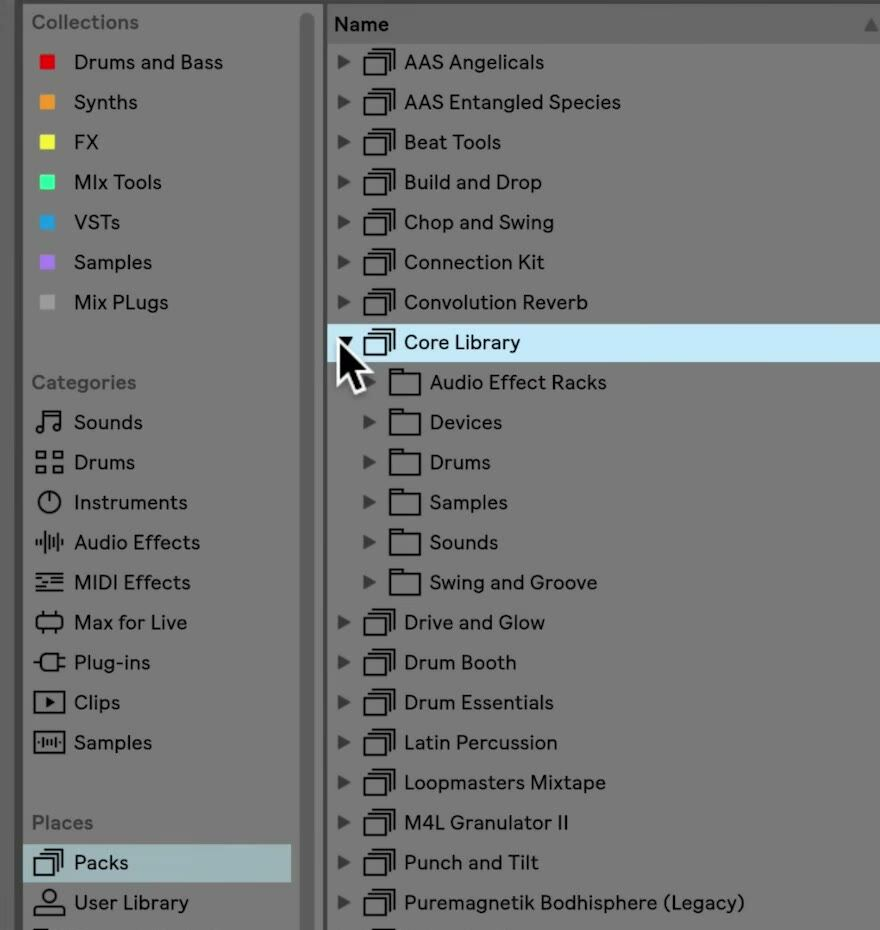

# What Is an Ableton Live Pack?

An Ableton Live Pack is an installable collection of content made for use in Live. Packs can contain Live Sets, samples, Live Clips, and presets; some also add instruments, devices, lessons, or other specialized material. Once installed, their content becomes part of Live’s Browser rather than belonging to one individual Set. See Ableton’s current [Live Pack FAQ](https://help.ableton.com/hc/en-us/articles/209072029-Ableton-Live-Pack-FAQ) for compatibility and licensing details.

## Video walkthrough

  <iframe
    src="https://www.youtube-nocookie.com/embed/TKH93Dck_X4?rel=0"
    title="Learn Live: What is in a Pack?"
    allow="accelerometer; autoplay; clipboard-write; encrypted-media; gyroscope; picture-in-picture; web-share"
    referrerpolicy="strict-origin-when-cross-origin"
    allowfullscreen>
  </iframe>

## Understand what a Pack bundles

A Pack is a way to distribute related creative resources as one library addition. Rather than supplying only one preset or one sample, a Pack can combine material that belongs to the same instrument collection, musical style, workflow, or learning topic.

The contents vary by Pack. Common types include:

- **Presets and Racks**, which provide ready-made device or multi-device settings.
- **Samples and loops**, which can be previewed and loaded as audio clips or used in instruments and Drum Racks.
- **Live Clips**, which may contain audio or MIDI material and, where applicable, their associated track device settings.
- **Live Sets**, which provide complete project examples or starting points.
- **Devices, lessons, and Pack information**, which some Packs provide in addition to musical content.

A Pack is not the same as the User Library. The User Library contains the presets, clips, defaults, samples, and other material you save yourself. A Pack adds content supplied with a Live edition or obtained separately.

## Browse Packs in Live’s Browser

In Live 12, open the **Packs** label in the Browser’s Places section. This area includes the Core Library, other installed Packs, and—when enabled—available downloads and updates. Expand an installed Pack to inspect its own folders.

The screenshot is from the source walkthrough and shows an earlier Live interface. Its exact folder names and the older Categories label are not a universal Pack layout. In Live 12, installed Pack content also appears under the relevant Library labels, such as Sounds, Instruments, Clips, and Samples.

Open the Packs label when you want to see the material from one Pack together. Use the Library labels, search, filters, or tags when you want to find the same content by type or sound across all installed Packs.

## Load Pack content into a Set

The Browser lets you preview compatible audio content before loading it. Select a sample and use the Browser preview controls, then drag it to a track, clip slot, or Arrangement timeline. Drag a preset or Rack to a compatible track, and drag or double-click a Live Clip when you want to bring its musical material into the Set.

The appropriate loading result depends on the item:

- A sample creates or is added to an audio clip.
- A device preset or Rack loads onto a compatible track.
- A Live Clip can restore the clip’s content and associated device settings.
- A Live Set can be opened as a separate project or used as a source for material through the Browser.

Check the track type and playback result after loading content. A Pack gives you library resources; it does not force a particular arrangement or replace the current Set.

## Check Pack information and requirements

Many installed Packs include a Pack Info page with a description of the creator and content, and sometimes a tutorial. Open the Pack’s context menu and choose **Show Pack Info**, or use **Help → Pack Overview** to review the information pages for installed Packs.

Packs can be included with a Live license or purchased separately. Review the Pack’s requirements before expecting every item to be fully editable: Packs with Max for Live devices require a Max for Live license, and Packs that use Live Suite devices have limited editing on licenses that do not include Suite. A newly purchased Partner Pack can also require you to re-authorize Live before it becomes available.

## Install and manage Packs deliberately

Packs download from the Browser or install from a downloaded `.alp` package. After installation, return to **Places → Packs** to confirm that the folder and its content are visible. Updates are managed from the same label, and an installed Pack can be removed from its context menu if it is no longer needed.

Start by opening one Pack, previewing a few samples or presets, and loading one item into a test Set. This makes it easier to understand what the Pack contributes before adding it to an active project or installing many large collections.

For current details, see Ableton’s [Live Pack FAQ](https://help.ableton.com/hc/en-us/articles/209072029-Ableton-Live-Pack-FAQ), [Working with the Browser](https://www.ableton.com/en/live-manual/12/working-with-the-browser/), and [Installing Live Packs](https://help.ableton.com/hc/en-us/articles/115001930644-Installing-Live-Packs) documentation. The source walkthrough is Ableton’s [Learn Live: What is in a Pack?](https://www.youtube.com/watch?v=TKH93Dck_X4).
